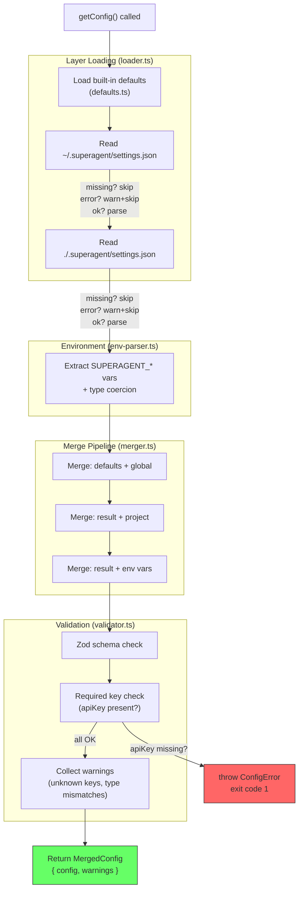

# Plan: Config System

## 1. Project File Structure

```
src/
├── index.ts                          # CLI entry point (skeleton for now, calls config)
└── config/
    ├── types.ts                      # TypeScript types: ConfigSchema, MergedConfig, ConfigLoadResult
    ├── defaults.ts                   # Built-in default values (single exported object)
    ├── loader.ts                     # File I/O: resolve paths, read files, parse JSON
    ├── merger.ts                     # Deep merge with override semantics (scalar replace, array concat)
    ├── env-parser.ts                 # SUPERAGENT_* env var extraction + type coercion
    ├── validator.ts                  # Zod schema definition + validation + warning collection
    └── config.ts                     # Public API: getConfig() orchestrates all layers

tests/
└── config/
    ├── defaults.test.ts              # Verify defaults are present for all required keys
    ├── loader.test.ts                # File missing / empty / BOM / syntax error / unreadable
    ├── merger.test.ts                # Scalar override / array merge / null reset / deduplication
    ├── env-parser.test.ts            # SUPERAGENT_ var extraction / JSON value / type coercion
    ├── validator.test.ts             # Required key check / type mismatch / unknown key / range check
    └── config.test.ts                # Integration: full 4-layer load + merge + validate
```

Each file has a **single core responsibility**:

| File | Responsibility | Why is it alone |
|------|---------------|-----------------|
| `types.ts` | All config-related types in one place | Every other file imports from here; changing a type should not touch logic |
| `defaults.ts` | Static default values object | Defaults change rarely; separated so merger/validator remain stable |
| `loader.ts` | File system access + JSON.parse | I/O is the only side-effect in the config pipeline; isolated for testability |
| `merger.ts` | Deep merge algorithm | Pure function — easy to test exhaustively with object fixtures |
| `env-parser.ts` | Environment variable extraction | Isolated because env var conventions may evolve (dot notation in v1.1) |
| `validator.ts` | Zod schema + runtime validation | Schema definition is verbose; kept separate to avoid cluttering orchestration |
| `config.ts` | Orchestration: calls loader→merger→env→validator in order | Thin orchestration; all logic delegated to other modules |

---

## 2. Data Flow



**Key data type**:

```
ConfigLoadResult {
  config: MergedConfig     // the final merged, validated config object
  warnings: string[]       // non-fatal warnings collected during load
}

ConfigError extends Error {
  code: "MISSING_REQUIRED_KEY" | "PARSE_ERROR" | "ENCODING_ERROR"
  filePath?: string        // which file caused it (if applicable)
  lineNumber?: number      // which line (if applicable)
}
```

---

## 3. Dependencies

### Runtime dependencies

| Package | Version | Why |
|---------|---------|-----|
| `zod` | ^3.23 | Schema validation + type inference (locked by 05-决策汇总) |
| TypeScript | ^5.5 | strict mode, for type safety |

### No additional runtime dependencies needed

- JSON parsing: Node.js built-in `JSON.parse`
- File I/O: Node.js built-in `fs.readFileSync`
- Home directory: Node.js built-in `os.homedir()`
- Deep merge: custom implementation (~30 lines, no library needed)
- Path resolution: Node.js built-in `path.resolve`

### Dev dependencies

| Package | Version | Why |
|---------|---------|-----|
| `vitest` | ^2 | Test runner (locked by 05-决策汇总) |
| `typescript` | ^5.5 | Type checker |

### Environment assumptions

- Node.js 22+ or Bun runtime (from 05-决策汇总)
- `$HOME` or `%USERPROFILE%` set for global config path resolution

---

## 4. Integration Points

### New modules (this feature)

All 7 files under `src/config/` are new. No existing code to modify.

### Skeleton for downstream features

The CLI entry point (`src/index.ts`) will be minimal in this feature — just enough to call `getConfig()` and print the result or error:

```
import { getConfig } from './config/config'

try {
  const { config, warnings } = getConfig()
  warnings.forEach(w => console.log(w))
  console.log('Config loaded:', config.model)
} catch (e) {
  if (e instanceof ConfigError) {
    console.error(e.message)
    process.exit(1)
  }
  throw e
}
```

This skeleton will be replaced by 008-cli-repl in a later feature.

### Downstream consumers (future features)

| Feature | What it reads from config |
|---------|--------------------------|
| 002-core-runtime | `maxTurns` |
| 003-model-fallback | `apiKey`, `baseUrl`, `model`, `fallbackModel`, `fallbackBaseUrl` |
| 006-permission-system | `permissions.autoApprove`, `permissions.deny`, `permissions.askTimeout` |
| 007-context-management | `rulesFile` (path to CLAUDE.md) |

### No integration with external APIs

Config is purely local. No network calls, no cloud services.

---

## 5. Risk Points

| # | Risk | Likelihood | Impact | Mitigation |
|---|------|:---:|:---:|------------|
| R1 | JSON syntax errors in user config cause cryptic failures | High | High | Zod produces clear error messages with paths; our loader wraps `JSON.parse` errors with file path + line number context |
| R2 | Deep merge of complex nested objects has subtle bugs (array within object within array) | Medium | Medium | Config nesting depth is limited to 2 levels in MVP (e.g., `permissions.autoApprove`). Comprehensive unit tests for merge edge cases: null, empty array, undefined, prototype pollution |
| R3 | `SUPERAGENT_*` env var namespace collision with other tools | Low | Low | `SUPERAGENT_` prefix is specific enough; document all env vars in README |
| R4 | Config file encoding issues (UTF-16, Latin-1) on non-English Windows | Low | Medium | Explicitly check for BOM in loader; fail with clear message for non-UTF-8 |
| R5 | Zod schema divergence from actual config usage over time | Medium | Medium | Schema is the single source of truth — TS types are inferred from Zod (`z.infer`). Adding a key without updating schema = type error at compile time |
| R6 | Blocking I/O at startup (100ms budget) | Low | Low | `readFileSync` for two small JSON files is < 5ms on SSD. Enforce 100ms budget with a timer in integration test |

---

## Rationale: Key Design Decisions

### Why custom deep merge instead of lodash.merge?

Config merge rules are specific (scalar replace, array concat with dedup, null reset). A custom 30-line implementation is:
- More maintainable than a dependency for this specific merge logic
- No prototype pollution risk (explicit own-property-only traversal)
- Zero additional bundle size

### Why synchronous file loading?

Config loading happens once at startup before the REPL loop. There's no concurrency benefit to async I/O during initialization. Sync code is simpler to reason about and debug.

### Why Zod over JSON Schema?

Zod is already locked by 05-决策汇总 as a project dependency. It provides:
- Runtime validation + TypeScript type inference in one definition
- Clear, human-readable error messages (no need for ajv or similar)
- Smaller API surface than JSON Schema + ajv combination
