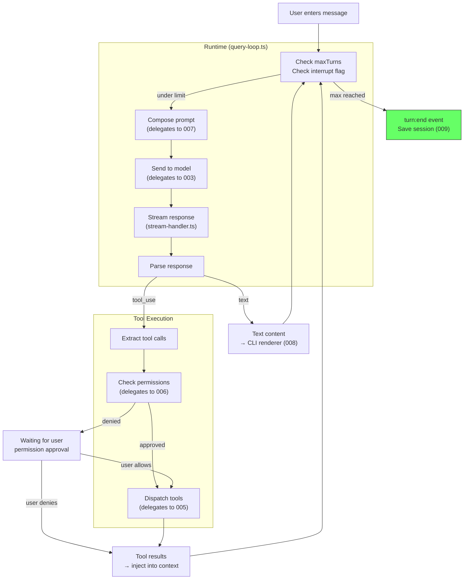

# Plan: Core Runtime

## 1. Project File Structure

```
src/
├── index.ts                          # (updated) CLI skeleton calls runtime
└── runtime/
    ├── types.ts                      # State enum, TurnEvent union, TurnContext, SessionState
    ├── state-machine.ts              # State transition table + transition guard
    ├── query-loop.ts                 # while-loop: compose → send → parse → act → repeat
    ├── stream-handler.ts             # AsyncGenerator wrapper: yield tokens, detect tool calls
    ├── tool-dispatcher.ts            # Extracts tool calls from response, routes to 005
    ├── turn-lifecycle.ts             # Event emitter: session/turn/tool start/end events
    └── runtime.ts                    # Public API: startTurn(), resumeSession(), shutdown()

tests/
└── runtime/
    ├── state-machine.test.ts
    ├── query-loop.test.ts            # Mock model + tools
    ├── stream-handler.test.ts        # Simulated model responses
    └── runtime.test.ts               # Integration: full turn lifecycle
```

| File | Responsibility |
|------|---------------|
| `types.ts` | State enum, TurnEvent discriminated union, TurnContext, SessionState |
| `state-machine.ts` | Pure function: `transition(current, event) → next` with guard validation |
| `query-loop.ts` | The while-loop with maxTurns check, interrupt flag polling, turn lifecycle events |
| `stream-handler.ts` | Wraps model AsyncGenerator; detects tool_use content blocks vs text blocks |
| `tool-dispatcher.ts` | Thin adapter: collects tool calls → calls 005 → formats results for context |
| `turn-lifecycle.ts` | Typed event emitter; consumed by 010-observability and 009-persistence |
| `runtime.ts` | Public API; wires all modules together; manages SessionState |

---

## 2. Data Flow



**SessionState shape** (passes through the loop):

```
SessionState {
  sessionId: string
  turnNumber: number
  messages: Message[]          // full conversation history (text + tool calls)
  toolResults: ToolResult[]    // current turn's tool results (cleared each turn)
  state: State                 // current state machine state
  interruptFlag: boolean       // set by Ctrl+C handler
  startedAt: number            // Date.now() at session start
}
```

---

## 3. Dependencies

### Runtime dependencies

| Package | Version | Why |
|---------|---------|-----|
| TypeScript | ^5.5 | strict mode, discriminated unions for TurnEvent |

No third-party runtime dependencies. Uses:
- `AsyncGenerator` (native ES2022, available in Node.js 22+ and Bun)
- EventEmitter pattern (custom implementation, ~20 lines, no `events` import needed)

### Dev dependencies

| Package | Version | Why |
|---------|---------|-----|
| `vitest` | ^2 | Test runner |

---

## 4. Integration Points

### Existing modules (from prior features)

| Module | How used |
|--------|---------|
| `src/config/config.ts` (001) | `getConfig()` → read `maxTurns`, `model` |

### Stub interfaces (for features not yet built)

The Core Runtime calls these interfaces that don't exist yet. For 002, we create **stubs** that return predictable dummy data:

| Interface | Stub returns | Real implementation in |
|-----------|-------------|----------------------|
| `composePrompt(messages)` | `{ system: "...", messages: [...] }` | 007-context-management |
| `sendMessage(prompt)` | `AsyncGenerator` yielding `"This is a stub response."` | 003-model-fallback |
| `dispatchTools(calls)` | `[{ name, result: "stub", success: true }]` | 005-tool-scheduling |
| `checkPermission(tool, args)` | `{ allowed: true }` | 006-permission-system |
| `saveSession(state)` | `void` (no-op) | 009-session-persistence |
| `emit(event)` | `console.log(JSON.stringify(event))` | 010-observability |

Each stub is a single file in `src/runtime/stubs/` — they are replaced when the real feature is built.

### Modules that consume Runtime events

| Module | Subscribes to |
|--------|--------------|
| 008-cli-repl | `text` chunks (for display), `turn:end` (for prompt) |
| 009-session-persistence | `turn:end` (save state) |
| 010-observability | All lifecycle events |

---

## 5. Risk Points

| # | Risk | Likelihood | Impact | Mitigation |
|---|------|:---:|:---:|------------|
| R1 | AsyncGenerator backpressure — CLI can't consume tokens as fast as model produces | Medium | Low | AsyncGenerator handles this natively; Node.js stream backpressure built in |
| R2 | Model returns malformed tool calls (invalid JSON in arguments) | High | Medium | Parse tool call args with try/catch; on failure, return error to model with "Invalid tool arguments: {raw}" so it can self-correct |
| R3 | Infinite loop: model keeps calling the same failing tool | Medium | High | maxTurns is the ultimate circuit breaker; also track identical consecutive tool calls — if 3 in a row with same args, inject hint "This tool has been called 3 times with the same arguments. Consider a different approach." |
| R4 | State machine gets stuck (transition not defined for event) | Low | High | State machine has a fallback transition for any unexpected event → ERROR state; ERROR state always allows transition to IDLE |
| R5 | Ctrl+C during tool execution leaves system in inconsistent state | Medium | Medium | SIGINT handler sets `interruptFlag`; tool results for the interrupted tool are not injected; session is saved with partial state |
| R6 | Stub interfaces hide integration bugs until late | High | Medium | Each stub logs when called (console.debug); integration tests verify the stub→real swap doesn't break the loop |
