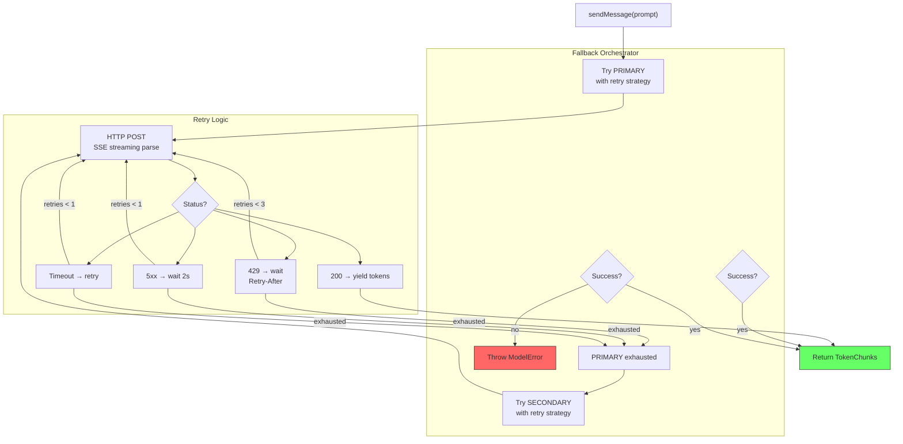

# Plan: Model Fallback

## 1. Project File Structure

```
src/
└── models/
    ├── types.ts              # Prompt, TokenChunk, ModelConfig, ModelError
    ├── client.ts             # HTTP client: POST to OpenAI-compatible /chat/completions
    ├── retry.ts              # Retry logic: 429/5xx/timeout strategies
    ├── fallback.ts           # Two-tier orchestrator: primary → secondary
    └── provider.ts           # Public API: sendMessage()

tests/
└── models/
    ├── client.test.ts
    ├── retry.test.ts
    ├── fallback.test.ts
    └── provider.test.ts
```

| File | Responsibility |
|------|---------------|
| `types.ts` | Prompt, TokenChunk, ModelError class, ModelConfig from 001-config |
| `client.ts` | Raw HTTP call (fetch or Bun.fetch) to OpenAI-compatible endpoint; SSE parsing |
| `retry.ts` | Pure retry logic: `withRetry(fn, strategy): Promise<T>` — configurable backoff |
| `fallback.ts` | Two-tier orchestrator: try primary with retry → on exhaustion, try secondary |
| `provider.ts` | `sendMessage()` — thin wrapper that calls fallback orchestrator |

---

## 2. Data Flow



---

## 3. Dependencies

### Runtime

| Package | Version | Why |
|---------|---------|-----|
| TypeScript | ^5.5 | Strict mode |

- HTTP client: `fetch` (native in Node.js 22+ and Bun)
- SSE parsing: custom (~30 lines, parse `data: {...}\n\n` lines)
- No third-party HTTP/SSE library

### Dev

| Package | Version | Why |
|---------|---------|-----|
| `vitest` | ^2 | Test runner; mock fetch with `vi.fn()` |

---

## 4. Integration Points

### Consumes

| Module | What |
|--------|------|
| 001-config | `apiKey`, `baseUrl`, `model`, `fallbackModel`, `fallbackBaseUrl` |

### Provides to

| Module | What |
|--------|------|
| 002-core-runtime | `sendMessage(prompt): AsyncGenerator<TokenChunk>` |

### Stub replacement

The stub at `src/runtime/stubs/model.ts` is replaced by `src/models/provider.ts`. The function signature is identical — no changes needed in 002.

---

## 5. Risk Points

| # | Risk | Mitigation |
|---|------|------------|
| R1 | SSE parsing edge cases (chunked across TCP packets, empty data lines, `[DONE]`) | Test with raw SSE byte streams; handle partial chunks with buffer |
| R2 | DeepSeek API format differs from OpenAI in subtle ways | Isolate differences in client.ts adapter; test against real DeepSeek API early |
| R3 | Token counting inconsistency between models | Use model's `usage` field; if missing, estimate with char/4; always mark "estimated" |
| R4 | 401/403 not retried but also might be transient (key rotation) | Document in error message: "Check your API key" |
| R5 | Connection refused (DNS/network) vs server error | Distinguish: network errors skip retry (no point), server errors retry |
