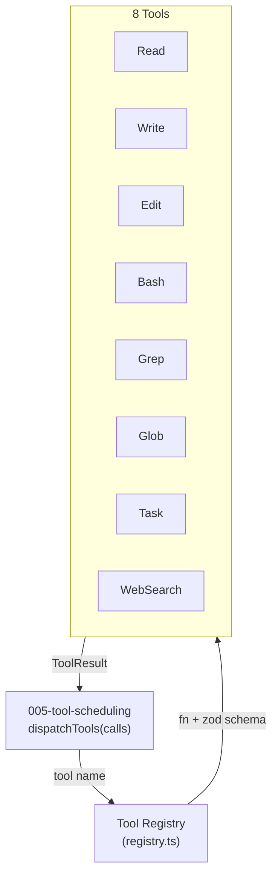

# Plan: Builtin Tools

## 1. Project File Structure

```
src/
└── tools/
    ├── types.ts              # ToolFunction, ToolContext, ToolResult, ToolRegistry
    ├── registry.ts           # Tool registration + lookup
    ├── read.ts               # Read file tool
    ├── write.ts              # Write file tool
    ├── edit.ts               # Edit (string replace) tool
    ├── bash.ts               # Bash execution tool
    ├── grep.ts               # Grep search tool
    ├── glob.ts               # Glob file match tool
    ├── task.ts               # Task management tool
    ├── web-search.ts         # Web search tool
    └── index.ts              # Export: registerAllTools()

tests/
└── tools/
    ├── registry.test.ts
    ├── read.test.ts
    ├── write.test.ts
    ├── edit.test.ts
    ├── bash.test.ts
    ├── grep.test.ts
    ├── glob.test.ts
    ├── task.test.ts
    └── web-search.test.ts
```

| File | Responsibility |
|------|---------------|
| `types.ts` | ToolFunction type, ToolContext, ToolResult, concurrency annotation |
| `registry.ts` | Map-based registry: register, get, list, isConcurrencySafe |
| `read.ts` | fs.readFileSync with offset/limit, line numbering |
| `write.ts` | fs.writeFileSync with pre-write read for diff, directory check |
| `edit.ts` | String search + replace with uniqueness check |
| `bash.ts` | child_process.exec with timeout, output capture |
| `grep.ts` | Regex search via line-by-line iteration |
| `glob.ts` | Fast glob via recursive readdir + minimatch |
| `task.ts` | In-memory task list (session-scoped) |
| `web-search.ts` | HTTP GET to search API |
| `index.ts` | registerAllTools() — registers all 8 |

---

## 2. Data Flow



Each tool follows this internal pattern:
1. Validate input args against Zod schema
2. Execute tool logic
3. Catch errors → return `{ output: "", error: "..." }` (never throw)
4. Return `{ output: "...", metadata: {...} }`

---

## 3. Dependencies

### Runtime

| Package | Version | Why |
|---------|---------|-----|
| TypeScript | ^5.5 | strict |
| `zod` | ^3.23 | Tool input validation (locked by 05) |
| `minimatch` | ^10 | Glob pattern matching (or use micromatch) |

### Node.js built-ins used

- `fs` — Read, Write, Edit, Grep, Glob
- `child_process` — Bash
- `path` — Path resolution for all file tools
- `fetch` — WebSearch HTTP

### Dev

| Package | Version | Why |
|---------|---------|-----|
| `vitest` | ^2 | Test runner with temporary directory fixtures |

---

## 4. Integration Points

### Consumes

| Module | What |
|--------|------|
| 001-config | `rulesFile` (for CLAUDE.md path, if needed by tools) |
| 005-tool-scheduling | Calls tools via registry |
| 006-permission-system | Intercepts Bash/Write/Edit before execution |

### Provides to

| Module | What |
|--------|------|
| 005-tool-scheduling | Tool registry (8 registered tools) |
| 002-core-runtime | (indirect — via 005) |

### Stub replacement

The stub at `src/runtime/stubs/tools.ts` is replaced by `src/tools/index.ts` + `src/tools/registry.ts`.

---

## 5. Risk Points

| # | Risk | Mitigation |
|---|------|------------|
| R1 | Bash commands can hang indefinitely | timeout enforced with `setTimeout` + `process.kill`; max 120s |
| R2 | Write/Edit race condition on same file | Handled by 005 serialization; tool itself is stateless |
| R3 | Glob on large repos (node_modules) | Default ignore: `node_modules`, `.git`, `dist`, `.next` |
| R4 | Edit old_string matching is fragile (whitespace) | Exact string match; trim warning in output if mismatch suspected |
| R5 | WebSearch API key/config not available | Tool returns empty gracefully; WebSearch is not required for MVP |
| R6 | Task tool state lost on crash | Tasks are in-memory; persisted when 009 saves full session (tasks embedded in session state) |
