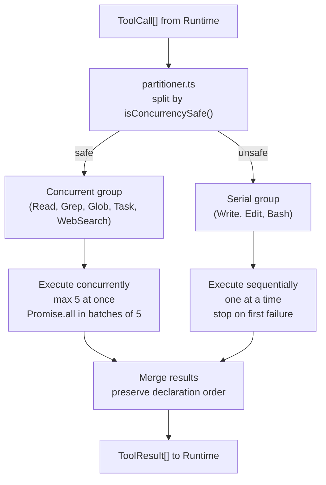

# Plan: Tool Scheduling

## 1. Project File Structure

```
src/
└── scheduling/
    ├── types.ts              # ToolCall, ToolResult, BatchPlan
    ├── partitioner.ts        # Partition calls: concurrent-safe vs serial
    ├── executor.ts           # Execute concurrent group, then serial group
    ├── scheduler.ts          # Public API: dispatchTools()
    └── index.ts              # Export: createScheduler()

tests/
└── scheduling/
    ├── partitioner.test.ts
    ├── executor.test.ts
    └── scheduler.test.ts
```

| File | Responsibility |
|------|---------------|
| `types.ts` | ToolCall, ToolResult, BatchPlan (concurrent: ToolCall[], serial: ToolCall[]) |
| `partitioner.ts` | Pure function: `partition(calls, registry): BatchPlan` |
| `executor.ts` | `executeBatch(plan, registry): Promise<ToolResult[]>` — concurrency + order |
| `scheduler.ts` | `dispatchTools()` — thin orchestrator |
| `index.ts` | Public export |

---

## 2. Data Flow



**Concurrency implementation:**

```
async function executeConcurrent(calls: ToolCall[]): Promise<ToolResult[]> {
  const results = new Array(calls.length)
  const chunks = chunkArray(calls, 5)  // split into batches of 5
  for (const chunk of chunks) {
    const chunkResults = await Promise.allSettled(
      chunk.map((call, i) => executeOne(call))
    )
    // Map results back to original indices; never throw
  }
  return results
}
```

---

## 3. Dependencies

### Runtime

| Package | Version | Why |
|---------|---------|-----|
| TypeScript | ^5.5 | strict |

No third-party dependencies. Concurrency uses `Promise.allSettled` (native) + `Array` chunking.

### Dev

| Package | Version | Why |
|---------|---------|-----|
| `vitest` | ^2 | Test runner; mock tool registry |

---

## 4. Integration Points

### Consumes

| Module | What |
|--------|------|
| 004-builtin-tools | `registry.getTool(name)`, `registry.isConcurrencySafe(name)` |
| 006-permission-system | `checkPermission(toolName, args)` before each tool executes |

### Provides to

| Module | What |
|--------|------|
| 002-core-runtime | `dispatchTools(calls): Promise<ToolResult[]>` |

### Stub replacement

Replace `src/runtime/stubs/tools.ts` dispatch function with `src/scheduling/scheduler.ts`.

---

## 5. Risk Points

| # | Risk | Mitigation |
|---|------|------------|
| R1 | Promise.allSettled on 5 tools — one hangs | Individual tool timeouts prevent this; if a tool hangs > 120s, its own timeout kills it |
| R2 | Results out of order when mapping back | Use index-based result array, not push |
| R3 | Permission check adds latency to each serial tool | Permission check is near-instant (synchronous for auto-approve, parallel for human wait in serial) |
| R4 | Serial group stops on first failure — too aggressive? | PRD requires this (AC-SCH-02). User can retry by describing the task differently. |
