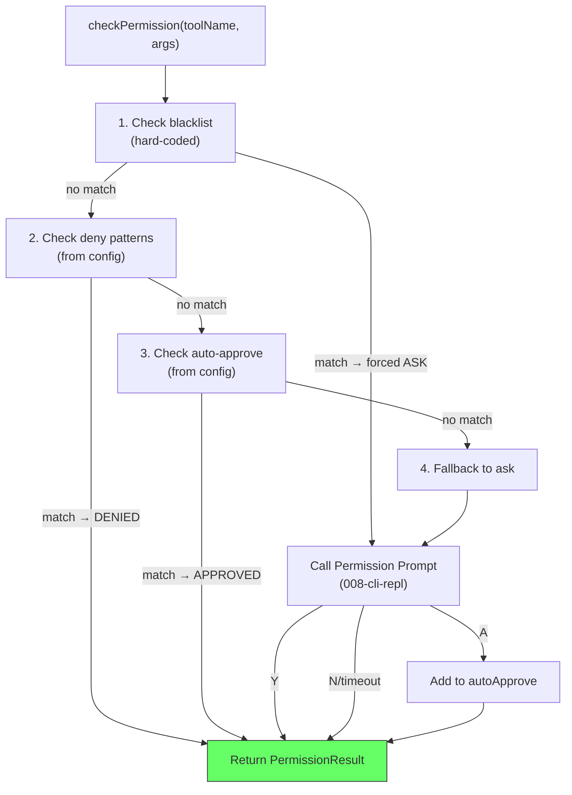

# Plan: Permission System

## 1. Project File Structure

```
src/
└── permissions/
    ├── types.ts              # PermissionResult, PermissionRule, PermissionEvent
    ├── blacklist.ts          # Hard-coded dangerous command patterns
    ├── matcher.ts            # Pattern matching: toolName:arg_pattern
    ├── checker.ts            # Core logic: blacklist → deny → approve → ask
    ├── prompt-adapter.ts     # Adapter to CLI permission prompt (008)
    └── index.ts              # Public API: createPermissionSystem()

tests/
└── permissions/
    ├── blacklist.test.ts
    ├── matcher.test.ts
    └── checker.test.ts
```

| File | Responsibility |
|------|---------------|
| `types.ts` | PermissionResult, PermissionRule, PermissionEvent |
| `blacklist.ts` | Static array of patterns that always force ask; never editable by config |
| `matcher.ts` | `matchPattern(toolName, args, pattern): boolean` — glob-style matching |
| `checker.ts` | `checkPermission()` — tier resolution logic |
| `prompt-adapter.ts` | Calls CLI permission prompt (008); injected as dependency |
| `index.ts` | Public export |

---

## 2. Data Flow



**Pattern matching algorithm:**

```
matchPattern(toolName: string, args: object, pattern: string): boolean
  1. Split pattern by ":" → [patternTool, patternArgs]
  2. If patternTool !== toolName AND patternTool !== "*" → false
  3. Build args string: join all arg values with " "
  4. Convert patternArgs to regex: escape regex chars, replace "*" with ".*"
  5. Test args string against regex
```

Examples:
- `Read:*` matches `Read("any/file.ts")`
- `Bash:git *` matches `Bash("git commit -m 'fix'")`
- `Bash:rm *` does NOT match `Bash("git status")`

---

## 3. Dependencies

### Runtime

| Package | Version | Why |
|---------|---------|-----|
| TypeScript | ^5.5 | strict |

No third-party runtime dependencies. Pattern matching uses built-in `RegExp`.

### Dev

| Package | Version | Why |
|---------|---------|-----|
| `vitest` | ^2 | Test runner |

---

## 4. Integration Points

### Consumes

| Module | What |
|--------|------|
| 001-config | `permissions.autoApprove`, `permissions.deny`, `permissions.askTimeout` |
| 008-cli-repl | `promptPermission()` — injected as a callback dependency |

### Provides to

| Module | What |
|--------|------|
| 005-tool-scheduling | `checkPermission(toolName, args): Promise<PermissionResult>` |

### Dependency injection for prompt

The permission checker is a pure function except for the ask prompt. The prompt function is injected:

```
createPermissionSystem(config, promptFn)
```

In tests, `promptFn` is a mock returning "approved"/"denied". In production, it's 008's `promptPermission()`.

### Stub replacement

Replace `src/runtime/stubs/permission.ts` with `src/permissions/index.ts`.

---

## 5. Risk Points

| # | Risk | Mitigation |
|---|------|------------|
| R1 | Blacklist too narrow — new dangerous patterns emerge | Blacklist is a static file; easy to add patterns. Audited on each release. |
| R2 | Pattern bypass via shell tricks (`rm --no-preserve-root`) | Blacklist patterns cover common variants; deny-all default for Bash is sensible (`Bash:*` in deny + explicit allow for safe commands) |
| R3 | "Always" adds too-broad pattern accidentally | Log pattern added; displayed in session summary; user can edit config file to remove |
| R4 | Permission check latency when prompt is needed | Prompt has 30s timeout; scheduling pauses for that tool only; concurrent tools keep running |
