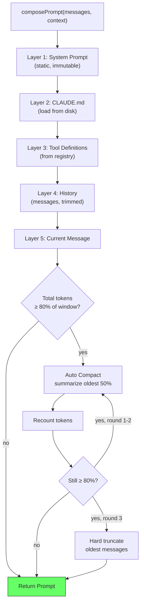

# Plan: Context Management

## 1. Project File Structure

```
src/
└── context/
    ├── types.ts                  # Message, Prompt, PromptContext, CompactionSummary
    ├── composer.ts               # Orchestrator: assemble 5-layer prompt
    ├── system-prompt.ts          # Static system prompt template
    ├── rules-loader.ts           # Read CLAUDE.md, trim, inject
    ├── tool-defs-layer.ts        # Format tool schemas for prompt
    ├── history-layer.ts          # Build conversation history + apply trim
    ├── compactor.ts              # Auto Compact: summarize oldest 50% of history
    ├── token-counter.ts          # Token estimation (char/4) + model usage tracking
    └── index.ts                  # Public API: composePrompt()

tests/
└── context/
    ├── composer.test.ts
    ├── compactor.test.ts
    ├── token-counter.test.ts
    └── rules-loader.test.ts
```

| File | Responsibility |
|------|---------------|
| `types.ts` | Message, Prompt, PromptContext, CompactionSummary types |
| `composer.ts` | Orchestrates 5 layers; checks token threshold; triggers compaction |
| `system-prompt.ts` | Single exported string constant — Agent's base identity |
| `rules-loader.ts` | File I/O for CLAUDE.md; size check + trim |
| `tool-defs-layer.ts` | Format tool registry entries as prompt text |
| `history-layer.ts` | Convert Message[] to prompt format; apply tool result trimming |
| `compactor.ts` | Summarize history using template-based extraction from message content |
| `token-counter.ts` | `estimateTokens(text)` + `trackUsage(usage)` |

---

## 2. Data Flow



**Compaction algorithm detail:**

```
Input: messages[], currentTokenCount
1. Sort messages by token count (largest first)
2. Select oldest 50% (by timestamp, not token size)
3. Extract from selected messages:
   - File paths modified (from Write/Edit tool results)
   - Error messages (from error responses)
   - Key decisions (from user approval events)
   - Current goal (from last user message)
4. Generate summary string:
   "## Previous conversation summary
   - Modified files: {list}
   - Errors encountered: {list}
   - Key decisions: {list}
   - Current goal: {text}
   - {N} turns summarized"
5. Replace selected messages with single summary message in history
6. Return new messages[] + new token count
```

---

## 3. Dependencies

### Runtime

| Package | Version | Why |
|---------|---------|-----|
| TypeScript | ^5.5 | strict |

No third-party runtime dependencies. All logic is string manipulation + file I/O.

### Dev

| Package | Version | Why |
|---------|---------|-----|
| `vitest` | ^2 | Test runner |

---

## 4. Integration Points

### Consumes

| Module | What |
|--------|------|
| 001-config | `rulesFile` path |
| 004-builtin-tools | Tool definitions via registry.listTools() |

### Provides to

| Module | What |
|--------|------|
| 002-core-runtime | `composePrompt(messages, context): Prompt` |

### Stub replacement

The stub at `src/runtime/stubs/context.ts` is replaced by `src/context/index.ts`.

---

## 5. Risk Points

| # | Risk | Mitigation |
|---|------|------------|
| R1 | Compaction summary loses critical context (e.g., partial bug fix state) | Summary template explicitly captures: modified files, error messages, current goal. Unit test verifies these are preserved. |
| R2 | Token estimation (char/4) inaccurate for non-Latin scripts | Over-estimate (safe direction). When real usage is available, use it and log the estimation error for tuning. |
| R3 | System prompt too large after CLAUDE.md injection | CLAUDE.md capped at 50KB; system prompt + tool defs + CLAUDE.md must be < 25% of context window — if exceeded, trim CLAUDE.md further. |
| R4 | Compaction runs mid-turn causing latency spike | Compaction ≤ 3s target (PRD NFR). Measured in integration test. |
| R5 | DeepSeek context window differs from Anthropic's 200K | Configurable contextWindowTokens from model config (003) — not hardcoded. |
