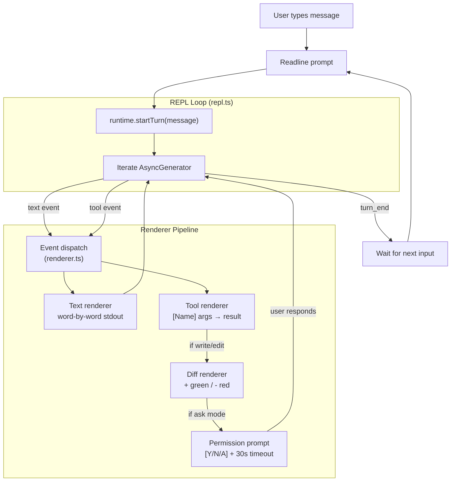

# Plan: CLI REPL

## 1. Project File Structure

```
src/
├── index.ts                          # (updated) Full REPL entry point
└── cli/
    ├── types.ts                      # RenderEvent, TerminalSize, DiffBlock
    ├── input.ts                      # User input: readline-based prompt
    ├── renderer.ts                   # Output orchestrator: routes events to renderers
    ├── text-renderer.ts              # Streaming text word-by-word
    ├── tool-renderer.ts              # Tool call status cards
    ├── diff-renderer.ts              # Unified diff with +/-
    ├── permission-prompt.ts          # Y/N/A interactive prompt
    ├── todo-panel.ts                 # Task list sidebar
    ├── summary.ts                    # Turn-end summary line
    └── repl.ts                       # Main REPL loop: input → runtime → render → repeat

tests/
└── cli/
    ├── renderer.test.ts
    ├── diff-renderer.test.ts
    ├── permission-prompt.test.ts
    └── repl.test.ts                  # Integration: simulate input, capture output
```

| File | Responsibility |
|------|---------------|
| `types.ts` | RenderEvent discriminated union, TerminalSize |
| `input.ts` | Readline wrapper: multi-line paste, /commands (/help, /plan, /exit) |
| `renderer.ts` | Dispatches TurnEvents to correct renderer (text/tool/diff/permission) |
| `text-renderer.ts` | `process.stdout.write` word-by-word; handles line wrapping at terminal width |
| `tool-renderer.ts` | Prints tool call + result in one line: `[Name] args → result` |
| `diff-renderer.ts` | Unified diff output: green `+` lines, red `-` lines, context lines |
| `permission-prompt.ts` | Displays prompt, waits for single keypress (Y/N/A), 30s timeout |
| `todo-panel.ts` | Renders task list in right margin or bottom section |
| `summary.ts` | Format and print turn-end statistics |
| `repl.ts` | Main loop: show prompt → read input → call runtime.startTurn() → iterate events → render |

---

## 2. Data Flow



**Key rendering detail — streaming text:**

```
For each text token:
  1. Append to current line buffer
  2. If buffer contains a space or newline: flush word to stdout
  3. If current line length > terminal width: wrap with indent
  4. process.stdout.write(word)
```

No cursor manipulation, no TUI framework for MVP — simple terminal output. If Ink TUI is added later, the renderer functions are swapped but the event interface stays the same.

---

## 3. Dependencies

### Runtime

| Package | Version | Why |
|---------|---------|-----|
| TypeScript | ^5.5 | strict |
| `readline` | (Node.js built-in) | Terminal input with line editing |

### No TUI framework in MVP

The plan uses plain `process.stdout.write` + `readline` for MVP simplicity. The event-based renderer interface allows swapping to Ink TUI in P1 without changing any other module.

### Dev

| Package | Version | Why |
|---------|---------|-----|
| `vitest` | ^2 | Test runner; mock stdout capture |

---

## 4. Integration Points

### Consumes

| Module | What |
|--------|------|
| 002-core-runtime | `startTurn(message): AsyncGenerator<TurnEvent>` |
| 001-config | Config for startup message (model name) |

### Provides to

(None — CLI is the top-level consumer; it produces terminal output)

### Skeleton evolution

The skeleton in `src/index.ts` (built in 001) is replaced with the full REPL loop. The startup sequence is now: load config → show header → enter REPL loop.

---

## 5. Risk Points

| # | Risk | Mitigation |
|---|------|------------|
| R1 | Streaming output slower than model → user perceives lag | Text renderer flushes immediately on each word boundary; no buffering |
| R2 | Terminal width detection fails (piped, CI, non-TTY) | Default to 80 columns when `process.stdout.columns` is undefined |
| R3 | Permission prompt blocks event loop → streaming pauses | Keypress listener is async/promise-based; does not block the event loop |
| R4 | Diff output for binary/special characters corrupts terminal | Sanitize: replace non-printable chars with `.` in diff output |
| R5 | Fast successive tool calls flood terminal output | Rate limit: max 1 tool status line per 200ms; batch concurrent tools into one line |
