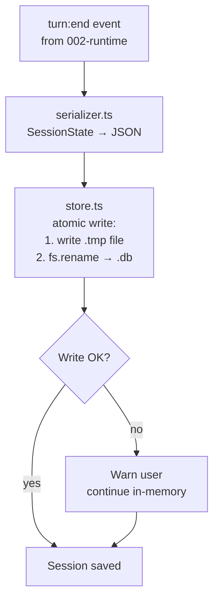

# Plan: Session Persistence

## 1. Project File Structure

```
src/
└── persistence/
    ├── types.ts              # SessionRecord, SessionSummary, SaveResult
    ├── store.ts              # SQLite operations: insert, update, query
    ├── serializer.ts         # SessionState ↔ JSON (for storage)
    ├── session-manager.ts    # Orchestrator: save, load, list
    └── index.ts              # Public API

tests/
└── persistence/
    ├── serializer.test.ts
    └── session-manager.test.ts
```

| File | Responsibility |
|------|---------------|
| `types.ts` | SessionRecord (DB row), SessionSummary (for --list), SaveResult |
| `store.ts` | SQLite CRUD: CREATE TABLE, INSERT, SELECT, UPDATE with parameterized queries |
| `serializer.ts` | SessionState → JSON string (with Message[] → JSON array); reverse |
| `session-manager.ts` | Business logic: atomic write via temp file, corruption detection |
| `index.ts` | Public export |

---

## 2. Data Flow



**Resume flow:**

```
superagent --resume
    │
    ▼
Read sessions table → get latest session_id
    │
    ▼
Load full SessionState from DB
    │
    ▼
Inject system message: "You were interrupted. Continue from where you left off: {last_goal}"
    │
    ▼
Enter REPL loop (turn continues from last saved turnNumber + 1)
```

**SQLite schema:**

```sql
CREATE TABLE IF NOT EXISTS sessions (
  id TEXT PRIMARY KEY,
  created_at INTEGER NOT NULL,
  updated_at INTEGER NOT NULL,
  turn_count INTEGER NOT NULL DEFAULT 0,
  first_message TEXT,
  state_json TEXT NOT NULL
);
```

One row per session. `state_json` contains the full serialized SessionState.

---

## 3. Dependencies

### Runtime

| Package | Version | Why |
|---------|---------|-----|
| TypeScript | ^5.5 | strict |
| `better-sqlite3` | ^11 | Synchronous SQLite (locked by 05-决策汇总) |

### Dev

| Package | Version | Why |
|---------|---------|-----|
| `vitest` | ^2 | Test runner; use `:memory:` database for tests |

---

## 4. Integration Points

### Consumes

| Module | What |
|--------|------|
| 002-core-runtime | SessionState (messages, turnNumber, toolResults) |

### Provides to

| Module | What |
|--------|------|
| 002-core-runtime | `loadSession(id)` → SessionState for --resume |
| 008-cli-repl | `listSessions()` → display for --list |

### Storage location

`~/.superagent/sessions.db` — same directory as global config. Project-level override possible via `.superagent/sessions.db`.

### Stub replacement

Replace `src/runtime/stubs/session.ts` with `src/persistence/index.ts`.

---

## 5. Risk Points

| # | Risk | Mitigation |
|---|------|------------|
| R1 | SQLite corruption on crash during write | Atomic write: write to `.tmp` file → `fs.renameSync` (atomic on same filesystem) |
| R2 | Session JSON grows very large (200+ turns) | SessionState.message array can be large; SQLite handles TEXT up to 1GB; warn at 100MB |
| R3 | better-sqlite3 native compilation issues | Pre-built binaries for Node.js 22+; fallback to JSON file if SQLite unavailable |
| R4 | Multiple Agent instances writing to same DB | Write lock via SQLite (inherent); second writer gets SQLITE_BUSY → wait 500ms → retry |
