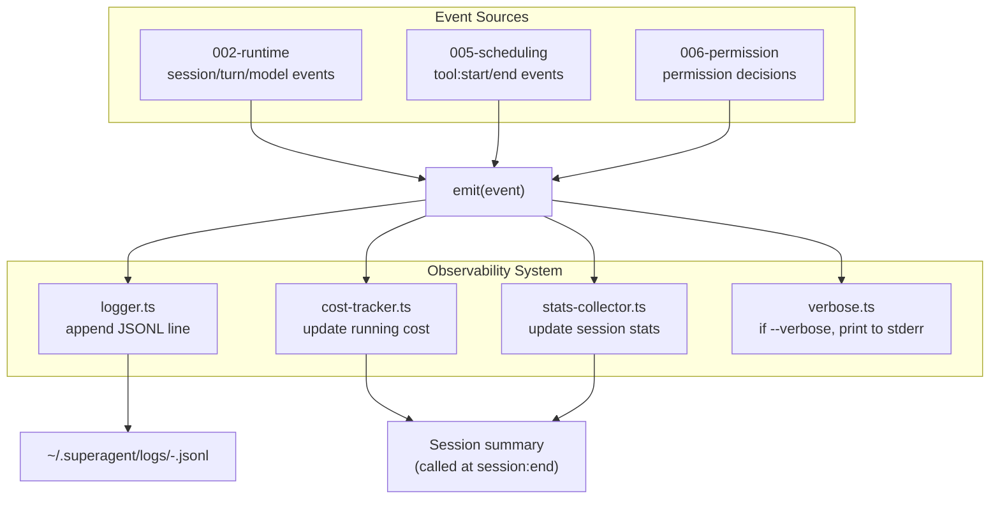

# Plan: Observability

## 1. Project File Structure

```
src/
└── observability/
    ├── types.ts              # LogEvent union, SessionStats, CostModel
    ├── logger.ts             # JSONL file writer + rotation
    ├── cost-tracker.ts       # Token → $ conversion + running totals
    ├── stats-collector.ts    # Aggregate session stats (turns, files, tokens, cost)
    ├── verbose.ts            # --verbose mode: print model request/response
    └── index.ts              # Public API: createObservability()

tests/
└── observability/
    ├── logger.test.ts
    ├── cost-tracker.test.ts
    └── stats-collector.test.ts
```

| File | Responsibility |
|------|---------------|
| `types.ts` | LogEvent discriminated union, SessionStats, CostModel price table |
| `logger.ts` | Append JSON line to `.jsonl` file; rotation at 50MB; mkdir on first write |
| `cost-tracker.ts` | Token × price table → cost; cumulative session cost |
| `stats-collector.ts` | Track files changed (from Write/Edit tool results), turn count, total tokens |
| `verbose.ts` | Print model request/response to stderr with key redaction |
| `index.ts` | Public export: `createObservability(config)` |

---

## 2. Data Flow



---

## 3. Dependencies

### Runtime

| Package | Version | Why |
|---------|---------|-----|
| TypeScript | ^5.5 | strict |
| `pino` | ^9 | Structured JSON logger (locked by 05-决策汇总) |

**pino usage**: Each LogEvent is passed to `pino.info(event)`. Pino handles:
- Timestamps (automatic)
- JSON serialization (automatic)
- File streams (via `pino.destination()`)
- Rotation (via `pino-rotating-file` or manual rotation check)

### Dev

| Package | Version | Why |
|---------|---------|-----|
| `vitest` | ^2 | Test runner |

---

## 4. Integration Points

### Consumes

| Module | What |
|--------|------|
| 002-core-runtime | Lifecycle events (session, turn, model) |
| 005-tool-scheduling | Tool start/end events |
| 006-permission-system | Permission decision events |

### Provides to

| Module | What |
|--------|------|
| 008-cli-repl | `getSessionStats()` for turn-end summary |

### Stub replacement

Replace `src/runtime/stubs/observe.ts` with `src/observability/index.ts`.

---

## 5. Risk Points

| # | Risk | Mitigation |
|---|------|------------|
| R1 | Log file grows too fast (100MB in one session) | Rotation at 50MB; max 3 files = 150MB ceiling per session |
| R2 | Cost calculation wrong → user surprised by bill | Use model-returned `usage` for token counts; log both raw numbers and calculated cost |
| R3 | pino dependency adds complexity for simple needs | pino is lightweight (~5KB); use pino's minimal mode (no transports, no pretty-print) |
| R4 | API key leaks in verbose mode | Redact `sk-*` patterns, `Authorization` headers, and `apiKey` values before printing |
| R5 | Disk I/O from logging blocks event loop | pino is async by default; uses stream buffering; no synchronous `fs.writeSync` calls |
