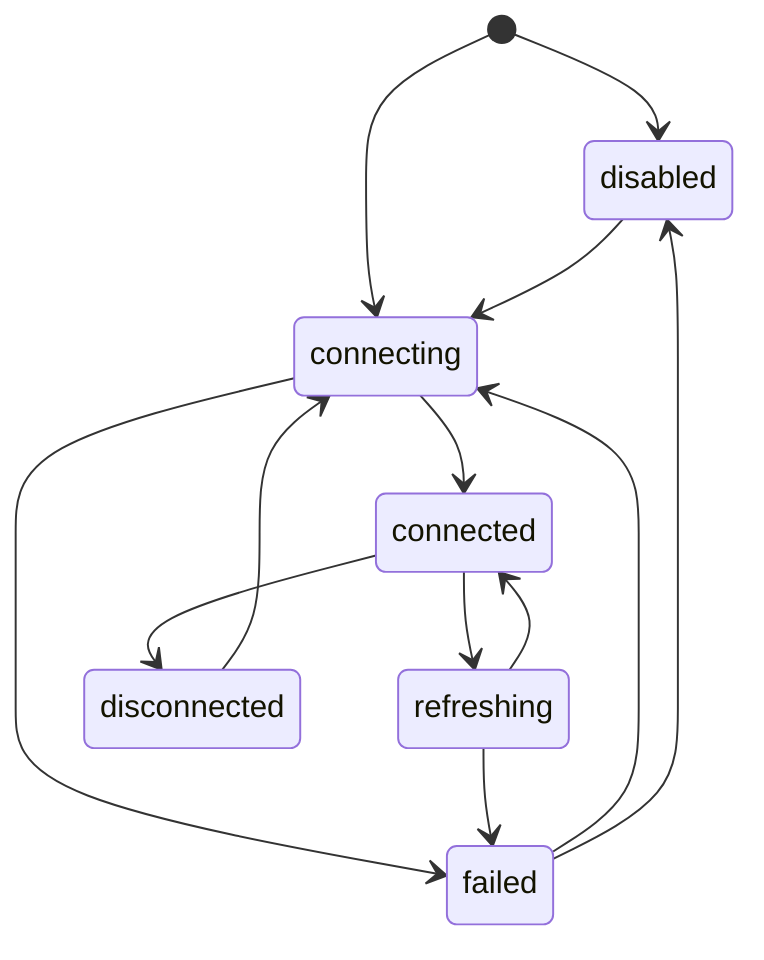

# Data Model: MCP Server Integration

## MCP Server Config

| Field | Description | Validation |
|-------|-------------|------------|
| `name` | Unique server identifier used in tool identity | Non-empty; safe identifier for permission keys |
| `enabled` | Whether this server should connect | Defaults to true when present |
| `transport` | Connection kind | `stdio` or `http` |
| `command` | Local command for stdio servers | Required for stdio |
| `args` | Command arguments for stdio servers | Optional list |
| `env` | Additional environment variables | Optional; secret-like values redacted in output |
| `url` | Remote server URL | Required for http |
| `headers` | Remote request headers | Optional; secret-like values redacted |

## MCP Server Session

| Field | Description |
|-------|-------------|
| `serverName` | Config name |
| `state` | `disabled`, `connecting`, `connected`, `refreshing`, `failed`, or `disconnected` |
| `lastError` | User-safe failure summary, if any |
| `tools` | Current discovered tool definitions |
| `connectedAt` | Timestamp for successful connection |
| `updatedAt` | Last state update timestamp |

## MCP Tool Definition

| Field | Description |
|-------|-------------|
| `serverName` | Origin server |
| `toolName` | Tool name as exposed by MCP server |
| `permissionKey` | Stable `mcp__server__tool` identity |
| `description` | User/model-visible tool description |
| `inputSchema` | Tool input schema exposed by the server |
| `isAvailable` | Whether the current session can invoke it |

## MCP Tool Call

| Field | Description |
|-------|-------------|
| `serverName` | Origin server |
| `toolName` | Requested tool |
| `permissionKey` | Permission identity evaluated |
| `permissionDecision` | `allow`, `ask`, or `deny` |
| `input` | Tool input after validation |
| `result` | Normalized success result or safe error |
| `durationMs` | Execution duration |
| `success` | Whether call succeeded |

## State Transitions

## Identity Rules

- Permission key format: `mcp__<serverName>__<toolName>`.
- `serverName` and `toolName` must be normalized before building permission keys.
- Built-in tool names and MCP tool names must never collide because MCP tools always include the `mcp__` prefix.
