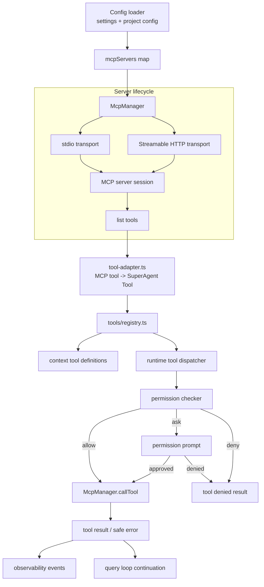
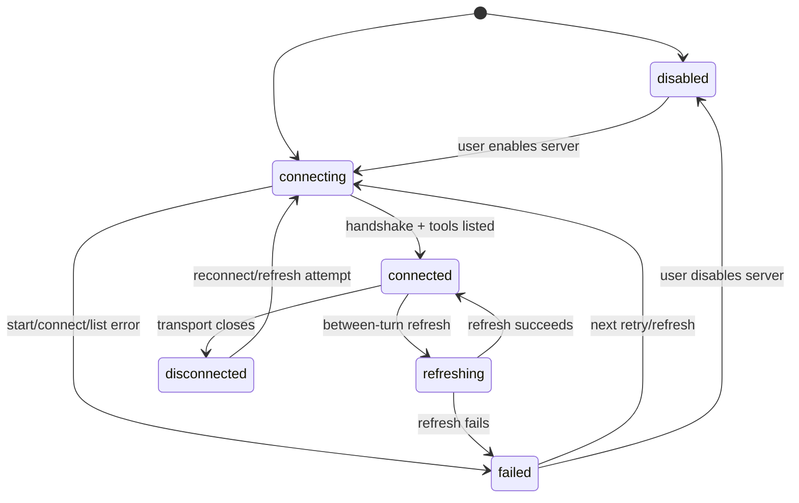

# Plan: MCP Server Integration

## 1. Project File Structure

```
src/
├── config/
│   ├── types.ts              # Add mcpServers config shape
│   ├── defaults.ts           # Default empty MCP server map
│   └── validator.ts          # Validate stdio/http server config
├── mcp/
│   ├── types.ts              # MCP config/session/tool/call domain types
│   ├── manager.ts            # Own server sessions, connect, refresh, shutdown
│   ├── transports.ts         # Build stdio and Streamable HTTP client transports
│   ├── tool-adapter.ts       # Convert MCP tool definitions into SuperAgent tools
│   ├── tool-names.ts         # Stable mcp__server__tool identity helpers
│   ├── errors.ts             # User-safe MCP error normalization and redaction
│   └── index.ts              # Public API: createMcpManager()
├── tools/
│   └── registry.ts           # Register built-in + discovered MCP tools
├── permissions/
│   ├── matcher.ts            # Match mcp__, mcp__server__*, mcp__server__tool rules
│   └── checker.ts            # Default MCP decision = ask unless allow/deny rule exists
├── runtime/
│   ├── runtime.ts            # Create MCP manager at session startup
│   ├── query-loop.ts         # Refresh MCP tools between turns
│   └── tool-dispatcher.ts    # Execute adapted MCP tools via normal tool path
└── observability/
    └── types.ts              # Add MCP connection/tool lifecycle event variants

tests/
├── mcp/
│   ├── tool-names.test.ts
│   ├── manager.test.ts
│   ├── tool-adapter.test.ts
│   ├── permissions.test.ts
│   └── integration.test.ts
├── config/
│   └── mcp-config.test.ts
└── runtime/
    └── mcp-refresh.test.ts
```

| File | Responsibility |
|------|----------------|
| `src/mcp/types.ts` | Own domain model for server config, session state, tool metadata, and tool call results |
| `src/mcp/manager.ts` | Connect enabled servers, track states, list tools, refresh, isolate failures, close sessions |
| `src/mcp/transports.ts` | Construct MCP SDK transports for local command and remote Streamable HTTP servers |
| `src/mcp/tool-adapter.ts` | Wrap discovered MCP tools in the existing `Tool` interface |
| `src/mcp/tool-names.ts` | Generate and parse Claude Code-style names: `mcp__<server>__<tool>` |
| `src/mcp/errors.ts` | Normalize failed connects/calls into safe user-visible errors with secrets redacted |
| `src/tools/registry.ts` | Accept dynamic MCP tools without mutating built-in definitions |
| `src/permissions/*` | Apply existing allow/ask/deny rules with MCP-specific default ask and deny precedence |

---

## 2. Data Flow



---

## 3. Technical Context

| Area | Decision |
|------|----------|
| Language/runtime | TypeScript strict on Node/Bun-compatible runtime |
| MCP SDK | `@modelcontextprotocol/sdk`, matching `specs/research/05-决策汇总.md` |
| Transport scope | Local command-based stdio and remote Streamable HTTP |
| Tool identity | Claude Code-compatible `mcp__<serverName>__<toolName>` |
| Permission default | Newly discovered MCP tools default to `ask` unless explicit allow/deny rule matches |
| Rule precedence | `deny` overrides allow/ask, following constitution security rule |
| Config model | Add `mcpServers` to existing layered JSON config; project config can supplement/override global config |
| Observability | Emit structured events for connection state changes and MCP tool calls |
| Testing | Vitest unit + integration tests with fake MCP servers; no real external service dependency |

---

## 4. Dependencies

### Runtime

| Package | Version | Why |
|---------|---------|-----|
| `@modelcontextprotocol/sdk` | latest compatible | Official MCP client transports and protocol types |

### Dev/Test

| Package | Version | Why |
|---------|---------|-----|
| `vitest` | existing | Unit and integration tests |
| local fake MCP server fixture | test-only | Deterministic stdio/HTTP server behavior without network dependencies |

---

## 5. Integration Points

### Consumes

| Module | What |
|--------|------|
| `001-config-system` | Load and validate `mcpServers` from layered settings |
| `004-builtin-tools` | Reuse `Tool` interface and tool registry conventions |
| `005-tool-scheduling` | MCP tools participate in normal scheduling; default not concurrency-safe unless metadata later proves otherwise |
| `006-permission-system` | Evaluate `mcp__*`, `mcp__server__*`, and `mcp__server__tool` rules |
| `010-observability` | Emit MCP connection and tool call events |
| `002-core-runtime` | Initialize manager at session start and refresh tools between turns |

### Provides to

| Module | What |
|--------|------|
| `007-context-management` | Dynamic list of MCP tool definitions for prompt/tool context |
| `008-cli-repl` | Server/tool identity for permission prompts and tool cards |
| `010-observability` | Event payloads for MCP lifecycle and calls |

---

## 6. State Model



| State | Meaning |
|-------|---------|
| `disabled` | Config exists but is not active |
| `connecting` | Runtime is starting command or opening remote connection |
| `connected` | Server session active and tools available |
| `refreshing` | Tool list is being updated |
| `failed` | Last connection or refresh failed; session continues without this server's tools |
| `disconnected` | Previously connected transport closed unexpectedly |

---

## 7. Permission Model

| Rule pattern | Meaning |
|--------------|---------|
| `mcp__*` | All MCP tools |
| `mcp__github__*` | All tools from server `github` |
| `mcp__github__create_issue` | One specific tool from server `github` |

Evaluation order:

1. Normalize MCP tool call to `mcp__<server>__<tool>`.
2. Check deny rules first.
3. Check allow rules.
4. Check ask rules.
5. If no rule matches, return `ask` for MCP tools.

This preserves the constitution rule that deny always overrides auto-approve and avoids treating server discovery as execution trust.

---

## 8. Error Handling & Secret Redaction

| Failure | Behavior |
|---------|----------|
| Command missing | Mark server `failed`, show concise setup error |
| Remote unreachable | Mark server `failed`, keep built-in tools available |
| Tool call timeout | Return MCP tool error result; keep server recoverable |
| Malformed tool result | Return normalized error and log raw category without leaking data |
| Oversized result | Truncate before injecting into context and include truncation marker |
| Secret-like config value | Redact in logs, terminal output, verbose output, and errors |

---

## 9. Observability Events

Add events to the existing observability union:

| Event | Purpose |
|-------|---------|
| `mcp:server_connect_start` | Server connection attempt begins |
| `mcp:server_connect_end` | Server connection succeeds/fails with safe reason |
| `mcp:tools_refresh` | Tool list refreshed with count and success/failure |
| `mcp:tool_start` | MCP tool invocation begins |
| `mcp:tool_end` | MCP tool invocation ends with duration and success/failure |

All events include `serverName`; tool events include `toolName` and `permissionKey`.

---

## 10. Test Strategy

| Layer | Tests |
|-------|-------|
| Unit | Tool name normalization/parsing; config validation; MCP permission matching; error redaction |
| Manager | Connect success/failure; state transitions; refresh adds/removes tools; shutdown closes sessions |
| Adapter | MCP tool definition becomes existing `Tool`; invocation returns expected tool result shape |
| Permission integration | Unknown MCP tool defaults ask; explicit allow works; deny overrides allow |
| Runtime integration | Session startup discovers fake MCP server tools; between-turn refresh changes tool list |
| Observability | MCP connection/tool events are emitted and redact secrets |

No tests should require public network or real third-party MCP services.

---

## 11. Risk Points

| # | Risk | Mitigation |
|---|------|------------|
| R1 | External MCP tools have hidden side effects | Default ask; require explicit allowlist; show server/tool identity in prompts |
| R2 | Dynamic tools destabilize prompt cache/context | Keep built-in tool order stable; append MCP tools deterministically by server/tool name |
| R3 | One broken MCP server blocks startup | Connect failures are isolated and non-fatal |
| R4 | Secrets leak through config or error messages | Central redaction in `mcp/errors.ts`; reuse verbose redaction patterns |
| R5 | Tool names collide or become ambiguous | Server-qualified identity `mcp__server__tool` everywhere |
| R6 | Remote MCP transport introduces flaky tests | Use fake local test servers and mock transports for deterministic tests |

---

## 12. Constitution Check

| Principle | Status |
|-----------|--------|
| Model freedom | Pass — MCP is model/provider independent |
| MIT open source | Pass — official SDK dependency must be license-compatible before implementation |
| CLI-first | Pass — config and permission prompts remain CLI-first |
| Local-first | Pass — no code upload; remote MCP only when user configures endpoint |
| API keys never leak | Pass with explicit redaction requirement |
| Dangerous operations intercepted | Pass — all MCP calls enter permission system; deny overrides allow |
| TypeScript strict / no unjustified any | Pass — plan creates typed domain layer |
| TDD discipline | Pass — task list will require tests before implementation |
