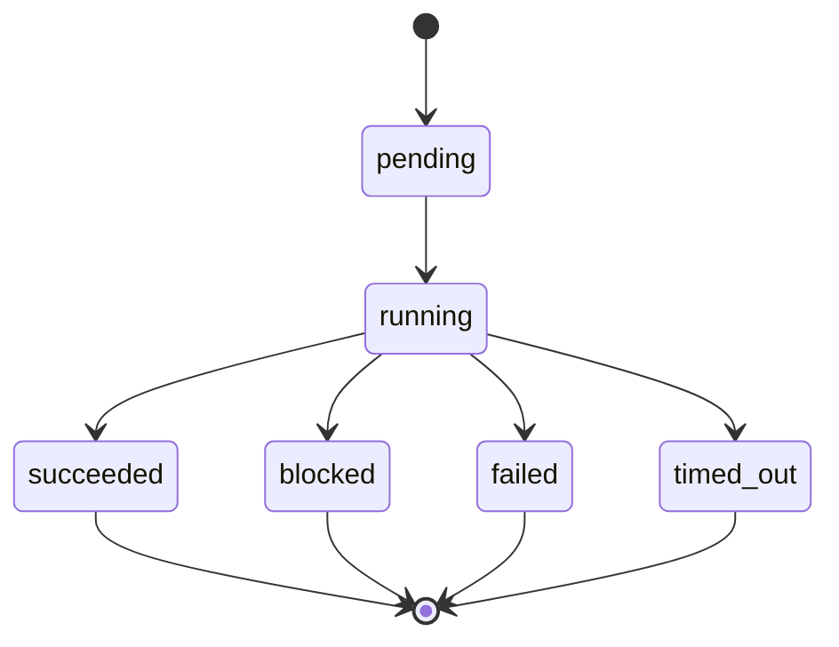

# Data Model: Hooks Lifecycle System

## Hook Config

| Field | Description | Validation |
|-------|-------------|------------|
| `name` | Human-readable hook identifier used in logs and errors | Non-empty safe string |
| `enabled` | Whether this hook should run | Defaults to true when present |
| `event` | Lifecycle event where the hook runs | One supported hook event |
| `command` | Local executable to run | Required for command hooks |
| `args` | Command arguments | Optional list of strings |
| `env` | Additional environment variables | Optional; secret-like values redacted in output |
| `timeoutMs` | Maximum execution time | Optional positive integer; default from config |
| `matcher` | Event-specific filter | Optional; schema depends on event |
| `blocking` | Whether a supported pre-action hook may block | Only meaningful for `UserPromptSubmit` and `PreToolUse` |

## Hook Event

| Field | Description |
|-------|-------------|
| `event` | Lifecycle event name |
| `sessionId` | Current session ID |
| `turnId` | Current turn ID when available |
| `timestamp` | Event timestamp |
| `cwd` | Current working directory |
| `payload` | Event-specific safe payload |

### Supported Events

| Event | Payload |
|-------|---------|
| `SessionStart` | session metadata, config source summary |
| `UserPromptSubmit` | prompt text and prompt metadata |
| `PreToolUse` | tool name, tool input summary, permission key if available |
| `PostToolUse` | tool name, success result summary, duration |
| `PostToolUseFailure` | tool name, safe error summary, duration |
| `PreCompact` | compaction trigger and token/context summary |
| `Stop` | final session status and summary stats |

## Hook Matcher

| Field | Description |
|-------|-------------|
| `tool` | Tool identity to match for tool hooks, e.g. `Bash`, `Read`, `mcp__server__tool`, or `*` |
| `inputPattern` | Optional string pattern applied to serialized tool input |
| `promptPattern` | Optional string pattern applied to submitted prompt text |

## Hook Execution

| Field | Description |
|-------|-------------|
| `hookName` | Configured hook name |
| `event` | Lifecycle event name |
| `startedAt` | Start timestamp |
| `durationMs` | Execution duration |
| `exitCode` | Process exit code if available |
| `timedOut` | Whether timeout terminated the process |
| `stdout` | Redacted/truncated stdout summary |
| `stderr` | Redacted/truncated stderr summary |
| `result` | Normalized hook result |

## Hook Result

| Field | Description |
|-------|-------------|
| `decision` | `continue` or `block` |
| `message` | Safe user-visible explanation |
| `rawOutput` | Original parsed hook output before normalization, never logged without redaction |

## State Transitions

## Identity Rules

- Hook names must be stable within a merged config.
- Observability events identify hooks by `hookName` and `event`.
- Hook matchers must not use ambiguous built-in/MCP tool identities; MCP tools retain their `mcp__server__tool` names.
