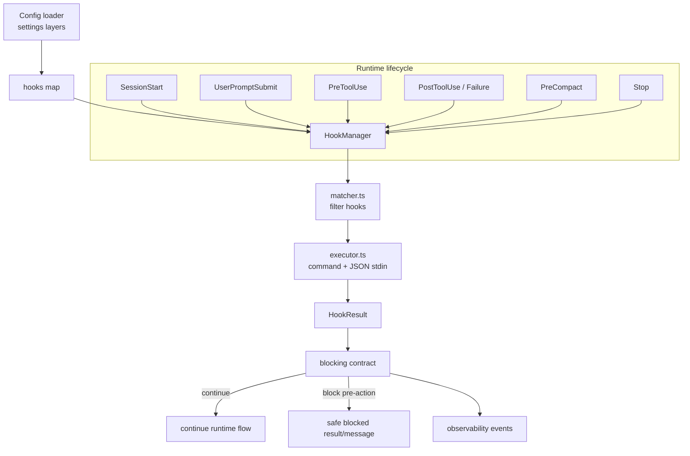
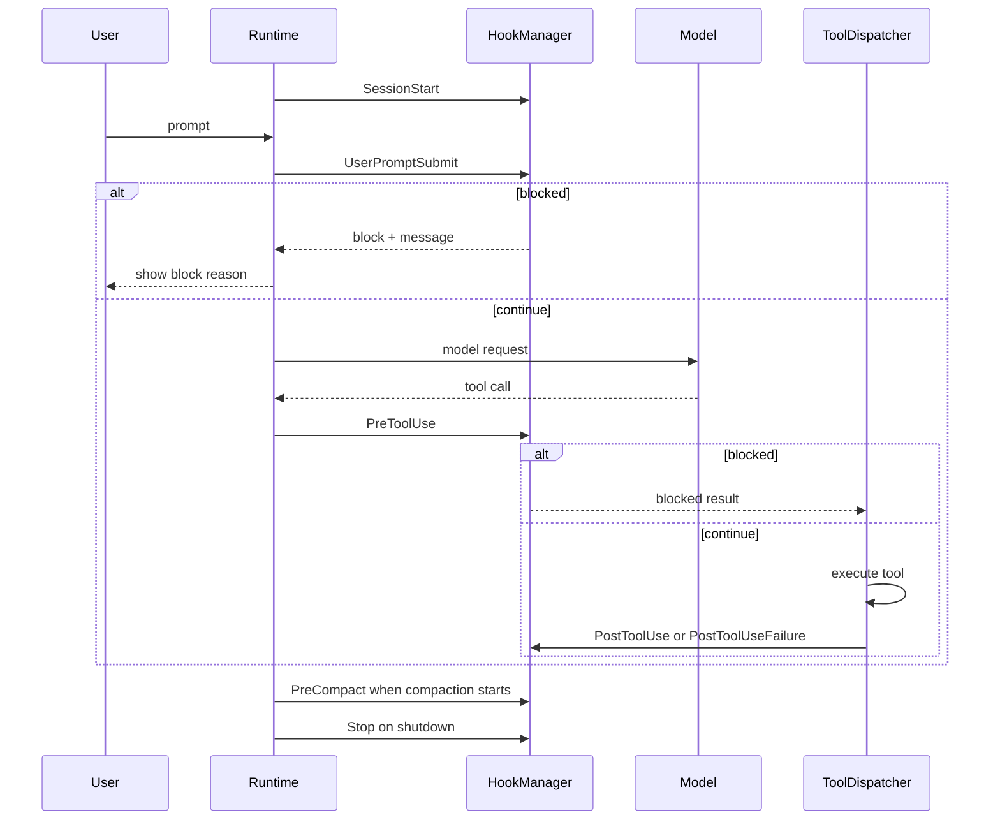

# Plan: Hooks Lifecycle System

## 1. Project File Structure

```
src/
├── config/
│   ├── types.ts              # Add hooks config shape
│   ├── defaults.ts           # Default empty hooks map + timeout default
│   └── validator.ts          # Validate hook events, command hooks, matcher rules
├── hooks/
│   ├── types.ts              # Hook config/event/execution/result domain types
│   ├── events.ts             # Supported lifecycle event constants and payload builders
│   ├── matcher.ts            # Match hooks by event/tool/input/prompt pattern
│   ├── executor.ts           # Run local command hook with JSON stdin, timeout, stdout/stderr capture
│   ├── manager.ts            # Own hook registry, ordered event dispatch, blocking semantics
│   ├── errors.ts             # Safe hook error normalization and redaction
│   └── index.ts              # Public API: createHookManager()
├── runtime/
│   ├── runtime.ts            # Create hook manager at session startup and emit SessionStart/Stop
│   ├── query-loop.ts         # Emit UserPromptSubmit and PreCompact hooks
│   └── tool-dispatcher.ts    # Emit PreToolUse/PostToolUse/PostToolUseFailure hooks
├── tools/
│   └── results.ts            # Add blocked-by-hook result helper if needed
└── observability/
    └── types.ts              # Add hook lifecycle event variants

tests/
├── config/
│   └── hooks-config.test.ts
├── hooks/
│   ├── matcher.test.ts
│   ├── executor.test.ts
│   ├── manager.test.ts
│   ├── errors.test.ts
│   └── integration.test.ts
└── runtime/
    ├── hooks-prompt.test.ts
    └── hooks-tool-dispatch.test.ts
```

| File | Responsibility |
|------|----------------|
| `src/hooks/types.ts` | Domain model for hook config, events, execution records, and normalized results |
| `src/hooks/events.ts` | Event constants and payload builders for lifecycle hook points |
| `src/hooks/matcher.ts` | Decide whether a configured hook applies to a prompt/tool/event |
| `src/hooks/executor.ts` | Spawn local command hooks, pass JSON stdin, enforce timeout, capture output |
| `src/hooks/manager.ts` | Ordered hook dispatch and blocking/observe-only contract enforcement |
| `src/hooks/errors.ts` | Normalize command-not-found, timeout, non-zero exit, invalid JSON with redaction |
| `src/runtime/*` | Fire hook events at session, prompt, tool, compaction, and stop boundaries |
| `src/observability/types.ts` | Add hook lifecycle event payloads for structured logs |

---

## 2. Data Flow



---

## 3. Technical Context

| Area | Decision |
|------|----------|
| Language/runtime | TypeScript strict on Node/Bun-compatible runtime |
| Hook execution type | Local command hooks only for v1.1 |
| Hook I/O | JSON event payload through stdin; JSON result through stdout |
| Lifecycle events | `SessionStart`, `UserPromptSubmit`, `PreToolUse`, `PostToolUse`, `PostToolUseFailure`, `PreCompact`, `Stop` |
| Blocking points | `UserPromptSubmit` and `PreToolUse` only |
| Observe-only points | `SessionStart`, `PostToolUse`, `PostToolUseFailure`, `PreCompact`, `Stop` |
| Execution ordering | Sequential in configured order; first block short-circuits event hooks |
| Timeout policy | Per-hook timeout with safe failure result |
| Observability | Emit hook lifecycle events with redacted stdout/stderr summaries |
| Testing | Vitest unit + integration tests with local fake hook commands; no network dependency |

---

## 4. Dependencies

### Runtime

| Package | Version | Why |
|---------|---------|-----|
| Node `child_process` | built-in | Spawn command hooks |
| Node `AbortController`/timers | built-in | Timeout and cancellation |

### Dev/Test

| Package | Version | Why |
|---------|---------|-----|
| `vitest` | existing | Unit and integration tests |
| local fixture hook scripts | test-only | Deterministic success/block/failure/timeout hooks |

No new third-party runtime dependency is required for the local command-hook MVP.

---

## 5. Integration Points

### Consumes

| Module | What |
|--------|------|
| `001-config-system` | Load and validate `hooks` from layered settings |
| `002-core-runtime` | Fire session, prompt, compaction, and stop hook events |
| `004-builtin-tools` | Use tool names and tool inputs in Pre/Post tool hook payloads |
| `006-permission-system` | PreToolUse hook runs before or alongside existing permission/tool execution boundary; dangerous command policy remains authoritative |
| `007-context-management` | Fire `PreCompact` before context compaction |
| `010-observability` | Emit hook lifecycle and failure events |

### Provides to

| Module | What |
|--------|------|
| `runtime` | `HookManager` for lifecycle dispatch and block decisions |
| `tools` | Safe blocked result for hook-denied tool calls |
| `observability` | Hook event payloads and redacted diagnostics |

---

## 6. Lifecycle Model



---

## 7. Hook Result Semantics

| Decision | Supported events | Behavior |
|----------|------------------|----------|
| `continue` | All events | Continue normal flow |
| `block` | `UserPromptSubmit`, `PreToolUse` | Stop current prompt/tool flow and return safe message/result |
| `block` on observe-only event | Observe-only events | Treat as hook contract failure; continue original runtime flow |
| Invalid output | All events | Treat as hook execution failure |
| Non-zero exit | All events | Treat as hook execution failure |
| Timeout | All events | Kill process and treat as hook execution failure |

Dangerous command interception from the permission system remains non-bypassable. Hooks can add stricter blocking but cannot downgrade deny rules.

---

## 8. Error Handling & Secret Redaction

| Failure | Behavior |
|---------|----------|
| Command missing | Hook execution failed with concise setup error |
| Non-zero exit | Redacted stderr summary recorded; observe-only flow continues |
| Invalid JSON output | Safe parse error; no raw output injected without redaction |
| Timeout | Terminate hook process and record timeout duration |
| Oversized stdout/stderr | Truncate before log/context display and include truncation marker |
| Secret-like output | Redact in terminal, verbose output, structured logs, and hook result summaries |

---

## 9. Observability Events

Add events to the existing observability union:

| Event | Purpose |
|-------|---------|
| `hook:start` | Hook execution begins |
| `hook:end` | Hook execution ends with decision and duration |
| `hook:failure` | Hook command fails, times out, or returns invalid output |
| `hook:block` | Supported pre-action hook blocks prompt or tool execution |

All events include `hookName`, `hookEvent`, `durationMs` when available, and safe/redacted diagnostic fields.

---

## 10. Test Strategy

| Layer | Tests |
|-------|-------|
| Unit | Hook event constants; matcher logic; redaction; result normalization |
| Config | Hook schema validation; disabled hooks; invalid blocking on observe-only events |
| Executor | JSON stdin; stdout parsing; non-zero exit; timeout; command missing; oversized output |
| Manager | Ordered dispatch; first block short-circuit; observe-only block ignored as failure |
| Runtime prompt | UserPromptSubmit block prevents model request |
| Runtime tool | PreToolUse block prevents tool execution; PostToolUse observe-only cannot mutate result |
| Observability | hook:start/end/failure/block emitted with redacted diagnostics |

No tests should require public network or external services.

---

## 11. Risk Points

| # | Risk | Mitigation |
|---|------|------------|
| R1 | Hooks hide or mutate Agent behavior | v1.1 only supports explicit blocking at pre-action points; no mutation contract |
| R2 | Hook scripts leak secrets to logs | Central redaction for payload summaries and stdout/stderr |
| R3 | Slow hooks degrade interactivity | Per-hook timeout and duration observability |
| R4 | Broken hooks make sessions brittle | Observe-only failures never crash session |
| R5 | Hook order surprises users | Sequential config order with first-block short-circuit |
| R6 | Hooks bypass dangerous command policy | Hooks can only add stricter blocks; existing deny/danger policy remains authoritative |

---

## 12. Constitution Check

| Principle | Status |
|-----------|--------|
| Model freedom | Pass — local command hooks do not bind model providers |
| MIT open source | Pass — no new proprietary dependency |
| CLI-first | Pass — hooks are configured and executed in CLI runtime |
| Local-first | Pass — v1.1 excludes HTTP hooks and external hook services |
| API keys never leak | Pass with explicit redaction requirement |
| Dangerous operations intercepted | Pass — hooks cannot downgrade existing deny/danger policy |
| TypeScript strict / no unjustified any | Pass — typed hook domain layer planned |
| TDD discipline | Pass — tasks will require contract/unit tests before implementation |
