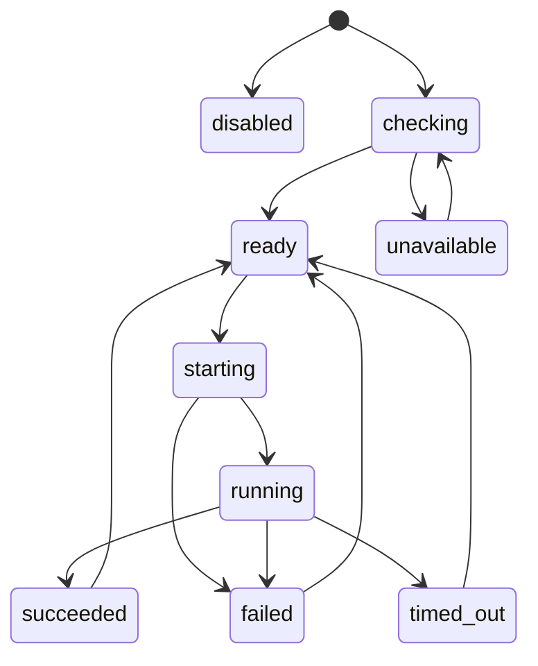

# Data Model: Docker Sandbox

## Sandbox Config

| Field | Description | Validation |
|-------|-------------|------------|
| `enabled` | Whether Docker sandbox mode is active | Defaults to false |
| `image` | Docker image used for sandboxed commands | Required when enabled |
| `workspaceMount` | Container path where current project is mounted | Absolute safe container path |
| `workdir` | Container working directory | Defaults to `workspaceMount` |
| `network` | Network policy: `disabled` or `enabled` | Defaults to `disabled` |
| `envAllowlist` | Host env vars allowed into container | Optional list of names/patterns |
| `env` | Additional explicit env vars for container | Optional; secret-like values redacted |
| `timeoutMs` | Default command timeout | Positive integer |
| `memoryLimit` | Optional Docker memory limit | Positive Docker-compatible value |
| `cpus` | Optional CPU limit | Positive number/string |
| `pullPolicy` | Image pull behavior: `never`, `missing`, `always` | Defaults to `never` |

## Sandbox Profile

| Field | Description |
|-------|-------------|
| `image` | Resolved image for one execution |
| `workspaceHostPath` | Host project path mounted read/write unless later configured otherwise |
| `workspaceContainerPath` | Container path for project workspace |
| `workdir` | Effective command working directory |
| `networkArgs` | Docker network args derived from policy |
| `env` | Resolved allowlisted and explicit environment |
| `resourceArgs` | Memory/CPU limits translated to Docker args |
| `timeoutMs` | Effective timeout for this command |

## Sandbox Availability

| Field | Description |
|-------|-------------|
| `dockerAvailable` | Whether Docker CLI/daemon can be reached |
| `imageAvailable` | Whether configured image exists or can be pulled according to policy |
| `reason` | Safe setup failure reason when unavailable |
| `checkedAt` | Timestamp for availability check |

## Sandbox Execution

| Field | Description |
|-------|-------------|
| `executionId` | Unique ID for one sandboxed command |
| `command` | Command requested by tool after permission approval |
| `profile` | Sandbox profile used for execution |
| `startedAt` | Start timestamp |
| `durationMs` | Execution duration |
| `status` | `starting`, `running`, `succeeded`, `failed`, or `timed_out` |
| `result` | Normalized sandbox result |

## Sandbox Result

| Field | Description |
|-------|-------------|
| `stdout` | Redacted/truncated stdout |
| `stderr` | Redacted/truncated stderr |
| `exitCode` | Command/container exit code if available |
| `durationMs` | Execution duration |
| `timedOut` | Whether timeout terminated execution |
| `safeError` | Safe setup/startup error if command did not run |

## State Transitions

## Isolation Rules

- Sandbox mode never bypasses existing permission checks.
- Host env variables are excluded unless allowlisted.
- Workspace mount is the only default host filesystem mount.
- Network defaults to disabled.
- Secret-like values are redacted before logs, terminal output, and verbose output.
