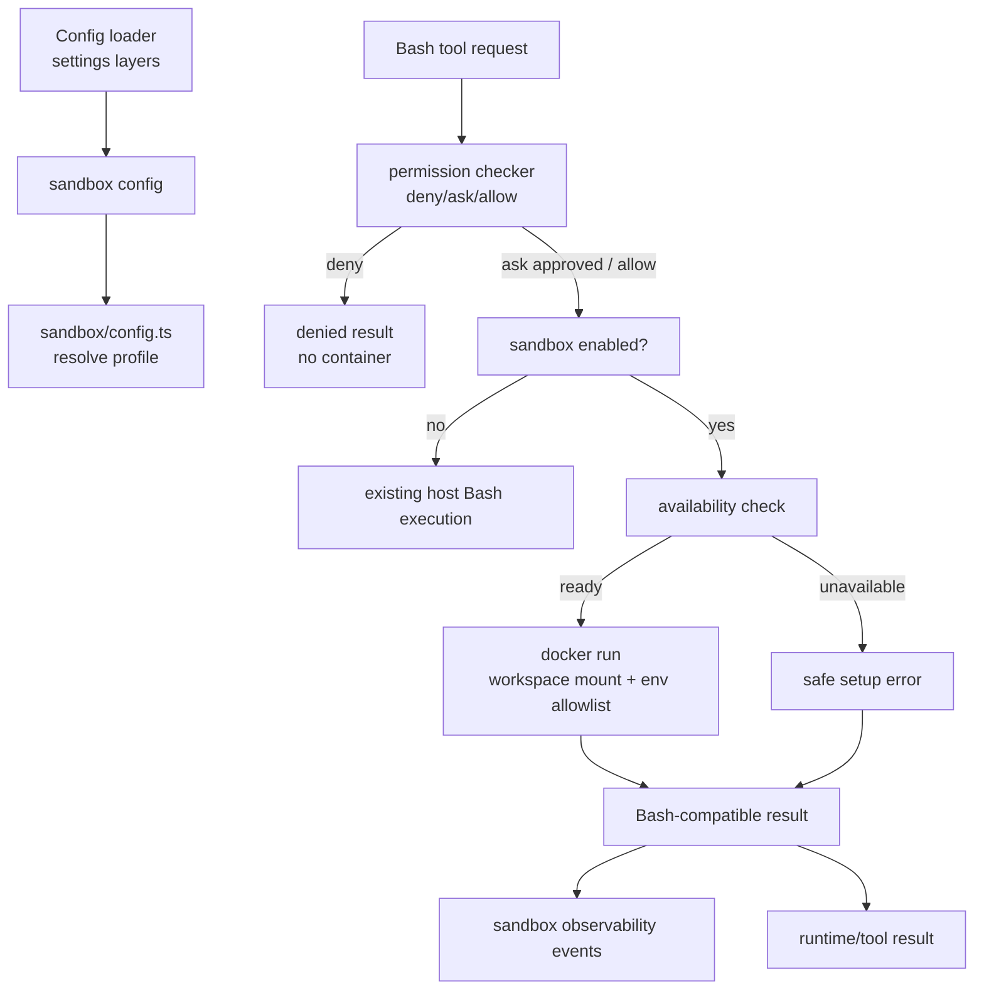
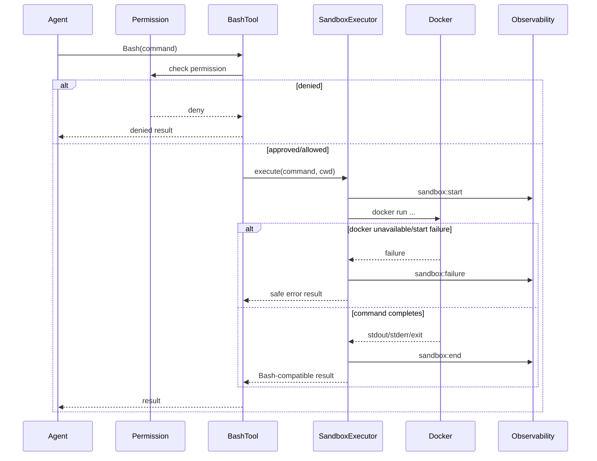

# Plan: Docker Sandbox

## 1. Project File Structure

```
src/
├── config/
│   ├── types.ts              # Add sandbox config shape
│   ├── defaults.ts           # Default sandbox disabled config
│   └── validator.ts          # Validate Docker sandbox config
├── sandbox/
│   ├── types.ts              # Sandbox config/profile/execution/result domain types
│   ├── config.ts             # Resolve sandbox config into execution profiles
│   ├── docker-cli.ts         # Small Docker CLI adapter abstraction
│   ├── availability.ts       # Probe Docker daemon/image availability
│   ├── executor.ts           # Run command in Docker with mounts/env/network/resources/timeout
│   ├── results.ts            # Normalize Docker command/setup failures to Bash-compatible results
│   ├── errors.ts             # Safe sandbox errors and redaction
│   └── index.ts              # Public API: createSandboxExecutor()
├── tools/
│   └── bash.ts               # Route Bash execution through sandbox when enabled
├── permissions/
│   └── checker.ts            # No semantic change; tests verify permission before sandbox
├── runtime/
│   └── tool-dispatcher.ts    # Ensure sandbox execution occurs after permission approval
└── observability/
    └── types.ts              # Add sandbox lifecycle event variants

tests/
├── config/
│   └── sandbox-config.test.ts
├── sandbox/
│   ├── config.test.ts
│   ├── availability.test.ts
│   ├── executor.test.ts
│   ├── results.test.ts
│   ├── errors.test.ts
│   └── integration.test.ts
└── runtime/
    └── sandbox-permissions.test.ts
```

| File | Responsibility |
|------|----------------|
| `src/sandbox/types.ts` | Domain model for sandbox config, profile, execution, availability, and result |
| `src/sandbox/config.ts` | Resolve validated config and workspace path into a concrete Docker execution profile |
| `src/sandbox/docker-cli.ts` | Abstract Docker command execution for tests and runtime |
| `src/sandbox/availability.ts` | Check Docker availability and image readiness according to pull policy |
| `src/sandbox/executor.ts` | Build and run Docker commands with mount/env/network/resource/timeout controls |
| `src/sandbox/results.ts` | Convert Docker stdout/stderr/exit/setup failures into existing Bash-compatible result shape |
| `src/tools/bash.ts` | Use sandbox executor when sandbox is enabled after permission approval |
| `src/observability/types.ts` | Add sandbox lifecycle event payloads |

---

## 2. Data Flow



---

## 3. Technical Context

| Area | Decision |
|------|----------|
| Language/runtime | TypeScript strict on Node/Bun-compatible runtime |
| Sandbox type | Local Docker container only for v1.1 |
| Docker interface | Docker CLI adapter abstraction, not Docker daemon SDK dependency for v1.1 |
| Permission order | Existing permission/dangerous command checks run before sandbox startup |
| Workspace | Mount current project workspace at deterministic container path |
| Network | Configurable; default disabled |
| Environment | Allowlist-only host env plus explicit configured env |
| Pull policy | Default `never`; optional `missing`/`always` later through config |
| Result shape | Normalize to existing Bash-compatible result |
| Observability | Emit sandbox start/end/failure events with redacted summaries |
| Testing | Unit tests with Docker CLI adapter mocks; optional integration test can be skipped when Docker unavailable |

---

## 4. Dependencies

### Runtime

| Package | Version | Why |
|---------|---------|-----|
| Docker CLI | user-installed | Local container execution |
| Node `child_process` | built-in | Invoke Docker CLI |

No new npm runtime dependency is required for the v1.1 Docker CLI adapter.

### Dev/Test

| Package | Version | Why |
|---------|---------|-----|
| `vitest` | existing | Unit/integration tests |
| fake Docker CLI adapter | test-only | Deterministic tests without requiring Docker daemon |

---

## 5. Integration Points

### Consumes

| Module | What |
|--------|------|
| `001-config-system` | Load and validate `sandbox` config |
| `004-builtin-tools` | Route Bash execution through sandbox when enabled |
| `006-permission-system` | Preserve deny/ask/allow before sandbox startup |
| `010-observability` | Emit sandbox lifecycle and failure events |
| `012-hooks-lifecycle-system` | Hooks may observe/block before sandbox execution if both features are enabled |
| `014-playwright-browser-tool` | Later browser tool can use Docker sandbox profile for isolated browser execution |

### Provides to

| Module | What |
|--------|------|
| `tools/bash.ts` | `SandboxExecutor` for command isolation |
| `runtime/tool-dispatcher.ts` | Bash-compatible command result from sandboxed execution |
| `observability` | Structured sandbox lifecycle events |

---

## 6. Execution Model



---

## 7. Docker Command Contract

Docker run should be built from a resolved profile:

| Concern | Behavior |
|---------|----------|
| Workspace | `--volume <hostWorkspace>:<workspaceMount>` |
| Workdir | `--workdir <workdir>` |
| Network disabled | `--network none` |
| Env allowlist | `--env NAME=value` only for allowlisted names |
| Explicit env | `--env NAME=value` after resolving placeholders |
| Memory | Docker-compatible memory flag when configured |
| CPU | Docker-compatible CPU flag when configured |
| Cleanup | Remove container after execution |
| Timeout | Parent process kills execution on timeout |

Exact flag layout can be implementation-specific, but tests must verify the semantic command construction through the Docker adapter abstraction.

---

## 8. Error Handling & Secret Redaction

| Failure | Behavior |
|---------|----------|
| Docker unavailable | Return setup safeError; no crash |
| Image unavailable | Return image safeError according to pull policy |
| Pull failure | Return redacted pull failure summary |
| Container startup failure | Return redacted startup failure summary |
| Command non-zero | Preserve stdout/stderr/exitCode as normal Bash failure |
| Timeout | Kill execution and return `timedOut: true` |
| Oversized output | Truncate stdout/stderr before context/log injection |
| Secret-like env/output | Redact in terminal, verbose output, structured logs, and result summaries |

---

## 9. Observability Events

Add events to the existing observability union:

| Event | Purpose |
|-------|---------|
| `sandbox:start` | Sandbox command execution begins |
| `sandbox:end` | Sandbox command execution ends with duration and exit status |
| `sandbox:failure` | Docker setup/startup/pull/timeout failure occurs |

All events include `executionId`, `image`, `workspaceMount`, `network`, `commandSummary`, `durationMs` when available, `success`, `timedOut`, and safe/redacted error fields.

---

## 10. Test Strategy

| Layer | Tests |
|-------|-------|
| Config | sandbox omitted/disabled; enabled without image; invalid network/pull policy/timeout/path |
| Profile resolution | workspace path with spaces; env allowlist; network disabled; resource args |
| Availability | Docker unavailable; image exists; missing image with pull disabled; pull failure |
| Executor | builds Docker adapter call; timeout; non-zero exit; stdout/stderr capture |
| Results/errors | Bash-compatible result shape; redaction; truncation |
| Runtime | permission deny prevents sandbox startup; allowed command routes to sandbox |
| Observability | sandbox:start/end/failure emitted with redacted diagnostics |
| Integration | optional Docker-backed smoke test skipped when Docker unavailable |

---

## 11. Risk Points

| # | Risk | Mitigation |
|---|------|------------|
| R1 | Users think sandbox removes need for permissions | Permission checks remain first and are tested |
| R2 | Workspace files can still be modified destructively | Existing write/danger policy remains; workspace mount is explicit and visible |
| R3 | Secrets leak into containers | Env allowlist only; redaction in diagnostics |
| R4 | Docker setup varies across machines | Safe availability checks and clear setup errors |
| R5 | Network access enables exfiltration | Default network disabled |
| R6 | Tests become flaky due to Docker daemon | Unit tests mock Docker adapter; real Docker smoke can be optional/skipped |

---

## 12. Constitution Check

| Principle | Status |
|-----------|--------|
| Model freedom | Pass — sandbox independent of model provider |
| MIT open source | Pass — no new proprietary runtime dependency |
| CLI-first | Pass — local CLI sandbox execution |
| Local-first | Pass — local Docker only; no cloud sandbox |
| API keys never leak | Pass with env allowlist and redaction requirement |
| Dangerous operations intercepted | Pass — permission checks occur before sandbox startup |
| TypeScript strict / no unjustified any | Pass — typed sandbox domain layer planned |
| TDD discipline | Pass — task list will require contract/unit tests before implementation |
