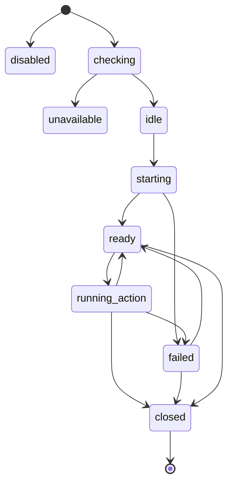

# Data Model: Playwright Browser Tool

## Browser Config

| Field | Description | Validation |
|-------|-------------|------------|
| `enabled` | Whether browser tools are available | Defaults to false |
| `headless` | Whether browser runs headless | Defaults to true |
| `defaultTimeoutMs` | Default action/navigation timeout | Positive integer |
| `artifactDir` | Local directory for screenshots and traces | Project-relative or absolute local path |
| `viewport` | Browser viewport dimensions | Positive width and height |
| `network` | Network policy hint: `enabled` or `disabled` | Defaults to enabled for browser feature; may be constrained by sandbox later |
| `captureScreenshots` | Whether screenshot artifacts are captured for navigation/actions | Defaults to true for inspection actions |

## Browser Availability

| Field | Description |
|-------|-------------|
| `available` | Whether Playwright package and browser executable are usable |
| `reason` | Safe setup failure reason when unavailable |
| `checkedAt` | Timestamp for availability check |
| `browserName` | Browser engine selected for execution |

## Browser Session

| Field | Description |
|-------|-------------|
| `sessionId` | SuperAgent session ID owning the browser state |
| `browserSessionId` | Unique ID for browser lifecycle state |
| `status` | `idle`, `starting`, `ready`, `running_action`, `failed`, or `closed` |
| `currentUrl` | Last known final URL after navigation/action |
| `title` | Last known page title |
| `createdAt` | Browser context creation timestamp |
| `lastActionAt` | Last action timestamp |
| `closedAt` | Browser close timestamp when closed |

## Browser Action

| Field | Description |
|-------|-------------|
| `actionId` | Unique ID for one browser operation |
| `type` | `open`, `click`, `type`, `select`, `wait`, `screenshot`, or `close` |
| `target` | Safe locator/URL/action target summary |
| `inputSummary` | Redacted summary of text or options supplied to the action |
| `timeoutMs` | Effective timeout for the action |
| `startedAt` | Action start timestamp |
| `durationMs` | Action duration |

## Browser Artifact

| Field | Description |
|-------|-------------|
| `artifactId` | Unique ID for one local artifact |
| `type` | `screenshot` or future artifact type |
| `path` | Local filesystem path to artifact |
| `mimeType` | Artifact MIME type |
| `sizeBytes` | Artifact size |
| `label` | Redacted user-visible label |

## Browser Result

| Field | Description |
|-------|-------------|
| `success` | Whether the requested action completed successfully |
| `pageState` | Bounded current page state: URL, title, visible text summary |
| `artifacts` | Local artifact metadata |
| `actionTrace` | Bounded redacted list of recent actions |
| `durationMs` | Execution duration |
| `timedOut` | Whether timeout ended the action |
| `safeError` | Safe setup/navigation/action/artifact error if applicable |

## State Transitions

## Isolation Rules

- Browser tool calls never bypass permission checks.
- Browser artifacts remain local.
- Page text and action traces are bounded before model context injection.
- Secret-like values are redacted before logs, terminal output, verbose output, and result summaries.
- Browser failure does not affect non-browser tools.
