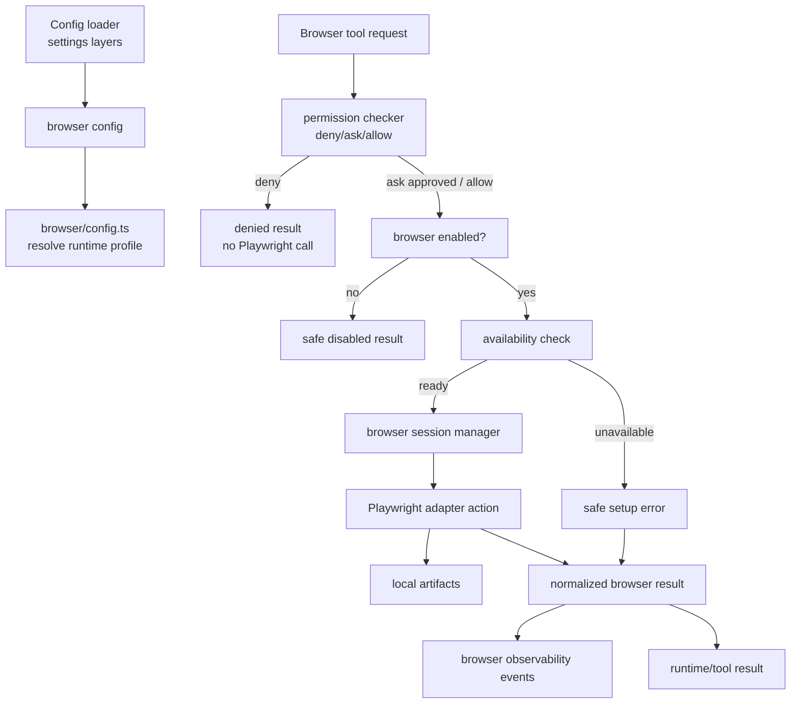
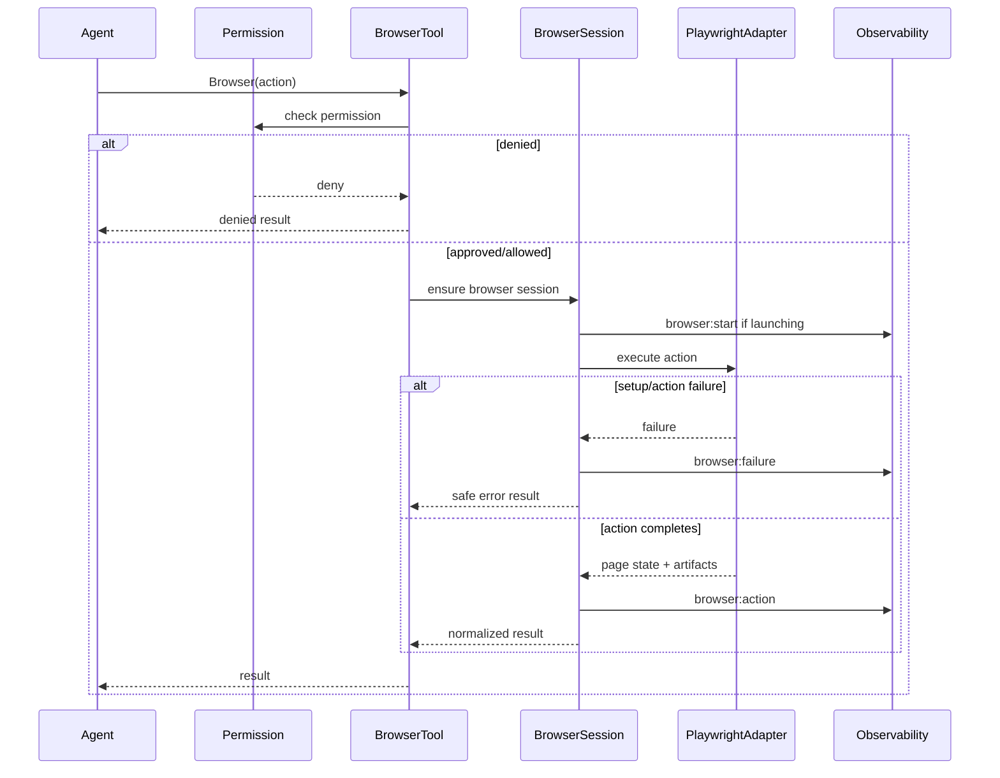

# Plan: Playwright Browser Tool

## 1. Project File Structure

```text
src/
├── config/
│   ├── types.ts              # Add browser config shape
│   ├── defaults.ts           # Browser disabled by default
│   └── validator.ts          # Validate browser config
├── browser/
│   ├── types.ts              # Browser config/session/action/result domain types
│   ├── config.ts             # Resolve browser config into runtime profile
│   ├── availability.ts       # Check Playwright/browser executable availability
│   ├── playwright-adapter.ts # Small Playwright adapter boundary for tests/runtime
│   ├── session.ts            # Browser lifecycle/session state management
│   ├── actions.ts            # Normalize and dispatch open/click/type/select/wait/screenshot/close
│   ├── results.ts            # Normalize browser output/failures
│   ├── artifacts.ts          # Local screenshot/artifact metadata handling
│   ├── errors.ts             # Safe browser errors and redaction
│   └── index.ts              # Public API: createBrowserTool/createBrowserManager
├── tools/
│   └── browser.ts            # Browser tool schema and tool registration
├── runtime/
│   └── tool-dispatcher.ts    # Ensure browser execution occurs after permission approval
└── observability/
    └── types.ts              # Add browser lifecycle/action event variants

tests/
├── config/
│   └── browser-config.test.ts
├── browser/
│   ├── types.test.ts
│   ├── config.test.ts
│   ├── availability.test.ts
│   ├── results.test.ts
│   ├── artifacts.test.ts
│   ├── session.test.ts
│   ├── actions.test.ts
│   └── integration.test.ts
└── runtime/
    └── browser-permissions.test.ts
```

| File | Responsibility |
|------|----------------|
| `src/browser/types.ts` | Domain model for browser config, availability, sessions, actions, artifacts, and results |
| `src/browser/playwright-adapter.ts` | Boundary over Playwright for deterministic unit tests without launching a real browser |
| `src/browser/session.ts` | Own browser/context/page lifecycle and cleanup |
| `src/browser/actions.ts` | Validate and dispatch browser operations to the adapter |
| `src/browser/results.ts` | Convert adapter outcomes and failures into bounded Agent-safe results |
| `src/tools/browser.ts` | Expose browser actions through the existing tool system |
| `src/runtime/tool-dispatcher.ts` | Preserve permission order before browser action execution |
| `src/observability/types.ts` | Add browser lifecycle and failure event payloads |

---

## 2. Data Flow



---

## 3. Technical Context

| Area | Decision |
|------|----------|
| Language/runtime | TypeScript strict on Node/Bun-compatible runtime |
| Browser engine | Playwright-controlled browser pages for v1.1 |
| Execution boundary | Local Playwright adapter by default; Docker sandbox optional later |
| Permission order | Existing permission checks run before browser actions |
| Tool exposure | Built-in browser tool/action schema, no MCP dependency |
| Artifacts | Local screenshot metadata and bounded page summaries |
| Output safety | Redact and truncate before logs/context/verbose output |
| Observability | Emit browser start/action/end/failure events |
| Testing | Unit tests with fake Playwright adapter; optional real Playwright smoke can be skipped when unavailable |

---

## 4. Dependencies

### Runtime

| Package | Version | Why |
|---------|---------|-----|
| `playwright` | existing/future dependency | Browser automation engine |
| Node `fs/path` | built-in | Local artifact handling |

No cloud browser or hosted MCP dependency is required for this feature.

### Dev/Test

| Package | Version | Why |
|---------|---------|-----|
| `vitest` | existing | Unit/integration tests |
| fake Playwright adapter | test-only | Deterministic tests without browser executable dependency |

---

## 5. Integration Points

### Consumes

| Module | What |
|--------|------|
| `001-config-system` | Load and validate `browser` config |
| `004-builtin-tools` | Register browser tool/action schema |
| `006-permission-system` | Preserve deny/ask/allow before browser execution |
| `010-observability` | Emit browser lifecycle/action/failure events |
| `013-docker-sandbox` | Optional future hardening, not required for this feature |

### Provides to

| Module | What |
|--------|------|
| `tools/browser.ts` | Browser action tool implementation |
| `runtime/tool-dispatcher.ts` | Normalized browser result after permission approval |
| `observability` | Structured browser diagnostics |

---

## 6. Execution Model



---

## 7. Browser Tool Contract

Browser action semantics should be built from the normalized request:

| Concern | Behavior |
|---------|----------|
| Open/navigate | Navigate to URL, return final URL/title/text summary/artifacts |
| Click | Use safe locator target summary and return resulting page state |
| Type | Redact typed text in logs and summaries |
| Select | Select value/label by safe target summary |
| Wait | Wait for visible selector/text/load state within timeout |
| Screenshot | Store local artifact and return metadata only |
| Close | Close browser context and mark session closed |
| Timeout | Parent action returns `timedOut: true` and safe error |

Exact Playwright API calls can be implementation-specific, but tests must verify semantic adapter calls through a fake adapter.

---

## 8. Error Handling & Secret Redaction

| Failure | Behavior |
|---------|----------|
| Browser disabled | Return safe disabled result |
| Playwright unavailable | Return setup safeError; no crash |
| Browser executable missing | Return setup safeError with remediation guidance |
| Navigation failure | Return safe navigation error and current known state when available |
| Missing target | Return action safeError with redacted target summary |
| Timeout | Return `timedOut: true` |
| Artifact write failure | Return page state and artifact safeError without crashing |
| Oversized output | Truncate visible text/action trace/error output |
| Secret-like values | Redact in terminal, verbose output, logs, artifacts metadata, and result summaries |

---

## 9. Observability Events

Add events to the existing observability union:

| Event | Purpose |
|-------|---------|
| `browser:start` | Browser session launch begins or completes |
| `browser:action` | One browser action completes |
| `browser:end` | Browser session closes |
| `browser:failure` | Setup/navigation/action/artifact/cleanup failure occurs |

All events include `browserSessionId`, `actionId` when available, `actionType`, `url`, `safeTarget`, `durationMs`, `success`, `timedOut`, `artifactCount`, and safe/redacted error fields.

---

## 10. Test Strategy

| Layer | Tests |
|-------|-------|
| Config | omitted/disabled defaults; timeout/viewport/network/artifact validation |
| Types | strict domain type shape and lifecycle status values |
| Availability | Playwright unavailable; browser executable unavailable; ready state |
| Results/errors | safe errors, redaction, truncation, timeout normalization |
| Artifacts | local artifact metadata; artifact write failure safe result |
| Session | launch/reuse/close lifecycle with fake adapter |
| Actions | open/click/type/select/wait/screenshot/close semantic adapter calls |
| Runtime | permission deny prevents Playwright adapter call |
| Observability | browser events emitted with redacted diagnostics |
| Integration | fake browser end-to-end; optional real Playwright smoke skipped when unavailable |

---

## 11. Risk Points

| # | Risk | Mitigation |
|---|------|------------|
| R1 | Browser actions create external side effects | Existing permission checks remain first and are tested |
| R2 | Page text leaks secrets into context/logs | Redaction and truncation before all output channels |
| R3 | Playwright setup varies across machines | Safe availability checks and optional smoke skip |
| R4 | Browser sessions leak processes | Session manager owns cleanup on close/session stop |
| R5 | Large pages exhaust context | Bounded visible text and action traces |
| R6 | Docker coupling blocks browser adoption | Local adapter is default; Docker integration optional |

---

## 12. Constitution Check

| Principle | Status |
|-----------|--------|
| Model freedom | Pass — browser tool is model-provider independent |
| MIT open source | Pass — Playwright is open source and no proprietary runtime dependency is required |
| CLI-first | Pass — feature is exposed through CLI Agent tools |
| Local-first | Pass — local Playwright execution and local artifacts only |
| API keys never leak | Pass with redaction requirements |
| Dangerous operations intercepted | Pass — permission checks occur before browser actions |
| TypeScript strict / no unjustified any | Pass — typed browser domain layer planned |
| TDD discipline | Pass — tasks require contract/unit tests before implementation |
