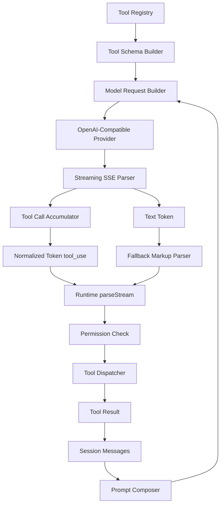

# Plan: Real Tool Calling

## 1. Architecture Overview



## 2. Functional Components

| Component | Responsibility |
|-----------|----------------|
| `src/models/provider.ts` | Include model tools and `tool_choice: "auto"` in request body. |
| `src/models/tool-schema.ts` | Convert registered tool metadata/zod schemas into OpenAI-compatible JSON schema. |
| `src/models/client.ts` | Parse streaming `delta.tool_calls`, accumulate fragments, emit normalized tool-use tokens. |
| `src/runtime/stream-handler.ts` | Continue supporting text fallback parsers after structured tokens. |
| `src/runtime/query-loop.ts` | Persist assistant tool calls and tool results into session history. |
| `src/runtime/runtime.ts` | Pass registered tools/model tool definitions into provider dependencies. |
| `tests/models/*` | Contract tests for request body and streaming parser behavior. |
| `tests/runtime/*` | Loop-level tests for dispatch and follow-up model requests. |

## 3. Data Flow

1. Runtime builds the tool registry.
2. Schema builder creates stable model-facing definitions.
3. Provider request contains `messages`, `tools`, and `tool_choice: "auto"`.
4. Provider streams text deltas and/or `tool_calls` deltas.
5. Client accumulates partial tool-call name/arguments by id/index.
6. Completed tool calls become internal `Token` objects.
7. Query loop turns tokens into `TurnEvent.tool_call` events.
8. Permission and dispatcher execute tools.
9. Tool result is appended to session history.
10. Next model request includes tool result and produces final text.

## 4. Document Structure

```text
specs/015-real-tool-calling/
├── clarify.md
├── spec.md
├── plan.md
└── tasks.md
```

## 5. Technical Architecture

| Layer | Decision |
|-------|----------|
| Provider protocol | OpenAI-compatible Chat Completions tools. |
| Tool schema source | Existing registry/tool schemas; no duplicate hardcoded definitions. |
| Streaming state | Per-request accumulator, cleared after stream completion/error. |
| Fallback behavior | Keep stream-handler text parsers as compatibility after structured parsing. |
| Permission | Unchanged; all tool calls route through current checker. |
| Observability | Reuse existing model/tool events; add parser error metadata only if already safe. |

## 6. Test Strategy

| Test Type | Files | Purpose |
|-----------|-------|---------|
| Contract | `tests/models/provider-tools.test.ts` | Request body includes stable tools schemas. |
| Unit | `tests/models/client-tool-calls.test.ts` | Parse fragmented and multiple tool-call streams. |
| Runtime | `tests/runtime/query-loop.test.ts` | Tool result feeds the next model request. |
| Compatibility | `tests/runtime/stream-handler.test.ts` | XML/DSML fallback remains supported. |
| Smoke | manual one-shot command | Verify real DeepSeek behavior. |

## 7. Risks

| Risk | Mitigation |
|------|------------|
| DeepSeek emits malformed or escaped JSON arguments | Parse with accumulator and explicit error event; retain fallback parser. |
| Tool schema conversion from zod is incomplete | Start with explicit minimal JSON schema conversion for existing tools only. |
| Dynamic schema order hurts prompt cache | Sort tools by stable registry order/name. |
| Multiple provider formats leak into runtime | Normalize all provider chunks into existing `Token` shape. |
