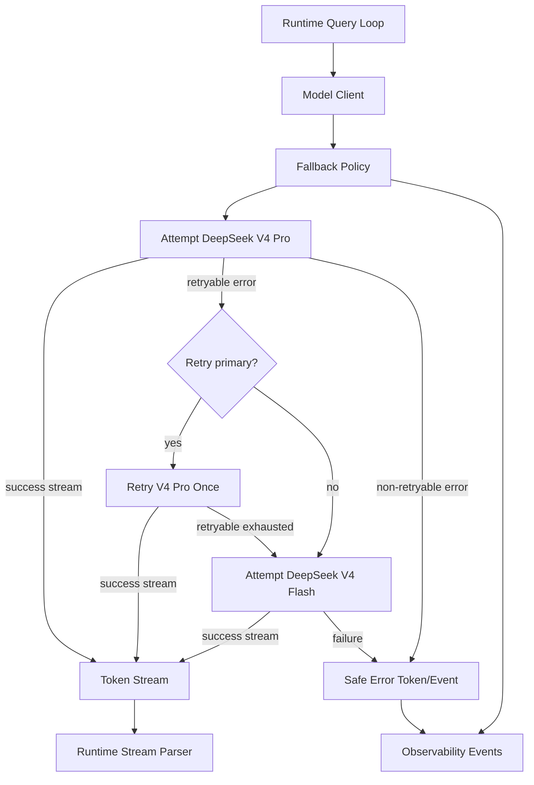

# Plan: Model Fallback

## 1. Architecture Overview



## 2. Functional Components

| Component | Responsibility |
|-----------|----------------|
| `src/models/client.ts` | Wrap provider stream calls with retry/fallback orchestration. |
| `src/models/provider.ts` | Expose provider errors with status/category while preserving streaming API. |
| `src/models/fallback-policy.ts` | Decide retry, fallback, or fail based on error category and attempt count. |
| `src/config/` | Read primary/fallback model config defaults. |
| `src/observability/` | Emit safe model attempt and fallback events. |
| `tests/models/*` | Unit tests for retryable/non-retryable behavior and prompt preservation. |
| `tests/runtime/query-loop.test.ts` | Integration proof that fallback stream still completes a turn. |

## 3. Data Flow

1. Query loop composes a prompt and calls the model client.
2. Model client creates a model attempt for the configured primary model.
3. Provider starts streaming or throws a categorized provider error.
4. Fallback policy maps the error to retry, fallback, or fail.
5. On fallback, the client reuses the same request payload with only `model` changed.
6. Successful fallback tokens flow through the existing stream parser unchanged.
7. Failed terminal attempts emit a safe error event.
8. Observability records model attempt duration, reason category, and fallback target.

## 4. Document Structure

```text
specs/016-model-fallback/
├── clarify.md
├── spec.md
├── plan.md
└── tasks.md
```

## 5. Technical Architecture

| Layer | Decision |
|-------|----------|
| Retry policy | One primary retry for 429/5xx where applicable. |
| Fallback policy | DeepSeek V4 Pro → DeepSeek V4 Flash. |
| Request mutation | Only `model` changes between primary and fallback. |
| Error classification | Timeout/network/429/5xx retryable; 400/401/403/404 terminal. |
| Streaming | Preserve `AsyncGenerator<Token>` interface. |
| Observability | Safe model attempt/fallback events with redacted errors. |
| Stickiness | Non-sticky fallback per request for MVP. |

## 6. Test Strategy

| Test Type | Files | Purpose |
|-----------|-------|---------|
| Unit | `tests/models/fallback-policy.test.ts` | Verify retry/fallback/fail decisions. |
| Contract | `tests/models/provider-fallback.test.ts` | Verify same request body except model id. |
| Runtime | `tests/runtime/query-loop.test.ts` | Verify fallback success still yields text/tool events. |
| Safety | `tests/models/provider-error-redaction.test.ts` | Verify secret-like data is redacted. |

## 7. Risks

| Risk | Mitigation |
|------|------------|
| Fallback hides bad request schema | Treat 400-class request errors as terminal. |
| Fallback doubles latency too often | No fallback path on successful primary calls; cap attempts. |
| Provider SDK error shape varies | Normalize errors at provider boundary. |
| Secrets leak in verbose mode | Centralize redaction before logging/events. |
