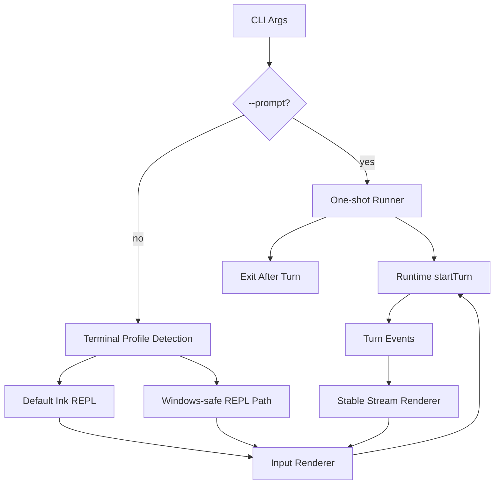

# Plan: CLI Stability on Windows

## 1. Architecture Overview



## 2. Functional Components

| Component | Responsibility |
|-----------|----------------|
| `src/index.ts` | Route CLI args into one-shot or interactive mode. |
| `src/cli/` | Own REPL rendering, terminal detection, and input behavior. |
| `src/runtime/runtime.ts` | Remain unchanged; provide `startTurn` to both CLI modes. |
| `tests/cli/*` | Verify CLI mode selection and one-shot behavior. |
| Manual smoke doc/checklist | Verify Windows terminal behavior that automated tests cannot simulate. |

## 3. Data Flow

1. CLI parses process args.
2. If `--prompt` exists, one-shot mode sends the prompt to runtime and exits.
3. Otherwise the CLI detects terminal profile.
4. Windows terminal profile selects stable input/render behavior.
5. User input becomes `runtime.startTurn(userMessage)`.
6. Runtime events stream to the renderer.
7. Renderer updates text output without destabilizing the input line.
8. User can continue typing or exit.

## 4. Document Structure

```text
specs/017-cli-stability-windows/
├── clarify.md
├── spec.md
├── plan.md
└── tasks.md
```

## 5. Technical Architecture

| Layer | Decision |
|-------|----------|
| Scope | CLI entry/render/input only; no model/runtime semantic changes. |
| Terminal support | Windows 11 PowerShell and VS Code integrated terminal for MVP. |
| One-shot | Keep as stable smoke and automation path. |
| Detection | Auto-detect Windows profile from `process.platform` and terminal env. |
| Rendering | Preserve streaming output; reduce input flicker by isolating input updates. |
| Verification | Automated CLI tests plus manual Windows smoke checklist. |

## 6. Test Strategy

| Test Type | Files | Purpose |
|-----------|-------|---------|
| Unit | `tests/cli/args.test.ts` | Verify `--prompt` routing and empty prompt error. |
| Unit | `tests/cli/terminal-profile.test.ts` | Verify Windows terminal detection. |
| Integration | `tests/cli/one-shot.test.ts` | Verify one-shot executes one turn and exits. |
| Manual | Windows smoke checklist | Verify real terminal typing and flicker behavior. |

## 7. Risks

| Risk | Mitigation |
|------|------------|
| Automated tests miss real terminal behavior | Require explicit manual smoke steps. |
| Windows fix breaks Unix terminals | Gate Windows-safe path behind terminal profile detection. |
| Render throttling hides streaming output | Keep streaming text; only stabilize input-area updates. |
| REPL refactor grows too large | Limit changes to CLI entry/input/render components. |
