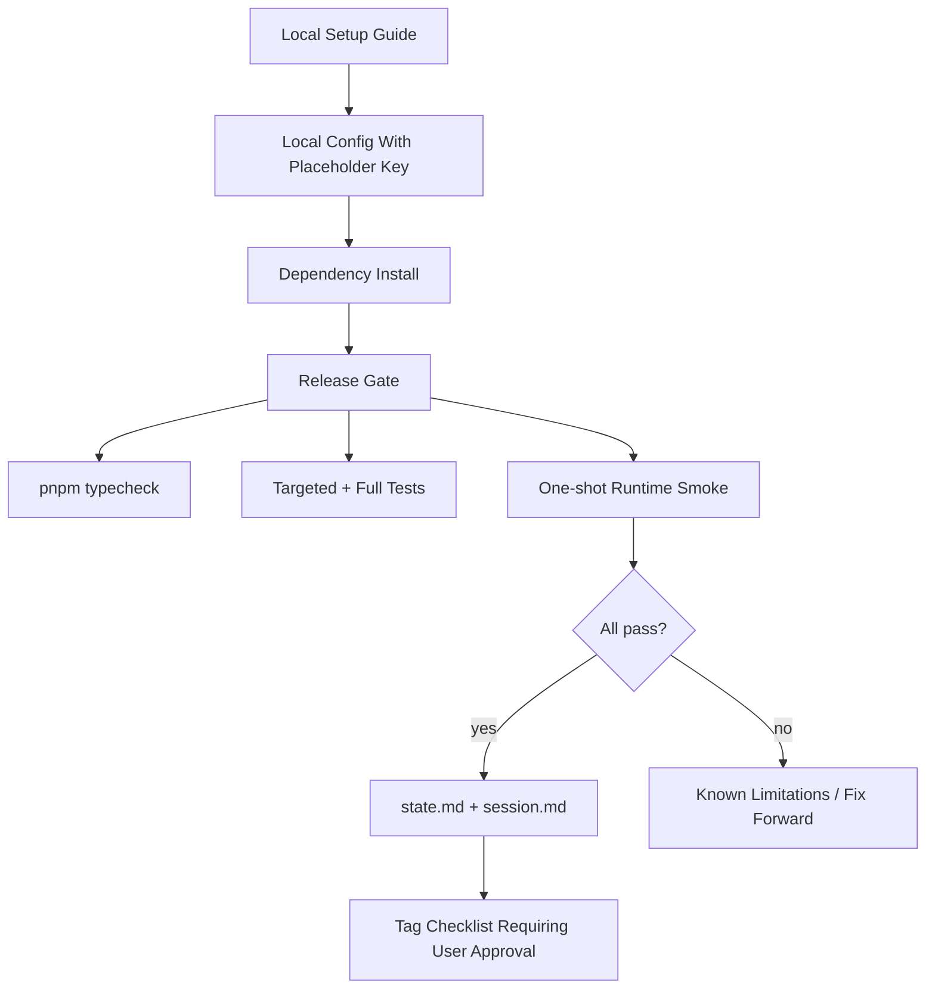

# Plan: Release Readiness

## 1. Architecture Overview



## 2. Functional Components

| Component | Responsibility |
|-----------|----------------|
| Setup docs | Explain dependency install, local config, API key placeholder, and Playwright browser setup. |
| Release gate checklist | List exact commands for typecheck, tests, and smoke. |
| Smoke scenario | Prove final model/tool loop by analyzing `src/runtime/runtime.ts`. |
| Closeout files | Record final verification results and known limitations. |
| Git/tag checklist | Explain tag format and require explicit user confirmation. |

## 3. Data Flow

1. Maintainer installs dependencies.
2. Maintainer creates local config with placeholder-guided API key setup.
3. Maintainer runs typecheck and test gate.
4. Maintainer runs one-shot local smoke.
5. Results are recorded in release closeout notes.
6. If all gates pass, maintainer may explicitly approve tag creation.
7. Specs remain frozen after closeout.

## 4. Document Structure

```text
specs/018-release-readiness/
├── clarify.md
├── spec.md
├── plan.md
├── tasks.md
├── state.md      # created at closeout
└── session.md    # created at closeout
```

## 5. Technical Architecture

| Layer | Decision |
|-------|----------|
| Setup | Document local pnpm-based install and run path. |
| Secrets | Placeholder-only docs; never write real keys. |
| Browser dependency | Include Playwright/browser install verification if browser tool is in release. |
| Verification | Typecheck, targeted tests, fallback/parser tests, one-shot smoke. |
| Release metadata | Tag command documented but not executed without explicit approval. |
| Closeout | `state.md` and `session.md` summarize results and limitations. |

## 6. Test Strategy

| Test Type | Files/Commands | Purpose |
|-----------|----------------|---------|
| Typecheck | `pnpm typecheck` | Verify TS correctness. |
| Unit/Integration | `pnpm test -- tests/models tests/runtime tests/cli` | Verify changed behavior. |
| Compatibility | `pnpm test -- tests/runtime/stream-handler.test.ts` | Verify fallback parser compatibility. |
| Smoke | `pnpm start -- --prompt "分析一下 src/runtime/runtime.ts 的 createRuntime 做了什么"` | Verify end-to-end model/tool loop. |
| Review | Docs inspect | Verify no secrets and copy-pastable commands. |

## 7. Risks

| Risk | Mitigation |
|------|------------|
| Docs drift from scripts | Verify commands during closeout and record results. |
| Secret leaks in docs | Use placeholders and review docs before commit. |
| Release tag created too early | Require explicit user confirmation before tag command. |
| Smoke depends on live provider | Mark provider smoke as manual and record failure reason if API unavailable. |
