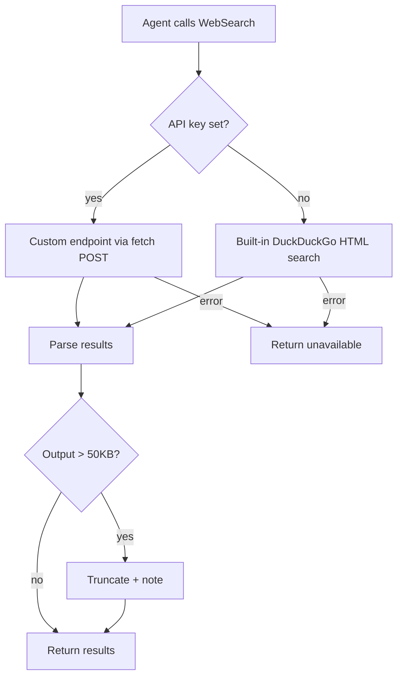

# Plan: WebSearch Tool — Built-in Search Provider

## 1. Architecture Overview



## 2. Functional Components

| Component | Responsibility |
|-----------|----------------|
| `searchDuckDuckGo()` | New function: fetch DuckDuckGo HTML search, parse results. |
| `webSearchTool()` (modified) | Route to built-in provider when no API key, keep existing custom-endpoint path. |
| `truncateResults()` | New helper: cap output at 50KB with truncation note. |
| Tests | Cover built-in provider path, truncation, graceful fallback. |

## 3. Data Flow

1. Agent invokes `WebSearch` with `{ query: "..." }`.
2. Tool checks `SUPERAGENT_WEBSEARCH_API_KEY`:
   - **Set**: POST to `SUPERAGENT_WEBSEARCH_ENDPOINT` with Bearer auth (existing path).
   - **Not set**: GET `https://html.duckduckgo.com/html/?q=<query>` and parse HTML.
3. Results parsed into `SearchResult[]` (title, url, snippet).
4. Output formatted; truncated if > 50KB.
5. Return `ToolResult` with output text and metadata.

## 4. File Changes

```text
src/tools/web-search.ts   — Add built-in provider + truncation logic
tests/tools/web-search.test.ts — Add tests for built-in provider + truncation
specs/019-websearch/      — Feature documentation
```

## 5. Technical Decisions

| Decision | Rationale |
|----------|-----------|
| DuckDuckGo HTML search as built-in provider | Free, no API key, publicly accessible, widely used by open-source AI tools. |
| No new npm dependencies | Use Node.js built-in `fetch`/`https` only; keep install footprint small. |
| Keep existing custom-endpoint path | Preserve backward compatibility for users who have configured a search API. |
| Soft fallback on all errors | Search is non-critical; Agent should continue working even if search is down. |

## 6. Test Strategy

| Test Type | What It Covers |
|-----------|----------------|
| Existing tests (5) | Custom endpoint, missing API key, HTTP error, empty query, timeout. All must pass unmodified. |
| New: built-in provider success | Mock DuckDuckGo HTML response, verify parsed results. |
| New: built-in provider failure | Mock network error / HTTP error from DuckDuckGo, verify graceful degradation. |
| New: result truncation | Return many/large results, verify output is capped at 50KB with note. |
| New: API key takes priority | When API key is set, built-in provider is skipped. |

## 7. Risks

| Risk | Mitigation |
|------|------------|
| DuckDuckGo rate limits | Tool is infrequently called (Agent discretion); timeout + soft fallback handles 429. |
| DuckDuckGo changes HTML structure | Parse defensively with fallback to empty results; test covers graceful degradation. |
| Built-in provider breaks custom-endpoint users | API key check gates the path; existing tests verify custom path is untouched. |
