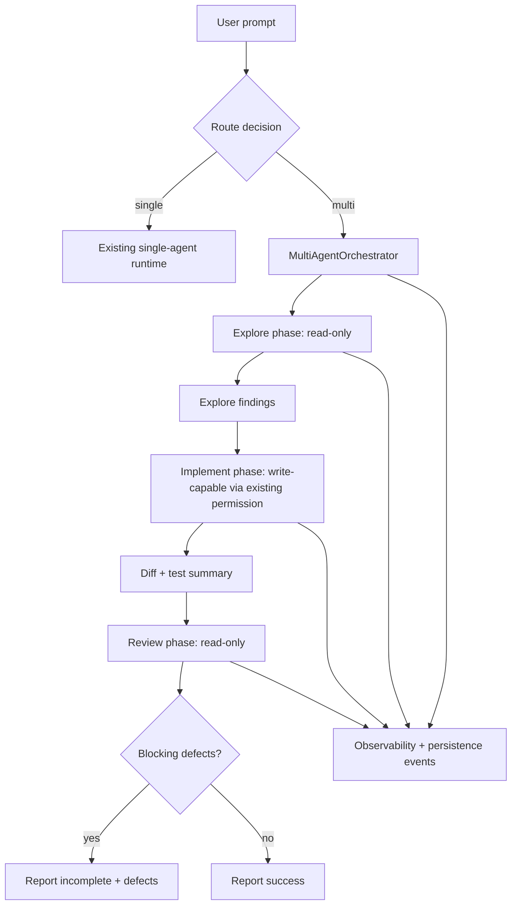

# Plan: Multi-Agent Orchestration

## 1. Architecture Overview



## 2. Functional Components

| Component | Responsibility |
|-----------|----------------|
| `src/agents/types.ts` | Agent role, orchestration run, phase result, routing decision types. |
| `src/agents/role-prompts.ts` | Deterministic role system guidance for Explore/Implement/Review. |
| `src/agents/router.ts` | Decide single-agent vs multi-agent based on explicit marker and complexity heuristic. |
| `src/agents/role-permissions.ts` | Wrap existing permission checker with role-scoped tool policy. |
| `src/agents/orchestrator.ts` | Execute Explore → Implement → Review and compose phase inputs. |
| Runtime integration | Add optional multi-agent path before normal query loop. |
| Observability integration | Emit phase lifecycle events. |
| Persistence integration | Store phase summaries in session state/events. |

## 3. Data Flow

1. User submits prompt.
2. Router returns `single` or `multi` decision.
3. For `single`, existing runtime path is unchanged.
4. For `multi`, orchestrator creates `OrchestrationRun`.
5. Explore receives prompt + project context + read-only tools and returns findings.
6. Implement receives prompt + findings and executes through existing runtime/tool scheduler.
7. Runtime collects changed files and test output from tool events.
8. Review receives prompt + findings + diff summary + test output.
9. Final result is success only if Review reports no blocking defects.
10. Phase lifecycle events are logged and persisted.

## 4. Technical Architecture

```text
src/agents/
  types.ts              # domain contracts
  role-prompts.ts       # Explore/Implement/Review prompts
  router.ts             # mode selection
  role-permissions.ts   # role-scoped permission wrapper
  orchestrator.ts       # serial phase runner
  index.ts              # public API

tests/agents/
  router.test.ts
  role-permissions.test.ts
  role-prompts.test.ts
  orchestrator.test.ts
  contract.test.ts

tests/runtime/
  multi-agent-integration.test.ts
```

## 5. Documentation Structure

```text
specs/020-multi-agent-orchestration/
  spec.md       # functional requirements and acceptance criteria
  clarify.md    # decisions and open questions
  plan.md       # architecture, data flow, technical plan
  tasks.md      # 2-5 minute implementation tasks
  state.md      # created at closeout
  session.md    # created at closeout
```

## 6. Integration Points

| Existing Area | Integration |
|---------------|-------------|
| `src/runtime` | Add optional orchestration path, keep existing single-agent path stable. |
| `src/permissions` | Wrap checker with role policy; deny writes for Explore/Review. |
| `src/scheduling` | Reuse existing serial write scheduling; no concurrent writes. |
| `src/observability` | Add multi-agent lifecycle event names. |
| `src/persistence` | Persist phase summaries as session events or metadata. |
| `src/cli` | Display phase labels in output stream. |

## 7. Test Strategy

| Test Type | What It Covers |
|-----------|----------------|
| Unit: router | Explicit trigger, simple task bypass, complexity trigger. |
| Unit: role permissions | Explore/Review deny writes; Implement delegates to existing permission. |
| Unit: prompts | Snapshot role prompts for deterministic role boundaries. |
| Unit: orchestrator | Phase order, context passing, blocking review behavior. |
| Runtime integration | Multi-agent path emits lifecycle events and preserves single-agent path. |
| Smoke | One-shot forced multi-agent prompt executes phases in order with fake provider. |

## 8. Risks

| Risk | Mitigation |
|------|------------|
| Role prompts become vague | Snapshot-test prompts and keep role contracts in code. |
| Multi-agent slows simple tasks | Router bypasses simple tasks; explicit trigger available. |
| Review sees too much context and rubber-stamps | Review input is limited to findings/diff/tests. |
| Permissions accidentally widened | Role permission wrapper tested independently. |
