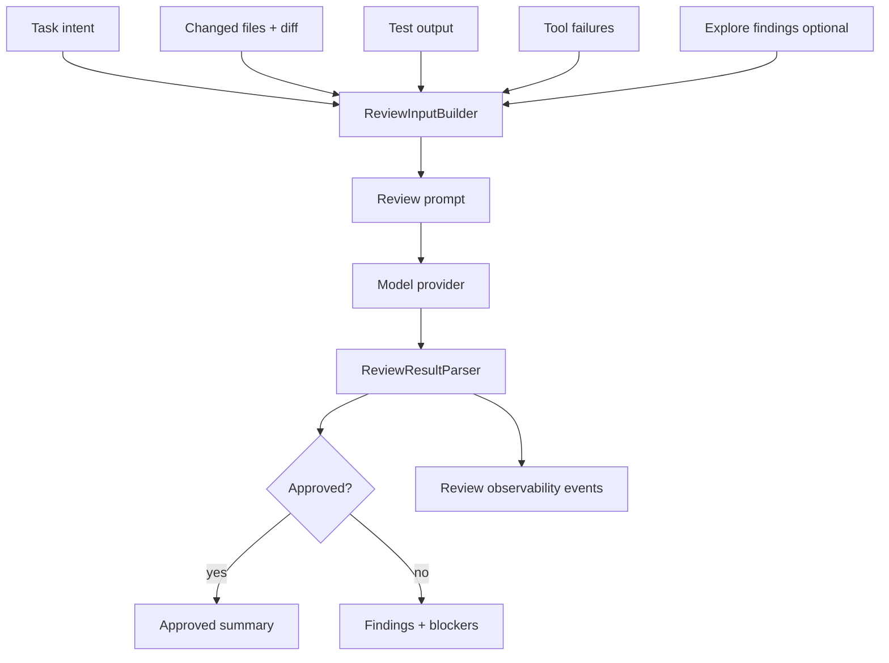

# Plan: Code Review Agent

## 1. Architecture Overview



## 2. Functional Components

| Component | Responsibility |
|-----------|----------------|
| `src/review/types.ts` | ReviewInput, ReviewFinding, ReviewResult contracts. |
| `src/review/input-builder.ts` | Build constrained review input from task/diff/tests/failures. |
| `src/review/prompt.ts` | Deterministic review system/user prompt builder. |
| `src/review/parser.ts` | Parse model review output; malformed output becomes inconclusive. |
| `src/review/reviewer.ts` | Execute review using model provider abstraction. |
| `src/review/index.ts` | Public API for standalone and 020 integration. |

## 3. Data Flow

1. Runtime or orchestrator provides task intent and execution evidence.
2. Input builder constructs `ReviewInput` without full implementation transcript.
3. Prompt builder creates role-specific review instructions.
4. Model provider returns review text/JSON.
5. Parser normalizes output to `ReviewResult`.
6. Runtime treats `approved=false` or inconclusive as not complete.
7. Observability records review started/completed/failed and finding counts.

## 4. Technical Architecture

```text
src/review/
  types.ts
  input-builder.ts
  prompt.ts
  parser.ts
  reviewer.ts
  index.ts

tests/review/
  contract.test.ts
  input-builder.test.ts
  prompt.test.ts
  parser.test.ts
  reviewer.test.ts
```

## 5. Documentation Structure

```text
specs/021-code-review-agent/
  spec.md
  clarify.md
  plan.md
  tasks.md
  state.md
  session.md
```

## 6. Integration Points

| Existing Area | Integration |
|---------------|-------------|
| `020 agents` | 020 Review phase can call `runCodeReview()`. |
| `runtime` | End-of-task review can be added after tool execution in later integration. |
| `observability` | Add review lifecycle/finding count events. |
| `cli` | Render blocking findings in concise table. |
| `persistence` | Store `ReviewResult` summary in session events. |

## 7. Test Strategy

| Test Type | What It Covers |
|-----------|----------------|
| Contract | Public review types and categories. |
| Input builder | Excludes full transcript, includes diff/test/tool failures. |
| Prompt snapshot | Stable reviewer instructions. |
| Parser | Valid JSON, malformed output, empty output, text fallback. |
| Reviewer | Fake provider success, blocking findings, malformed output. |
| Integration | 020 Review phase consumes `ReviewResult`. |

## 8. Risks

| Risk | Mitigation |
|------|------------|
| Reviewer rubber-stamps | Constrained evidence and malformed-output blocking. |
| Too many false blockers | Severity taxonomy; warnings do not block. |
| Diff too large | Input builder truncates with visible note. |
| Full transcript leaks into review | Unit test forbids transcript field inclusion. |
