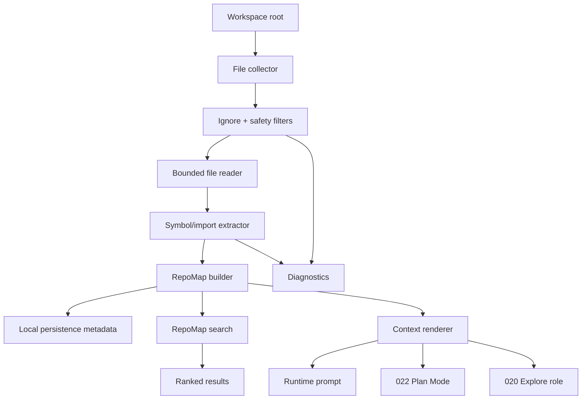

# Plan: Repo Map / Codebase Index

## 1. Architecture Overview



## 2. Functional Components

| Component | Responsibility |
|-----------|----------------|
| `src/repo-map/types.ts` | Repo map, indexed file, symbol, query, result, diagnostic contracts. |
| `src/repo-map/ignore.ts` | Built-in skip rules for ignored, generated, binary, oversized, and secret files. |
| `src/repo-map/collector.ts` | Deterministically collect candidate files under workspace root. |
| `src/repo-map/extractor.ts` | Extract imports, exports, and top-level symbols for TS/JS; generic fallback for other text. |
| `src/repo-map/builder.ts` | Build `RepoMap` from collected files and diagnostics. |
| `src/repo-map/search.ts` | Deterministic ranked search over paths, symbols, imports, and summaries. |
| `src/repo-map/render.ts` | Render bounded repo-map prompt context. |
| `src/repo-map/refresh.ts` | Incrementally update changed, added, and deleted files. |
| Runtime integration | Inject repo-map context when available and within budget. |
| Planning integration | Provide repo-map context to 022 planning prompt. |
| Agent integration | Provide repo-map hints to 020 Explore role. |

## 3. Data Flow

1. Runtime requests a repo map for the current workspace.
2. Collector enumerates candidate files in deterministic sorted order.
3. Ignore layer filters unsafe/noisy files before reading content.
4. Bounded reader reads only files under size limits.
5. Extractor builds imports, exports, symbols, and lightweight summaries.
6. Builder combines indexed files, import graph, symbol table, and diagnostics.
7. Search receives query text and ranks results by exact symbol, basename, import, path, and summary matches.
8. Renderer creates a compact context block with top files, symbols, and diagnostics within budget.
9. Runtime, plan mode, and Explore consume the same rendered repo-map context.
10. Refresh updates changed files and removes deleted entries between turns or before context build.

## 4. Technical Architecture

```text
src/repo-map/
  types.ts
  ignore.ts
  collector.ts
  extractor.ts
  builder.ts
  search.ts
  render.ts
  refresh.ts
  index.ts

tests/repo-map/
  contract.test.ts
  ignore.test.ts
  collector.test.ts
  extractor.test.ts
  builder.test.ts
  search.test.ts
  render.test.ts
  refresh.test.ts

tests/runtime/
  repo-map-integration.test.ts
```

## 5. Documentation Structure

```text
specs/023-repo-map-codebase-index/
  spec.md
  clarify.md
  plan.md
  tasks.md
  state.md
  session.md
```

## 6. Ranking Signals

| Signal | Priority |
|--------|----------|
| Exact exported symbol match | Highest |
| Exact top-level symbol match | High |
| Exact file basename match | High |
| Import path/module match | Medium |
| Path substring match | Medium |
| Summary token match | Low |
| Unsupported generic text match | Lowest |

## 7. Safety Filters

| Category | Default Handling |
|----------|------------------|
| VCS metadata | Skip `.git/**`. |
| Dependencies | Skip `node_modules/**`, package manager caches. |
| Build output | Skip `dist/**`, `build/**`, `coverage/**`, `.next/**`, `.turbo/**`. |
| Secrets | Skip `.env*`, `*.pem`, `*.key`, credential-like filenames. |
| Binary files | Skip by extension and null-byte detection when sampled. |
| Oversized files | Skip above configured byte limit with diagnostic. |
| Generated bundles | Skip minified files and common generated suffixes. |

## 8. Integration Points

| Existing Area | Integration |
|---------------|-------------|
| `src/config` | Add repo-map enable flag, max files, max file bytes, and prompt budget. |
| `src/runtime` | Build or refresh repo map before prompt composition when enabled. |
| `src/context` | Include bounded repo-map context block. |
| `src/agents` | Inject repo-map hints into Explore role prompt. |
| `src/planning` | Include repo-map context in planner prompt. |
| `src/persistence` | Store repo-map metadata, diagnostics, and refresh timestamps. |
| `src/observability` | Emit index build/refresh/search events. |

## 9. Test Strategy

| Test Type | What It Covers |
|-----------|----------------|
| Contract snapshot | Stable repo-map shapes and diagnostics. |
| Ignore unit | Secret/generated/binary/oversized skip behavior. |
| Collector unit | Deterministic ordering and max file limits. |
| Extractor unit | TS/JS imports, exports, functions, classes, constants. |
| Builder unit | Symbol table, import graph, and diagnostic aggregation. |
| Search unit | Ranking order and empty result behavior. |
| Render unit | Bounded prompt block and deterministic output. |
| Refresh unit | Changed, added, and deleted file updates. |
| Runtime integration | Repo-map context injection without blocking normal execution. |

## 10. Risks

| Risk | Mitigation |
|------|------------|
| Regex extraction misses complex syntax | Keep output as hints, not authority; tools still read files before edits. |
| Repo map bloats prompts | Enforce small context budget and top-N rendering. |
| Secrets leak into context | Deny common secret paths before reading and test filters. |
| Large repos index slowly | Max file count, size limits, and incremental refresh. |
| Ranking appears authoritative when stale | Include refresh timestamp and remove deleted files on refresh. |
