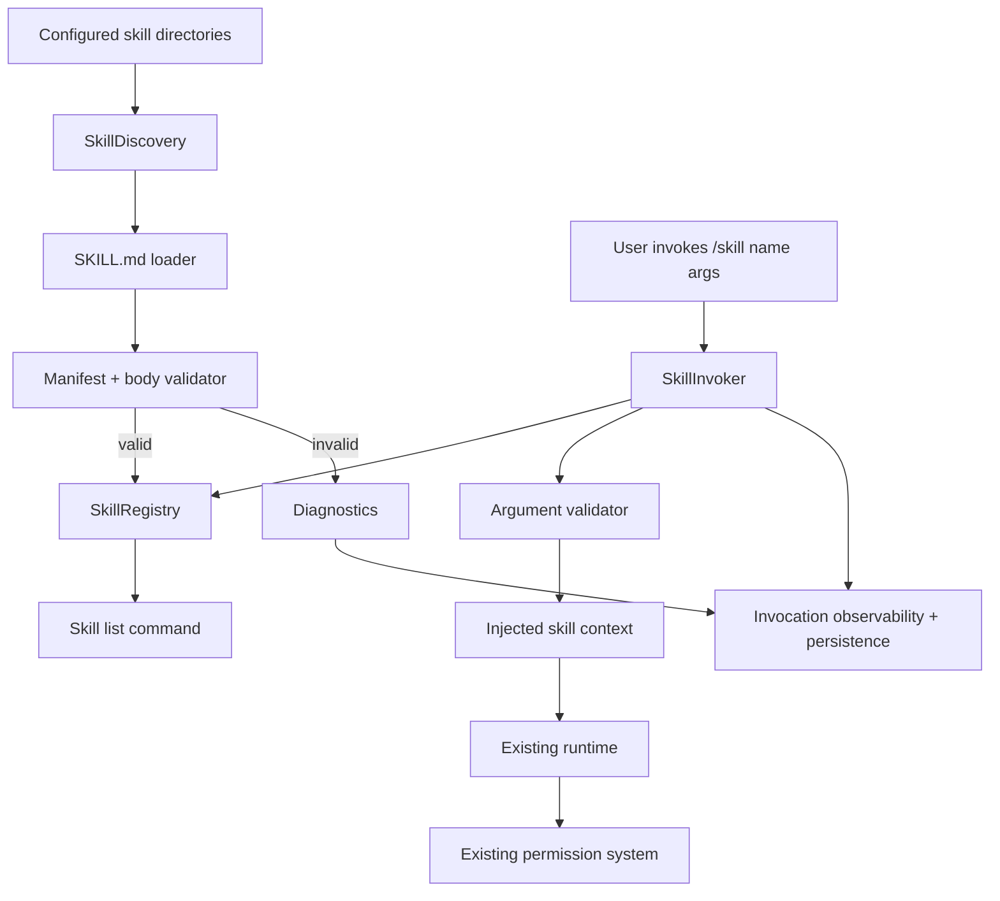

# Plan: Skill System

## 1. Architecture Overview



## 2. Functional Components

| Component | Responsibility |
|-----------|----------------|
| `src/skills/types.ts` | Skill manifest, argument, registry, diagnostic, invocation contracts. |
| `src/skills/manifest.ts` | Parse `SKILL.md` frontmatter and normalize metadata. |
| `src/skills/validator.ts` | Validate names, descriptions, versions, arguments, suggested mode, allowed roles, and body size. |
| `src/skills/discovery.ts` | Deterministically scan configured local directories and collect valid definitions plus diagnostics. |
| `src/skills/registry.ts` | Resolve skills by name, apply precedence, expose list and lookup APIs. |
| `src/skills/invocation.ts` | Validate invocation arguments and build injected context. |
| `src/skills/prompt.ts` | Render skill context block for runtime and role prompts. |
| Runtime integration | Inject selected skill instructions before normal execution. |
| CLI integration | Parse `/skill`, list skills, and display clear missing/invalid diagnostics. |
| Persistence integration | Persist discovery diagnostics and invocation events. |

## 3. Data Flow

1. Startup or session initialization reads configured skill directories.
2. Discovery scans directories in deterministic precedence order.
3. Each candidate `SKILL.md` is parsed into metadata and markdown body.
4. Validator accepts valid skills and emits diagnostics for invalid ones.
5. Registry stores valid skills by name, with project-local overriding user-global duplicates.
6. CLI lists registry entries for user discovery.
7. User invokes `/skill <name> <args>`.
8. Invoker validates required/optional arguments against metadata.
9. Runtime receives a context block containing skill metadata, instructions, and invocation arguments.
10. Model may request tools, but existing permission checks still approve, ask, or deny each tool call.
11. Invocation and diagnostics are emitted to observability and persisted in session events.

## 4. Technical Architecture

```text
src/skills/
  types.ts
  manifest.ts
  validator.ts
  discovery.ts
  registry.ts
  invocation.ts
  prompt.ts
  index.ts

tests/skills/
  contract.test.ts
  manifest.test.ts
  validator.test.ts
  discovery.test.ts
  registry.test.ts
  invocation.test.ts
  prompt.test.ts

tests/runtime/
  skill-integration.test.ts
```

## 5. Documentation Structure

```text
specs/024-skill-system/
  spec.md
  clarify.md
  plan.md
  tasks.md
  state.md
  session.md
```

## 6. Manifest Shape

```markdown
---
name: run-feature
description: Run a feature workflow from spec to verification.
version: 1.0.0
entry: SKILL.md
suggestedMode: plan
allowedRoles: [implement]
arguments:
  - name: feature
    description: Feature number or directory.
    required: true
---

Skill instructions in markdown.
```

## 7. Integration Points

| Existing Area | Integration |
|---------------|-------------|
| `src/config` | Add local skill directory configuration and max body size. |
| `src/runtime` | Accept skill invocation context and inject into prompt. |
| `src/cli` | Add `/skill` command and skill listing output. |
| `src/permissions` | No bypass; permissions remain unchanged. |
| `src/persistence` | Store `skill.discovered`, `skill.invalid`, and `skill.invoked` events. |
| `src/agents` | Filter skills by `allowedRoles` for 020 role prompts. |
| `src/planning` | Route `suggestedMode: plan` invocations through 022 plan mode. |

## 8. Test Strategy

| Test Type | What It Covers |
|-----------|----------------|
| Contract snapshot | Stable `SkillManifest`, `SkillDefinition`, and diagnostics shape. |
| Manifest unit | Frontmatter parsing, missing metadata, malformed frontmatter. |
| Validator unit | Name/version/argument/body size validation. |
| Discovery unit | Deterministic scan order, invalid-skill isolation, duplicate precedence. |
| Registry unit | List, lookup, missing skill error with available names. |
| Invocation unit | Argument validation and injected context rendering. |
| Runtime integration | Skill context is injected; tool permissions still govern execution. |

## 9. Risks

| Risk | Mitigation |
|------|------------|
| Skill text becomes implicit code execution | Treat skill body as context only and leave tools behind permission gates. |
| Invalid skill blocks all discovery | Collect diagnostics and continue loading other skills. |
| Oversized skill pollutes context | Enforce configurable max body size and skip by default. |
| Duplicate names behave unpredictably | Deterministic precedence and duplicate diagnostic. |
| Skill arguments become a schema DSL | Keep first version to simple argument descriptors. |
