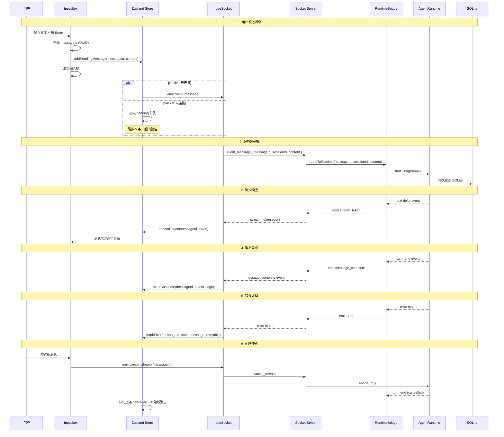

# Implementation Plan: Web 流式消息输入

**Feature**: 026-web-message-input  
**Based on**: spec.md  
**Status**: Draft  

---

## 1. Project File Structure

```
packages/web/src/
├── components/
│   ├── chat/
│   │   ├── message-list.tsx      # 消息列表 + 虚拟滚动 (NEW)
│   │   ├── message-bubble.tsx    # 消息气泡组件 (NEW)
│   │   └── input-box.tsx         # 底部输入框 (NEW)
│   └── ui/
│       └── status-indicator.tsx  # 发送状态指示器 (NEW)
├── store/
│   └── chat.ts                   # Zustand store: 消息/队列/状态 (NEW)
├── hooks/
│   ├── use-socket.ts             # Socket 连接 + 重连逻辑 (MODIFY from 025)
│   ├── use-input-history.ts      # 输入历史上下键导航 (NEW)
│   └── use-virtual-scroll.ts     # 虚拟滚动 hook (NEW)
├── server/
│   ├── runtime-bridge.ts         # Socket ↔ AgentRuntime 事件映射 (MODIFY from 025)
│   └── socket-handlers.ts        # Socket 事件处理器 (NEW)
├── types/
│   └── message.ts                # Message 类型 + Socket 协议定义 (NEW)
└── utils/
    ├── dompurify.ts              # XSS 转义封装 (NEW)
    └── uuid.ts                   # UUID 生成工具 (NEW)

packages/web/app/
└── page.tsx                      # 主页面，组装 Chat 组件 (MODIFY)

tests/
├── store/chat.test.ts            # Store 单元测试 (NEW)
├── components/chat.test.tsx      # 消息列表/输入框组件测试 (NEW)
└── socket/
    └── message-flow.test.ts      # Socket 消息流集成测试 (NEW)
```

### 文件职责说明

| 文件 | 核心职责 |
|------|---------|
| `message-types.ts` | Message 接口、Status 枚举、Socket 协议类型定义 |
| `chat.ts` | Zustand store：消息数组、pending 队列、连接状态、当前 streaming messageId |
| `use-socket.ts` | Socket 连接管理、指数退避重连、事件监听器注册/清理 |
| `use-input-history.ts` | 输入历史管理，↑↓ 键导航，最多 50 条 |
| `use-virtual-scroll.ts` | 虚拟滚动逻辑：计算可视区域、渲染窗口、滚动位置 |
| `message-list.tsx` | 消息列表容器，集成虚拟滚动，自动滚动到底部 |
| `message-bubble.tsx` | 单个消息气泡，根据 role/state 渲染不同样式 |
| `input-box.tsx` | Textarea 自动高度、Enter/Shift+Enter、粘贴、Esc 清空 |
| `socket-handlers.ts` | 服务端 Socket 事件处理：接收 client_message → 调用 runtime.startTurn() → 转发 stream 事件 |
| `runtime-bridge.ts` | 连接 Socket 与 AgentRuntime 的桥梁，事件双向映射 |
| `dompurify.ts` | DOMPurify 配置封装，安全转义 HTML |
| `uuid.ts` | 前端 messageId 生成 |

---

## 2. Frontend Design System Injection

### 2.1 Source Materials

| Source | Usage |
|--------|-------|
| Root `DESIGN.md` | Authoritative design direction for dense terminal-first chat layout, message hierarchy, input controls, status states, spacing, accessibility, and reduced-motion behavior |
| `specs/design-reference/stitch-export/claude_style_chat_workspace/` | Primary visual reference for chat workspace composition, message stream hierarchy, and bottom input placement |
| `specs/design-reference/stitch-export/obsidian_command/` | Secondary reference for compact command/input affordances and keyboard-oriented interaction density |

### 2.2 Component Mapping

| Planned component | DESIGN.md mapping | Visual reference |
|-------------------|-------------------|------------------|
| `MessageList` | Layout & Spacing, Lists, Elevation & Depth | `claude_style_chat_workspace/` |
| `MessageBubble` | Typography, Cards/Panels, Terminal Output | `claude_style_chat_workspace/` |
| `InputBox` | Inputs, Buttons, Micro-interactions | `claude_style_chat_workspace/`, `obsidian_command/` |
| `StatusIndicator` | Chips/Badges, Micro-interactions, Accessibility | `claude_style_chat_workspace/` |

### 2.3 Design Constraints

- Message input UI must preserve a terminal-first developer workflow: high-density history, compact input chrome, and clear status feedback without decorative dashboard treatment.
- The bottom input area must remain keyboard-first and readable during long prompts, with focus states and send/error/pending states following root `DESIGN.md`.
- Message list virtualization and auto-scroll behavior must maintain visual stability and scanability during streaming updates.
- Responsive behavior should reorganize the same chat workspace structure rather than inventing a separate mobile-only interaction model.

---

## 3. Data Flow



---

## 4. Dependencies

### 4.1 Language & Runtime

- **Node.js**: ≥ 18.0.0
- **TypeScript**: ~5.4
- **React**: 18.x

### 4.2 Third-Party Libraries

| 库 | 用途 | 是否新增 |
|----|------|---------|
| `zustand` | 状态管理 | ✅ 新增（项目首次使用） |
| `socket.io-client` | 前端 Socket.io 客户端 | ✅ 新增 |
| `dompurify` | XSS 防护，转义 HTML | ✅ 新增 |
| `@types/dompurify` | DOMPurify 类型 | ✅ 新增 |
| `uuid` | messageId 生成 | ✅ 新增（或使用 crypto.randomUUID 内置） |

**注意**：`crypto.randomUUID` 是 Web API 浏览器内置，Node.js 19+ 也内置。如果目标 Node.js 18，需要安装 `uuid` 包，或者使用 polyfill。

**决策**：使用浏览器内置 `crypto.randomUUID()`，无需安装 uuid 包。

**新增依赖总计**：3 个（zustand, socket.io-client, dompurify），均为行业标准，无风险。

---

## 5. Integration Points with Existing System

### 5.1 前置依赖（必须先完成）

| 依赖项 | 来自哪个 Feature | 集成方式 |
|--------|-----------------|---------|
| WebServer 类 | 025-web-server-start | 挂载 Socket.io 到 WebServer 的 http server |
| RuntimeBridge 类 | 025-web-server-start (预留) | 实现 Socket 事件到 AgentRuntime 的映射 |
| AgentRuntime | 现有 CLI | 复用 `startTurn()` 方法和流式事件 |
| SQLite 会话持久化 | 现有 CLI | 复用会话存储，Web 会话与 CLI 会话共享同一数据库 |

### 5.2 对 025 的修改

- **`src/server/index.ts` (WebServer)**：增加 `attachSocketIO()` 方法，挂载 Socket.io 到 http server
- **`src/server/runtime-bridge.ts`**：从空壳改为完整实现，包含：
  - `handleClientMessage()` → 调用 `runtime.startTurn()`
  - 订阅 runtime 事件 → 转发到 Socket
  - `abortTurn()` 方法支持中断

### 5.3 与现有系统的关键复用

| 复用点 | 现有模块 | 说明 |
|--------|---------|------|
| Agent Runtime | `src/runtime/runtime.ts` | 100% 复用，无需修改 |
| Model Provider | `src/models/` | 100% 复用，Web 使用相同的模型和配置 |
| 会话持久化 | `src/persistence/` | 100% 复用，Web 和 CLI 共享同一会话数据库 |
| Token 计数 | `src/observability/token-counter.ts` | 100% 复用 |
| 权限系统 | `src/permissions/` | 后端逻辑复用，后续 feature 实现 Web 端审批 UI |

---

## 6. Risks & Mitigations

### 6.1 Technical Risks

| ID | 风险描述 | 严重度 | 概率 | 缓解方案 |
|----|---------|:-----:|:----|---------|
| R-MI-01 | 流式输出时 React 频繁重渲染导致卡顿 | 高 | 中 | 使用 Zustand selector 精确订阅；虚拟滚动只渲染可视区域；memo 包装气泡组件 |
| R-MI-02 | Socket 重连后消息状态不一致 | 中 | 低 | 重连后从后端拉取完整会话历史，本地状态全量替换；消息 ID 前端生成，幂等性保证 |
| R-MI-03 | XSS 漏洞，模型返回恶意脚本 | 高 | 低 | DOMPurify 强制转义所有流式输出，白名单标签/属性，绝不使用 dangerouslySetInnerHTML 不加防护 |
| R-MI-04 | 虚拟滚动计算错误，消息跳变/闪烁 | 中 | 中 | 固定消息高度，或提前估算高度；使用 tanstack/virtual 成熟库，不手写；充分测试滚动边界 |
| R-MI-05 | 指数退避重连逻辑死循环 | 低 | 低 | 最大重试次数 10 次，超过后停止并显示"连接失败，请刷新"，手动刷新后重置 |
| R-MI-06 | 前端排队与后端处理速度不匹配 | 低 | 低 | 最多排队 5 条，达到限制时禁用输入框，清晰提示用户 |

### 6.2 Integration Risks

| ID | 风险描述 | 严重度 | 概率 | 缓解方案 |
|----|---------|:-----:|:----|---------|
| R-MI-07 | Runtime 事件与 Socket 事件映射错误 | 中 | 中 | 强类型定义，TypeScript 编译器检查；集成测试覆盖完整消息流 |
| R-MI-08 | 会话持久化格式与 CLI 不兼容 | 中 | 低 | 复用完全相同的持久化代码，不做任何修改；先写测试验证 CLI 保存的会话 Web 能正确加载 |
| R-MI-09 | Socket.io 客户端/服务端版本不匹配 | 低 | 低 | 严格锁定版本号，client 和 server 使用相同主版本；文档中明确记录 |

### 6.3 UX Risks

| ID | 风险描述 | 严重度 | 概率 | 缓解方案 |
|----|---------|:-----:|:----|---------|
| R-MI-10 | 自动滚动在用户向上看历史时打扰用户 | 中 | 高 | 只有当用户在最底部时才自动滚动，用户向上滚动后停止自动滚动，显示"点击回到最新"按钮 |
| R-MI-11 | 长文本输入卡顿 | 低 | 低 | Textarea 使用 contenteditable 或原生 resize，不做受控组件的频繁 setState；输入防抖 |
| R-MI-12 | 网络差时用户不知道发送状态 | 中 | 高 | 清晰的状态指示器：pending (灰色) → sending (旋转动画) → streaming (脉冲) → sent (对勾) → error (红色叉) |

---

## 7. Testing Strategy

### 7.1 Unit Tests

- `chat.test.ts`: Store action 测试（加消息、追加 token、状态变更、排队逻辑）
- `use-input-history.test.ts`: 上下键导航、边界测试（第一条/最后一条）
- `dompurify.test.ts`: XSS 攻击向量测试，验证脚本被正确转义
- `uuid.test.ts`: UUID 格式正确性测试

### 7.2 Component Tests

- `message-bubble.test.tsx`: 各种 role/status 下的渲染正确性
- `input-box.test.tsx`: Enter/Shift+Enter/Esc 行为、自动高度、粘贴测试
- `message-list.test.tsx`: 虚拟滚动渲染数量、自动滚动行为

### 7.3 Integration Tests

- `message-flow.test.ts`: 完整 Socket 消息流端到端测试（发送 → 流式接收 → 完成）
- `reconnection.test.ts`: 断开重连、排队消息自动发送、状态恢复
- `cancel-stream.test.ts`: 流式输出中发送新消息，验证上一条被正确中断

### 7.4 E2E / Manual Tests

- 500 条消息滚动性能测试（验证 60fps）
- 50,000 字符大文本输入测试（不卡顿）
- XSS 攻击测试（注入 `<script>` 验证被转义）
- 网络断开/重连场景测试
- 三个浏览器兼容性测试（Chrome/Firefox/Safari）

---

> **Plan Version**: v1.0 | **Created**: 2026-06-18 | **Next Step**: Generate tasks.md
