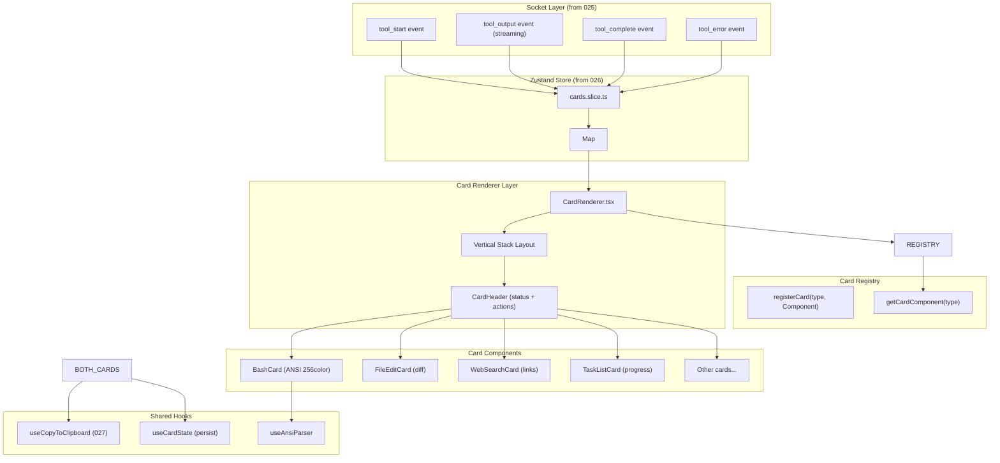

# Implementation Plan: Web Tool Cards Rendering

**Feature**: 028-web-tool-cards  
**Based on**: spec.md  
**Status**: Draft

---

## 1. Project File Structure

```
packages/web/src/
├── components/
│   └── chat/
│       └── cards/
│           ├── CardRegistry.ts                # 卡片注册机制
│           ├── CardRenderer.tsx              # 主渲染器入口
│           ├── CardHeader.tsx                # 统一卡片头部
│           ├── BashCard.tsx                  # Bash 终端卡片 (ANSI 256色)
│           ├── FileReadCard.tsx              # 文件读取卡片
│           ├── FileWriteCard.tsx             # 文件写入卡片
│           ├── FileEditCard.tsx              # 文件编辑 diff 卡片
│           ├── GrepCard.tsx                  # 搜索结果卡片
│           ├── GlobCard.tsx                  # 文件匹配卡片
│           ├── TaskListCard.tsx              # 任务列表卡片
│           ├── SubAgentGridCard.tsx          # 子 Agent 网格卡片
│           ├── WebSearchCard.tsx             # 网络搜索结果卡片
│           └── ErrorCard.tsx                 # 智能错误摘要卡片
├── hooks/
│   ├── use-card-state.ts                     # 卡片折叠/展开状态管理
│   └── use-ansi-parser.ts                    # ANSI 转义序列解析 hook
├── lib/
│   └── ansi-parser.ts                        # 256色 + 基础格式解析器
├── store/
│   └── slices/
│       └── cards.slice.ts                    # Zustand cards 状态切片
└── types/
    └── cards.ts                               # ToolCard 类型定义

tests/
└── components/
    └── chat/
        └── cards/
            ├── card-registry.test.ts
            ├── bash-card.test.tsx
            ├── file-edit-card.test.tsx
            └── web-search-card.test.tsx
```

### 文件职责说明

| 文件 | 核心职责 |
|------|---------|
| `CardRegistry.ts` | 可扩展卡片注册机制，类型安全的卡片映射，支持动态新增卡片类型 |
| `CardRenderer.tsx` | 主渲染入口，根据 tool type 分发到对应卡片组件，处理垂直堆叠 |
| `CardHeader.tsx` | 统一卡片头部组件（状态指示器、工具名称、时间戳、复制/折叠按钮） |
| `BashCard.tsx` | 终端输出卡片，ANSI 256色渲染、流式更新、虚拟滚动 |
| `FileEditCard.tsx` | Diff 渲染，新增/删除行高亮、变更统计 |
| `WebSearchCard.tsx` | 结构化搜索结果展示、可点击链接、展开更多结果 |
| `ErrorCard.tsx` | 智能错误摘要 + 可折叠堆栈跟踪 |
| `ansi-parser.ts` | ANSI 转义序列解析（16色 + 256色 + 粗体/下划线/反显） |
| `use-card-state.ts` | 卡片状态管理（展开/折叠状态持久化） |

---

## 2. Frontend Design System Injection

### 2.1 Source Materials

| Source | Usage |
|--------|-------|
| Root `DESIGN.md` | Authoritative design direction for tool cards, compact panels, status badges, terminal output, code/diff previews, controls, accessibility, and dense developer-tool hierarchy |
| `specs/design-reference/stitch-export/claude_style_detailed_tool_cards/` | Primary visual reference for tool card structure, metadata hierarchy, actions, and status presentation |
| `specs/design-reference/stitch-export/humanist_detailed_tool_cards/` | Secondary reference for readable detailed tool output and compact card composition |

### 2.2 Component Mapping

| Planned component | DESIGN.md mapping | Visual reference |
|-------------------|-------------------|------------------|
| `CardRenderer`, `CardHeader` | Cards/Panels, Chips/Badges, Buttons | `claude_style_detailed_tool_cards/` |
| `BashCard` | Terminal Output, Typography, Layout & Spacing | `claude_style_detailed_tool_cards/` |
| `FileReadCard`, `FileWriteCard`, `FileEditCard` | Terminal Output, Cards/Panels, Lists | `claude_style_detailed_tool_cards/`, `humanist_detailed_tool_cards/` |
| `GrepCard`, `GlobCard`, `WebSearchCard` | Lists, Links, Chips/Badges | `humanist_detailed_tool_cards/` |
| `TaskListCard`, `SubAgentGridCard`, `ErrorCard` | Status hierarchy, Cards/Panels, Micro-interactions | `claude_style_detailed_tool_cards/` |

### 2.3 Design Constraints

- Tool cards must preserve a compact execution timeline: clear headers, status badges, metadata, and actions without spacious dashboard chrome.
- Terminal, file, search, diff, task, and error cards must share one visual grammar so mixed tool output remains scannable in a single chat message.
- Long outputs should default to controlled folding/virtualization while keeping enough summary context visible for review.
- Error, success, running, and pending states must follow root `DESIGN.md` status semantics and accessibility requirements.

---

## 3. Data Flow



### 关键数据流节点

1. **事件接收**: `tool_start` / `tool_output` / `tool_complete` / `tool_error` 事件更新 Store 中对应 `toolCallId` 的卡片状态
2. **状态持久化**: 卡片展开/折叠状态存储在 Zustand 中，会话间持久化
3. **渲染分发**: `CardRenderer` 根据卡片类型从 `CardRegistry` 查找对应组件
4. **垂直堆叠**: 同消息内的多工具调用结果各自独立渲染，垂直堆叠，独立状态
5. **流式更新**: `BashCard` 接收增量输出，高效追加到显示区域（不重绘全文）
6. **智能错误**: 错误事件触发 `ErrorCard`，默认显示摘要，点击展开完整堆栈

---

## 4. Dependencies

### 4.1 Runtime Dependencies

| 库 | 用途 | 新增/复用 |
|----|------|----------|
| `ansi-to-html` / `ansi-up` | ANSI 转义序列转 HTML，支持 256 色 | ✅ 新增 |
| `diff` | 文件编辑差异对比，unified diff 渲染 | ✅ 新增 |
| `zustand` | 状态管理 | ✅ 复用 026 |
| `marked` | 代码块语法高亮 | ✅ 复用 027 |
| `shiki` | 语法高亮（文件内容展示） | ✅ 复用 027 |

### 4.2 Build Tool Dependencies

无新增构建工具依赖，继承 026/027 的现有配置。

---

## 5. Integration Points with Existing System

### 5.1 Upstream Dependencies

| 依赖 | 来自 Feature | 集成方式 |
|------|-------------|---------|
| Socket.io client | 025-web-server-start | 监听 tool_start/tool_output/tool_complete/tool_error 事件 |
| Zustand Store | 026-web-message-input | 扩展 store，新增 cards slice |
| useCopyToClipboard hook | 027-web-chat-stream | 所有卡片的复制按钮复用 |
| Markdown syntax highlighting | 027-web-chat-stream | FileRead/FileEdit 卡片中代码高亮复用 |

### 5.2 对 026 的修改

需要扩展 `packages/web/src/store/index.ts`：
```typescript
// 新增 cards slice 导入
import { cardsSlice } from './slices/cards.slice'

// 将 cardsSlice 合并到主 store
export const useStore = create<StoreState>()(
  combine(
    // ...现有 slices
    cardsSlice
  )
)
```

### 5.3 对 027 的修改

无需修改 027，直接复用导出的 hooks 和渲染器。

### 5.4 Downstream Dependencies

| Feature | 依赖本 Feature 的方式 |
|---------|----------------------|
| 029-web-diff-display | 更高级的 diff 可视化复用 FileEditCard 基础 |
| 030-web-terminal-output | 完整终端仿真复用 BashCard 的 ANSI 解析和滚动逻辑 |

---

## 6. Risks & Mitigations

### 6.1 Technical Risks

| ID | 风险描述 | 严重度 | 概率 | 缓解方案 |
|----|---------|:-----:|:----:|---------|
| R-CARD-01 | ANSI 解析不完整导致某些命令输出显示异常 | 中 | 中 | 使用成熟的 `ansi-to-html` 或 `ansi-up` 库；覆盖 `npm test` / `git diff` / `ls --color` 等常见场景测试 |
| R-CARD-02 | 流式 Bash 输出高频重渲染导致性能下降 | 高 | 中 | 仅对增量内容进行 DOM 追加；使用 `requestAnimationFrame` 批处理高频更新；超过渲染阈值自动开启虚拟滚动 |
| R-CARD-03 | CardRegistry 类型安全无法保证新增卡片符合接口 | 中 | 低 | 使用 TypeScript discriminant union + generic register 函数强制类型检查；单元测试覆盖所有卡片类型 |
| R-CARD-04 | 长 diff 渲染性能问题（1000+ 行变更） | 中 | 低 | 虚拟滚动复用 026 的 useVirtualScroll；默认只显示前 100 行差异，"展开全部" 按钮按需渲染 |

### 6.2 UX Risks

| ID | 风险描述 | 严重度 | 概率 | 缓解方案 |
|----|---------|:-----:|:----:|---------|
| R-UX-01 | 垂直堆叠多卡片导致单条消息过长 | 中 | 中 | 智能默认折叠长卡片（>50行）；卡片间保持一致间距和视觉分隔 |
| R-UX-02 | 9种卡片样式不一致 | 中 | 低 | 统一 CardHeader 组件；统一卡片容器样式、间距、阴影；视觉回归测试覆盖所有卡片类型 |
| R-UX-03 | 错误信息过度折叠导致用户错过关键调试信息 | 低 | 低 | 错误类型和消息默认可见，仅堆栈折叠；醒目提示"点击展开完整堆栈" |

### 6.3 Integration Risks

| ID | 风险描述 | 严重度 | 概率 | 缓解方案 |
|----|---------|:-----:|:----:|---------|
| R-INT-01 | Socket 事件 payload 格式变化导致卡片状态异常 | 中 | 低 | Zod schema 验证所有进入 store 的 tool 事件；类型不匹配时优雅降级为通用文本卡片 |
| R-INT-02 | 与 027 Markdown 渲染器的样式冲突 | 低 | 低 | 使用 `.tool-card` CSS 命名空间；样式隔离；视觉测试对比 |

---

## 7. Testing Strategy

### 7.1 Unit Tests

| 测试目标 | 覆盖点 |
|---------|-------|
| Card Registry | 注册/查找逻辑；类型安全；未知类型的降级策略 |
| ANSI Parser | 16 标准色 / 256 色 / 粗体 / 下划线 / 反显 / 混合序列 |
| Card State Hook | 展开/折叠状态切换；多卡片状态隔离；持久化读写 |

### 7.2 Component Tests

| 组件 | 测试场景 |
|------|---------|
| `BashCard` | 流式追加渲染；256 色显示；滚动行为；复制按钮；长输出自动折叠 |
| `FileEditCard` | diff 高亮正确；新增/删除/修改行视觉区分；变更统计数字正确 |
| `WebSearchCard` | 链接可点击；摘要截断正确；展开更多功能正常 |
| `ErrorCard` | 默认只显示错误类型和消息；点击展开显示完整堆栈；复制错误详情 |
| `CardRenderer` | 垂直堆叠布局；每个卡片独立状态；未知类型优雅降级 |

### 7.3 Integration Tests

| 场景 | 验证点 |
|------|-------|
| Socket 事件驱动渲染 | tool_start → tool_output (N次) → tool_complete 完整流程，状态正确演进 |
| 多工具并行渲染 | 3个工具同时返回 → 3张独立卡片正确堆叠，状态互不干扰 |
| 状态持久化 | 刷新页面后，卡片展开/折叠状态保持不变 |

### 7.4 Performance Tests

| 指标 | 目标 |
|------|------|
| 单卡片首次渲染延迟 | < 50ms |
| Bash 流式渲染帧率 | ≥ 60fps（使用 PerformanceObserver 测量） |
| 1000行 Bash 输出滚动 | 无掉帧（虚拟滚动生效） |
| 5张卡片同时渲染 | 无明显卡顿 |

---

## 8. Implementation Phases

### Phase 1: Foundation & Infrastructure (可并行)

**Tasks**:
- TypeScript 类型定义 (`types/cards.ts`)
- Card Registry 实现
- Zustand cards slice 状态管理
- CardHeader 通用组件
- CardRenderer 主分发器
- useCardState hook（持久化）
- ANSI 解析器基础

### Phase 2: Core Card Components (可并行)

**Tasks**:
- BashCard（ANSI 256色 + 流式渲染 + 虚拟滚动）
- FileReadCard
- FileWriteCard
- FileEditCard（diff 渲染）
- GrepCard
- GlobCard
- ErrorCard（智能摘要 + 可折叠堆栈）

### Phase 3: Advanced Card Components (可并行)

**Tasks**:
- TaskListCard（进度条 + 复选框状态）
- SubAgentGridCard（2列网格 + 独立单元格流式输出）
- WebSearchCard（结构化结果 + 可点击链接 + 展开更多）

### Phase 4: Polish & Integration

**Tasks**:
- 垂直堆叠布局优化
- 智能默认折叠逻辑
- 复制按钮统一集成
- 深色主题样式统一
- WCAG 对比度检查
- 性能优化（节流 / 虚拟滚动 / memo）
- 完整测试覆盖

---

**Plan Version**: v1.0  
**Created**: 2026-06-18  
**Next Step**: Generate tasks.md with `/speckit-tasks`
