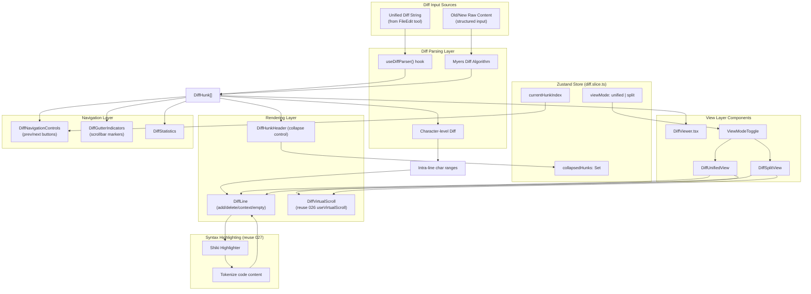

# Implementation Plan: Web Diff Display

**Feature**: 029-web-diff-display  
**Based on**: spec.md  
**Status**: Draft

---

## 1. Project File Structure

```
packages/web/src/
├── components/
│   └── chat/
│       └── diff/
│           ├── DiffViewer.tsx                 # 主入口组件
│           ├── DiffViewModeToggle.tsx         # Unified/Split 模式切换
│           ├── DiffUnifiedView.tsx            # 合并视图渲染
│           ├── DiffSplitView.tsx              # 分栏视图渲染
│           ├── DiffLine.tsx                   # 单行渲染（+/-/context/empty）
│           ├── DiffHunkHeader.tsx             # Hunk 头部（行号范围 + 折叠按钮）
│           ├── DiffGutterIndicators.tsx       # 滚动条变更标记
│           ├── DiffNavigationControls.tsx     # 上一处/下一处导航按钮
│           ├── DiffStatistics.tsx             # 变更统计面板
│           └── DiffVirtualScroll.tsx          # 虚拟滚动包装器
├── hooks/
│   ├── use-diff-parser.ts                     # Diff 字符串解析 hook
│   ├── use-diff-navigation.ts                 # Hunk 导航状态
│   ├── use-diff-virtual-scroll.ts             # 虚拟滚动逻辑（复用 026）
│   └── use-char-level-diff.ts                 # 字符级差异计算
├── lib/
│   ├── diff-parser.ts                         # Unified diff → 结构化 DiffHunk[]
│   ├── char-level-diff.ts                     # 行内字符级差异算法
│   └── diff-statistics.ts                     # 统计计算工具
├── store/
│   └── slices/
│       └── diff.slice.ts                      # Zustand diff 视图状态（模式 + 折叠状态）
└── types/
    └── diff.ts                                 # Diff 类型定义（DiffLine/DiffHunk/DiffStatistics）

tests/
└── components/
    └── chat/
        └── diff/
            ├── diff-parser.test.ts
            ├── char-level-diff.test.ts
            ├── DiffUnifiedView.test.tsx
            ├── DiffSplitView.test.tsx
            └── DiffNavigation.test.tsx
```

### 文件职责说明

| 文件 | 核心职责 |
|------|---------|
| `DiffViewer.tsx` | 主入口，聚合所有子组件，管理视图模式切换 |
| `DiffUnifiedView.tsx` | 合并视图渲染（旧/新内容在同一列，+/- 标记区分） |
| `DiffSplitView.tsx` | 分栏视图渲染（左旧右新，行号垂直对齐） |
| `DiffLine.tsx` | 单行渲染逻辑：新增绿/删除红/上下文灰/空白占位 |
| `DiffHunkHeader.tsx` | Hunk 范围显示 + 折叠/展开控制 |
| `DiffNavigationControls.tsx` | 上一处/下一处跳转按钮 + 当前位置指示器 |
| `DiffGutterIndicators.tsx` | 滚动条上的变更位置标记（可点击跳转） |
| `DiffStatistics.tsx` | 新增/删除/修改行数 + Hunk 数量统计 |
| `DiffVirtualScroll.tsx` | 大 diff 虚拟滚动（复用 026 的 useVirtualScroll） |
| `use-diff-parser.ts` | 将 unified diff 字符串解析为 DiffHunk[] 结构 |
| `use-char-level-diff.ts` | 计算单行内的字符级差异，返回高亮范围 |
| `diff-parser.ts` | Myers diff 算法封装，统一 diff 格式解析 |
| `char-level-diff.ts` | 行内字符级差异算法（diff-match-patch 封装） |
| `diff.slice.ts` | Zustand 状态：视图模式（unified/split）、各 hunk 折叠状态 |

---

## 2. Frontend Design System Injection

### 2.1 Source Materials

| Source | Usage |
|--------|-------|
| Root `DESIGN.md` | Authoritative design direction for dense code review surfaces, diff colors, line hierarchy, controls, accessibility, and terminal-first developer UI |
| `specs/design-reference/stitch-export/detailed_tool_card_view/` | Primary visual reference for detailed tool card composition, code/diff panels, metadata hierarchy, and action placement |
| `specs/design-reference/stitch-export/humanist_detailed_tool_card_view/` | Secondary reference for compact readable diff/tool detail presentation and interaction hierarchy |

### 2.2 Component Mapping

| Planned component | DESIGN.md mapping | Visual reference |
|-------------------|-------------------|------------------|
| `DiffViewer` | Layout & Spacing, Elevation & Depth, Terminal Output | `detailed_tool_card_view/` |
| `DiffUnifiedView` / `DiffSplitView` | Terminal Output, Typography, Cards/Panels | `detailed_tool_card_view/`, `humanist_detailed_tool_card_view/` |
| `DiffLine`, `DiffHunkHeader` | Terminal Output, Colors, Lists | `detailed_tool_card_view/` |
| `DiffViewModeToggle`, `DiffNavigationControls` | Buttons, Chips/Badges, Micro-interactions | `humanist_detailed_tool_card_view/` |
| `DiffGutterIndicators`, `DiffStatistics` | Information density, status indicators, scanability guidance | `detailed_tool_card_view/` |

### 2.3 Design Constraints

- Diff UI must preserve code-review scanability: line numbers, change markers, hunk boundaries, and statistics should be visually clear without adding dashboard-like chrome.
- Add/delete/modify colors must follow root `DESIGN.md` status semantics and maintain WCAG AA contrast against dark code surfaces.
- Unified and split modes must share the same hierarchy and controls so users can switch modes without relearning the layout.
- Large diff virtualization, folding, and navigation controls should feel like developer tooling: compact, keyboard-friendly, and optimized for long code sessions.

---

## 3. Data Flow



### 关键数据流节点

1. **双输入支持**: 接受两种输入格式 —— 标准 unified diff 字符串（来自 FileEdit 工具）或结构化的旧/新文件内容对（需要先运行 Myers 算法生成 diff）
2. **解析层**: `useDiffParser` 将输入转换为标准化的 `DiffHunk[]` 结构，包含行类型、行号、内容、字符级差异范围
3. **状态管理**: 视图模式和各 hunk 折叠状态存储在 Zustand slice 中，跨组件共享
4. **视图分发**: 根据 `viewMode` 选择 Unified 或 Split 渲染器
5. **虚拟滚动**: 超过 500 行自动启用虚拟滚动，复用 026 的 `useVirtualScroll` hook
6. **语法高亮**: 每行代码内容通过 027 的 Shiki 渲染器进行语法高亮
7. **字符级高亮**: 每行内的变更字符通过 `useCharLevelDiff` 计算后单独高亮
8. **导航系统**: 变更块导航按钮 + 滚动条标记，支持快速在变更间跳转

---

## 4. Dependencies

### 4.1 Runtime Dependencies

| 库 | 用途 | 新增/复用 |
|----|------|----------|
| `diff` | Myers diff 算法，unified diff 解析 | ✅ 新增 |
| `diff-match-patch` | 字符级差异计算（行内精确高亮） | ✅ 新增 |
| `zustand` | diff 视图状态管理（模式 + 折叠状态） | ✅ 复用 026 |
| `shiki` | 代码语法高亮 | ✅ 复用 027 |
| `useVirtualScroll` hook | 大 diff 虚拟滚动 | ✅ 复用 026 |

### 4.2 Build Tool Dependencies

无新增构建工具依赖，完全继承 026/027/028 的现有配置。

---

## 5. Integration Points with Existing System

### 5.1 Upstream Dependencies

| 依赖 | 来自 Feature | 集成方式 |
|------|-------------|---------|
| Virtual Scroll hook | 026-web-message-input | 复用 `useVirtualScroll` hook 实现大 diff 流畅滚动 |
| Zustand Store | 026-web-message-input | 扩展 store，新增 diff slice 管理视图状态 |
| Shiki Syntax Highlighting | 027-web-chat-stream | 复用语法高亮渲染器对 diff 代码行着色 |
| FileEditCard | 028-web-tool-cards | FileEditCard 内嵌 DiffViewer 组件替代基础 diff 显示 |

### 5.2 对 028 的修改

需要升级 `FileEditCard.tsx` 中的 diff 渲染：

```typescript
// packages/web/src/components/chat/cards/FileEditCard.tsx
// 替换基础 diff 渲染为新的 DiffViewer 组件

// Before: 简单 +/- 高亮
<div className="diff-simple">
  {lines.map(line => <div className={line.type}>{line.content}</div>)}
</div>

// After: 完整 DiffViewer
<DiffViewer
  diff={props.diffContent}
  defaultViewMode="split"
  showStatistics={true}
  showNavigation={lines.length > 100}
/>
```

### 5.3 对 026 的修改

需要扩展 `packages/web/src/store/index.ts`：

```typescript
// 新增 diff slice 导入
import { diffSlice } from './slices/diff.slice'

// 将 diffSlice 合并到主 store
export const useStore = create<StoreState>()(
  combine(
    // ...现有 slices (input, cards, etc.)
    diffSlice
  )
)
```

### 5.4 Downstream Dependencies

| Feature | 依赖本 Feature 的方式 |
|---------|----------------------|
| 031-web-git-history-view | Git 历史视图中文件版本对比复用 DiffViewer |
| 032-web-code-review-ui | PR 代码审查界面复用 diff 渲染和导航 |
| 033-web-file-compare | 任意两个文件对比功能复用核心组件 |

---

## 6. Risks & Mitigations

### 6.1 Technical Risks

| ID | 风险描述 | 严重度 | 概率 | 缓解方案 |
|----|---------|:-----:|:----:|---------|
| R-DIFF-01 | 10,000 行大 diff 渲染卡顿 | 高 | 中 | 500 行阈值启用虚拟滚动（复用 026 useVirtualScroll）；未变更区块自动折叠；按需渲染而非全量渲染 |
| R-DIFF-02 | Split 模式左右行对齐错误 | 中 | 中 | 严格按 diff hunk 结构配对渲染；empty placeholder 行保证垂直对齐；单元测试覆盖所有边界情况（新增/删除/修改/上下文混合） |
| R-DIFF-03 | Myers diff 算法性能瓶颈 | 中 | 低 | Web Worker 离线计算大文件 diff；增量解析；10,000 行以上截断警告 + "查看完整 diff" 按钮 |
| R-DIFF-04 | 字符级高亮计算开销大 | 低 | 中 | 仅对变更行计算字符差异；缓存已计算的行结果；可视区域外延迟计算 |
| R-DIFF-05 | 虚拟滚动与折叠状态冲突 | 中 | 低 | 折叠 hunk 时从虚拟滚动高度中扣除对应行数；状态变更时强制 recalculate 滚动高度 |

### 6.2 UX Risks

| ID | 风险描述 | 严重度 | 概率 | 缓解方案 |
|----|---------|:-----:|:----:|---------|
| R-UX-DIFF-01 | Unified vs Split 模式用户困惑 | 低 | 中 | 明确的模式切换按钮 + 工具提示；默认根据 diff 类型智能选择（小 diff unified，大重构 split） |
| R-UX-DIFF-02 | 颜色对比度不达标 | 高 | 低 | 严格遵循 WCAG AA 4.5:1；使用设计系统预定义的成功/错误色板而非自定义色；自动化对比度测试 |
| R-UX-DIFF-03 | 折叠的未变更区块被遗漏 | 中 | 低 | 醒目折叠按钮 + 折叠行数显示；"展开全部"快捷键；统计面板明确显示折叠行数 |
| R-UX-DIFF-04 | 滚动条标记与实际位置偏移 | 低 | 中 | 虚拟滚动启用时重新计算标记位置；ResizeObserver 监听容器尺寸变化 |

### 6.3 Integration Risks

| ID | 风险描述 | 严重度 | 概率 | 缓解方案 |
|----|---------|:-----:|:----:|---------|
| R-INT-DIFF-01 | FileEditCard 升级导致现有功能回归 | 中 | 低 | 保留旧实现作为 fallback；A/B 测试验证；完整视觉回归测试 |
| R-INT-DIFF-02 | 与 027 语法高亮样式冲突 | 低 | 低 | `.diff-line` CSS 命名空间隔离；样式优先级明确；视觉测试验证 |
| R-INT-DIFF-03 | 不同来源 diff 格式不统一 | 中 | 中 | `useDiffParser` 前端标准化处理；Zod schema 验证输入格式；不支持的格式优雅降级为文本显示 |

---

## 7. Testing Strategy

### 7.1 Unit Tests

| 测试目标 | 覆盖点 |
|---------|-------|
| Diff Parser | unified diff 格式解析；hunk 边界识别；行号计算正确；异常格式优雅降级 |
| Character-level Diff | 新增/删除/替换/移动字符正确识别；空行/全空/全相等边界情况；性能基准（1000 char < 5ms） |
| Statistics Calculation | 新增/删除/修改行数统计正确；hunk 数量计算；折叠行排除逻辑 |
| Diff Slice | viewMode 切换；hunk 折叠/展开；多 diff 实例状态隔离 |

### 7.2 Component Tests

| 组件 | 测试场景 |
|------|---------|
| `DiffUnifiedView` | 新增/删除/上下文行颜色正确；行号显示；折叠 hunk 正确收起；语法高亮应用 |
| `DiffSplitView` | 左右列内容对应；新增行右侧显示左侧空白；删除行左侧显示右侧空白；垂直对齐像素级准确 |
| `DiffNavigationControls` | 上一处/下一处跳转正确；到达边界时按钮禁用；当前位置指示器更新 |
| `DiffGutterIndicators` | 滚动条标记位置与实际 hunk 对应；点击标记正确跳转；虚拟滚动时标记位置更新 |
| `DiffVirtualScroll` | 500+ 行自动启用；滚动流畅（60fps）；折叠 hunk 时高度重新计算；与真实滚动对比无视觉跳变 |
| `DiffViewer` (集成) | Unified ↔ Split 模式切换无数据丢失；大 diff 渲染 < 1s；键盘导航（j/k 跳转变更）；复制功能正常 |

### 7.3 Integration Tests

| 场景 | 验证点 |
|------|-------|
| FileEditCard 集成 | Agent 编辑文件 → diff 正确渲染 → 统计数字准确 → 导航功能可用 |
| 模式切换持久化 | 用户选择 Split 模式 → 刷新页面 → 偏好保留（localStorage） |
| Socket 流式 diff 更新 | tool_output 增量追加 diff 内容 → 组件增量重渲染而非全量重绘 |
| 大文件性能基准 | 10,000 行 diff → 首屏渲染 < 1s → 滚动 60fps → 模式切换 < 100ms |

### 7.4 Accessibility Tests

| 指标 | 目标 |
|------|------|
| 颜色对比度 | 所有文本/背景组合 ≥ 4.5:1（WCAG AA） |
| 键盘导航 | Tab 遍历所有交互元素；Enter/Space 触发操作；j/k 快捷键跳转变更 |
| 屏幕阅读器 | 变更行正确朗读（"新增：代码内容" / "删除：代码内容"）；hunk 折叠状态正确播报 |
| 焦点管理 | 导航跳转后焦点正确移动到目标 hunk |

---

## 8. Implementation Phases

### Phase 1: Foundation & Core Types (可独立并行)

**Tasks**:
- TypeScript 类型定义 (`types/diff.ts`): DiffViewMode, DiffLineType, DiffLine, DiffHunk, DiffStatistics
- Diff Parser 核心库 (`lib/diff-parser.ts`): unified diff 字符串解析 + Myers 算法封装
- Character-level Diff 算法 (`lib/char-level-diff.ts`): 行内字符级差异计算
- 统计计算工具 (`lib/diff-statistics.ts`): 新增/删除/修改行数 + hunk 数量统计
- Zustand diff slice (`store/slices/diff.slice.ts`): 视图模式 + 折叠状态管理

### Phase 2: Unified View 核心渲染 (可独立并行)

**Tasks**:
- `DiffLine.tsx`: 单行渲染（新增绿/删除红/上下文灰/空白占位）
- `DiffHunkHeader.tsx`: hunk 头部 + 折叠/展开控制
- `DiffUnifiedView.tsx`: 合并视图完整渲染
- 语法高亮集成（复用 027 Shiki）
- 字符级高亮在行内应用

### Phase 3: Split View + 导航系统 (依赖 Phase 1+2)

**Tasks**:
- `DiffSplitView.tsx`: 分栏视图渲染，左右行垂直对齐
- `DiffViewModeToggle.tsx`: Unified ↔ Split 模式切换按钮
- `DiffNavigationControls.tsx`: 上一处/下一处跳转按钮 + 位置指示器
- `DiffGutterIndicators.tsx`: 滚动条变更位置标记
- `DiffStatistics.tsx`: 变更统计面板显示

### Phase 4: 性能优化 + 虚拟滚动 (依赖 Phase 1-3)

**Tasks**:
- `DiffVirtualScroll.tsx`: 500 行阈值启用虚拟滚动，复用 026 useVirtualScroll
- `use-diff-virtual-scroll.ts hook`: 虚拟滚动逻辑适配 diff 结构
- 大未变更区块自动折叠（> 20 行未变更）
- 渲染性能优化：React.memo 包装行组件；按需计算字符级差异

### Phase 5: 集成 + 完善 (依赖所有前置 Phase)

**Tasks**:
- `DiffViewer.tsx` 主组件封装：聚合所有子组件
- `use-diff-parser.ts` / `use-diff-navigation.ts` hooks 封装
- FileEditCard 集成升级：替换简单 diff 为 DiffViewer
- 深色主题样式统一 + WCAG 对比度验证
- 键盘快捷键支持（j/k 跳转，v 切换模式）
- 完整测试覆盖（单元 + 组件 + 性能基准）
- 复制功能：选中区域复制完整上下文

---

**Plan Version**: v1.0  
**Created**: 2026-06-18  
**Next Step**: Generate tasks.md with `/speckit-tasks`
