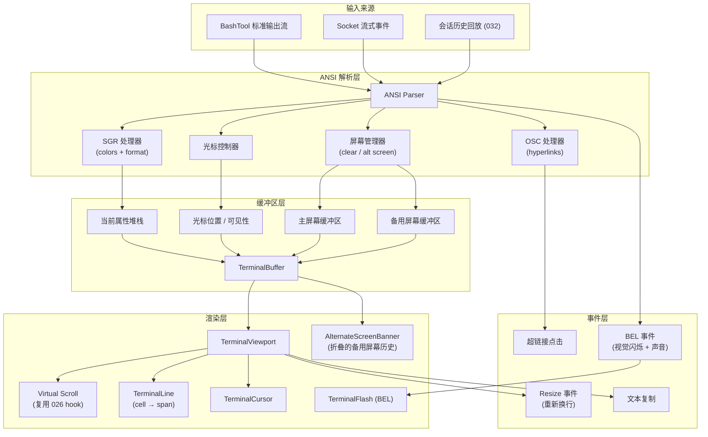

# Implementation Plan: Web Terminal Color Output

**Feature**: 030-web-terminal-color-output  
**Based on**: spec.md  
**Status**: Draft

---

## 1. Project File Structure

```
packages/web/src/
├── components/
│   └── chat/
│       └── terminal/
│           ├── TerminalRenderer.tsx            # 主入口组件
│           ├── TerminalViewport.tsx            # 视口 + 虚拟滚动
│           ├── TerminalLine.tsx                # 单行渲染
│           ├── TerminalCursor.tsx              # 光标渲染
│           ├── AlternateScreenBanner.tsx       # 备用屏幕折叠区
│           └── TerminalFlash.tsx               # BEL 响铃视觉闪烁
├── hooks/
│   ├── use-terminal-buffer.ts                  # 终端缓冲区管理 hook
│   ├── use-terminal-parser.ts                  # ANSI 解析 hook
│   └── use-terminal-virtual-scroll.ts          # 终端专用虚拟滚动
├── lib/
│   ├── ansi-parser/
│   │   ├── index.ts                            # Parser 入口
│   │   ├── sgr.ts                              # SGR 格式代码处理
│   │   ├── cursor.ts                           # 光标控制
│   │   ├── screen.ts                           # 清屏 / 擦除 / 备用屏幕
│   │   ├── colors.ts                           # 16色 / 256色 / TrueColor 映射
│   │   └── osc.ts                              # OSC 序列（超链接等）
│   ├── terminal-buffer.ts                      # TerminalBuffer 数据结构
│   ├── terminal-cell.ts                        # TerminalCell + 属性合并
│   └── color-contrast.ts                       # WCAG 对比度自动调整
├── store/
│   └── slices/
│       └── terminal.slice.ts                   # 多终端实例状态管理
└── types/
    └── terminal.ts                              # Terminal* 类型定义

tests/
└── components/
    └── terminal/
        ├── ansi-parser.test.ts
        ├── terminal-buffer.test.ts
        ├── color-contrast.test.ts
        ├── TerminalRenderer.test.tsx
        └── performance.bench.test.ts
```

### 文件职责说明

| 文件 | 核心职责 |
|------|---------|
| `ansi-parser/index.ts` | 主解析器：输入原始字节流 → 输出 TerminalCell + TerminalEvent |
| `ansi-parser/sgr.ts` | SGR (Select Graphic Rendition) 代码 0-107 处理 → TerminalAttributes |
| `ansi-parser/cursor.ts` | CSI 光标控制：绝对定位、相对移动、保存/恢复 |
| `ansi-parser/screen.ts` | 清屏/擦行、备用屏幕切换、滚动区域设置 |
| `ansi-parser/colors.ts` | 16 色板 → RGB、256 色调色板 → RGB 映射表 |
| `ansi-parser/osc.ts` | OSC 8 超链接、窗口标题等 Operating System Command |
| `terminal-buffer.ts` | 行缓冲区管理：追加、插入、滚动、备用屏幕切换 |
| `color-contrast.ts` | 前景/背景色对比度检测，自动调整暗色保证 WCAG AA |
| `TerminalRenderer.tsx` | 主组件，聚合 Viewport + Cursor + Flash + AlternateScreenBanner |
| `TerminalViewport.tsx` | 可视区域管理，集成虚拟滚动 |
| `TerminalLine.tsx` | 单行渲染：cells → spans with inline styles |

---

## 2. Frontend Design System Injection

### 2.1 Source Materials

| Source | Usage |
|--------|-------|
| Root `DESIGN.md` | Authoritative design direction for terminal-first dark UI, typography, density, panel boundaries, component states, accessibility, and interaction behavior |
| `specs/design-reference/stitch-export/superagent_terminal/` | Visual reference for the terminal workspace shell and terminal output presentation |

### 2.2 Component Mapping

| Planned component | DESIGN.md mapping | Visual reference |
|-------------------|-------------------|------------------|
| `TerminalRenderer` / `TerminalViewport` | Layout & Spacing, Elevation & Depth, Terminal Output | `specs/design-reference/stitch-export/superagent_terminal/` |
| `TerminalLine` | Typography, Terminal Output, Colors | `specs/design-reference/stitch-export/superagent_terminal/` |
| `TerminalCursor` | Components, Micro-interactions, Accessibility | `specs/design-reference/stitch-export/superagent_terminal/` |
| `AlternateScreenBanner` | Cards/Panels, Lists, Chips/Badges | `specs/design-reference/stitch-export/superagent_terminal/` |
| `TerminalFlash` | Micro-interactions, Accessibility, reduced-motion behavior | `specs/design-reference/stitch-export/superagent_terminal/` |

### 2.3 Design Constraints

- Terminal output must use the design system's technical-content typography direction and preserve monospace alignment for logs, code, prompts, and replayed shell output.
- Terminal containers must follow the compact panel-based developer-tool layout: minimal gutters, clear borders, low visual noise, and no decorative shadows.
- ANSI colors may reflect command output, but surrounding terminal chrome, focus states, banners, and fallback UI must follow root `DESIGN.md` rather than inventing separate styling.
- Accessibility work must preserve the design direction while meeting WCAG contrast, keyboard focus, screen reader, and reduced-motion requirements.

---

## 3. Data Flow



### 关键数据流节点

1. **流式解析**: 解析器增量处理字节流，不缓存全部输入。每个 chunk 处理后立即更新 buffer，UI 实时响应。
2. **属性堆栈**: SGR 代码不直接操作 DOM，而是修改 `currentAttributes` 对象。后续字符继承该属性直到遇到重置码。
3. **双缓冲区**: 备用屏幕 (Alternate Screen) 进入时保存当前光标和滚动位置，退出时恢复，备用屏幕内容保存为可折叠区块。
4. **虚拟滚动**: 超过 500 行自动启用，仅渲染可视区域 ± 缓冲区。`use-terminal-virtual-scroll` 基于 026 的 `useVirtualScroll`，适配终端固定行高特性。
5. **增量渲染**: 每行有 `timestamp` 哈希，React.memo 跳过未变更行重渲染。流式更新仅重绘新追加的行。
6. **对比度自动调整**: 渲染前检测前景/背景色对比度，低于 4.5:1 时自动调亮前景色，保证 WCAG AA。

---

## 4. Dependencies

### 4.1 Runtime Dependencies

| 库 | 用途 | 新增/复用 |
|----|------|----------|
| `ansicolor` / 自研 Parser | ANSI 转义序列解析 | ✅ 新增（自研，精确控制所有 SGR 代码） |
| `wcag-contrast` | 对比度计算，自动调整暗色 | ✅ 新增 |
| `zustand` | 多终端实例状态管理 | ✅ 复用 026 |
| `useVirtualScroll` | 终端虚拟滚动 | ✅ 复用 026 hook（适配增强） |
| `useCopyToClipboard` | 终端输出复制 | ✅ 复用 027 |

### 4.2 Build Tool Dependencies

无新增构建依赖，完全继承现有 Webpack + TypeScript 配置。

---

## 5. Integration Points with Existing System

### 5.1 Upstream Dependencies

| 依赖 | 来自 Feature | 集成方式 |
|------|-------------|---------|
| Zustand Store | 026-web-message-input | 扩展 store 新增 terminal slice，管理多终端实例 |
| useVirtualScroll hook | 026-web-message-input | 终端专用适配：固定行高、行级回收、预渲染缓冲区 |
| useCopyToClipboard | 027-web-chat-stream | 终端选中区域复制、完整输出复制 |
| BashCard | 028-web-tool-cards | 替换 028 中的基础 ANSI 渲染器为新 TerminalRenderer |

### 5.2 对 028 BashCard 的修改

```typescript
// packages/web/src/components/chat/cards/BashCard.tsx
// Before
<AnsiRenderer output={output} />

// After
<TerminalRenderer
  stream={output}          // 字符串或 ReadableStream
  maxLines={10000}        // 滚动缓冲区大小
  virtualScrollThreshold={500}
  enableBell={true}
  enableAlternateScreen={true}
  fontHeight={14}          // px
/>
```

### 5.3 对 026 的修改

需要扩展 `packages/web/src/store/index.ts`：

```typescript
// 新增 terminal slice 导入
import { terminalSlice } from './slices/terminal.slice'

// 合并入主 store
export const useStore = create<StoreState>()(
  combine(
    // ...现有 slices
    terminalSlice
  )
)
```

### 5.4 Downstream Dependencies

| Feature | 依赖本 Feature 的方式 |
|---------|----------------------|
| 032-web-session-history-sidebar | 回放历史终端输出，复用 TerminalRenderer |
| 033-web-terminal-interactive | 在 TerminalRenderer 基础上添加键盘输入和 PTY 集成 |

---

## 6. Risks & Mitigations

### 5.1 Technical Risks

| ID | 风险描述 | 严重度 | 概率 | 缓解方案 |
|----|---------|:-----:|:----:|---------|
| R-TERM-01 | 自研 Parser 遗漏边缘 case 导致未解析的 ESC 字符泄漏到 UI | 中 | 高 | 全面的 fuzz 测试；`\x1b` 字符兜底渲染为不可见或警告符号；对比 xterm.js 输出做回归 |
| R-TERM-02 | TrueColor 深色前景在深色背景上对比度不足 | 中 | 中 | `color-contrast.ts` 自动检测 < 4.5:1 组合，调亮前景色 10-20%；可选禁用自动调整的 prop |
| R-TERM-03 | 光标定位和字符宽度计算错误（Emoji / CJK 双宽字符） | 中 | 中 | `eastasianwidth` 库或自研宽度计算函数；限制 MVP 为近似处理，不追求 100% 精确对齐 |
| R-TERM-04 | 长行自动换行性能问题 | 低 | 中 | ResizeObserver 去抖；仅重计算可见行的换行；CSS `overflow-wrap: anywhere` 兜底 |
| R-TERM-05 | 备用屏幕切换时状态不同步 | 低 | 低 | 进入时完整快照 buffer + cursor，退出时原子恢复；状态机防止重入 |

### 5.2 UX Risks

| ID | 风险描述 | 严重度 | 概率 | 缓解方案 |
|----|---------|:-----:|:----:|---------|
| R-UX-TERM-01 | 闪烁 (blink) 格式导致可访问性问题 | 高 | 低 | 默认禁用 blink 效果；提供 `enableBlink` prop 显式开启；遵循 `prefers-reduced-motion` |
| R-UX-TERM-02 | BEL 响铃过于频繁打扰用户 | 中 | 低 | 默认仅视觉闪烁，禁用声音；`enableBellSound` prop 显式开启声音；1 秒冷却防刷屏 |
| R-UX-TERM-03 | 备用屏幕内容丢失导致用户困惑 | 中 | 低 | 退出备用屏幕后在主缓冲区顶部显示"[全屏应用输出已保存，点击展开]"的可折叠 banner |
| R-UX-TERM-04 | 虚拟滚动导致查找功能失效 | 低 | 低 | MVP 不实现终端内搜索；浏览器 Ctrl+F 仅能查找可见行，未来由 03x-search-in-terminal 处理 |

### 5.3 Integration Risks

| ID | 风险描述 | 严重度 | 概率 | 缓解方案 |
|----|---------|:-----:|:----:|---------|
| R-INT-TERM-01 | BashCard 集成时功能回归（基础颜色、滚动、复制） | 中 | 中 | 保留旧 AnsiRenderer 作为 fallback；视觉回归测试对比新旧渲染器输出；A/B 测试灰度 |
| R-INT-TERM-02 | 与卡片折叠状态交互问题 | 低 | 低 | 虚拟滚动在折叠时暂停渲染；展开时重新计算视口位置 |

---

## 7. Testing Strategy

### 6.1 Unit Tests

| 测试目标 | 覆盖点 |
|---------|-------|
| ANSI Parser | SGR 0-9, 21-29, 30-39, 40-49, 90-97, 100-107 全量测试；256 色板全映射；TrueColor RGB 正确解析；光标上下左右/绝对定位；清屏/擦行代码；备用屏幕进入/退出 |
| TerminalBuffer | 行追加；行插入；滚动；属性继承；光标边界保护（不能 < 0 或 > width） |
| Color Contrast | 所有 16 色 + 256 色 + 典型 TrueColor 组合与深色背景对比度 ≥ 4.5:1；自动调整算法验证 |
| Width Calculation | ASCII = 1、CJK = 2、Emoji = 2、组合字符 = 0；边缘 case 验证 |

### 6.2 Component Tests

| 组件 | 测试场景 |
|------|---------|
| `TerminalLine` | 纯文本、带格式文本、嵌套格式组合、超链接、Emoji、CJK 文本渲染 |
| `TerminalRenderer` | 1000 行渲染 < 100ms；10000 行渲染 < 500ms；流式更新 60fps；自动换行正确 |
| `TerminalViewport` | 500 行阈值自动开启虚拟滚动；DOM 节点数 < 200；滚动位置保持正确 |
| `TerminalCursor` | 可见/隐藏状态正确；块/下划线/竖线样式正确渲染 |
| `AlternateScreenBanner` | 进入/退出备用屏幕后 banner 显示正确；点击展开/折叠功能 |

### 6.3 Integration Tests

| 场景 | 验证点 |
|------|-------|
| BashCard 集成 | `npm test` 全彩色输出正确渲染；`git diff | less -R` 备用屏幕模式；`vim -c ":q"` 退出恢复；`ls --color` 基础颜色 |
| 端到端流式渲染 | Socket 推送 1000 行彩色输出 → 增量渲染无卡顿 → 最终 DOM 与快照一致 |
| 复制功能 | 选中多行 → Ctrl+C → 剪贴板内容与终端显示一致，保留换行和空格 |

### 6.4 Performance Benchmarks

| 指标 | 目标 | 测试方法 |
|------|------|---------|
| Parser 吞吐量 | ≥ 1 MB/s | 1MB 随机 ANSI 文本解析计时 |
| 1000 行渲染 | < 100ms | vitest 性能钩子测量 mount 时间 |
| 10000 行渲染 | < 500ms | 同上，虚拟滚动启用 |
| 滚动帧率 | ≥ 60fps | PerformanceObserver 测量 10 次完整滚动 |
| 内存增长 | ≤ 10 MB / 1000 行 | Chrome DevTools Memory 快照对比 |

### 6.5 Accessibility Tests

| 检查项 | 标准 |
|--------|------|
| 颜色对比度 | 所有前景/背景组合 axe-core 检测无错误 |
| 键盘可达性 | 终端区域可 Tab 聚焦；方向键滚动；Home/End 跳转到首尾 |
| 屏幕阅读器 | 内容以 pre 标签呈现，ARIA label 描述"终端输出区域" |
| 减少动画 | `prefers-reduced-motion: reduce` 时禁用 blink 和 flash 效果 |

---

## 8. Implementation Phases

### Phase 1: Core Parser + Buffer (可独立并行)

**Tasks**:
- TypeScript 类型定义 (`types/terminal.ts`)
- 16 色 / 256 色 / TrueColor 颜色映射表 (`lib/ansi-parser/colors.ts`)
- SGR 格式代码处理器 (`lib/ansi-parser/sgr.ts`) - 支持 0-9, 21-29, 30-39, 40-49, 90-97, 100-107
- 光标控制器 (`lib/ansi-parser/cursor.ts`)
- 屏幕管理器 (`lib/ansi-parser/screen.ts`) - 清屏、擦行、备用屏幕
- OSC 处理器 (`lib/ansi-parser/osc.ts`) - 超链接 (OSC 8)
- ANSI Parser 入口 (`lib/ansi-parser/index.ts`)
- TerminalBuffer 实现 (`lib/terminal-buffer.ts`)
- TerminalCell + 属性合并逻辑 (`lib/terminal-cell.ts`)
- 对比度自动调整 (`lib/color-contrast.ts`)

### Phase 2: Basic Rendering (依赖 Phase 1)

**Tasks**:
- TerminalLine 单行渲染组件
- TerminalCursor 光标组件
- 基础 CSS 样式（等宽字体、行高、颜色变量）
- Zustand terminal.slice（单终端实例）
- TerminalRenderer 主组件（无虚拟滚动版本）
- BashCard 基础集成验证

### Phase 3: Advanced Features (可并行，依赖 Phase 1+2)

**Tasks**:
- 备用屏幕支持 + AlternateScreenBanner 组件
- BEL 响铃处理 + TerminalFlash 组件
- OSC 8 超链接渲染 + 点击处理
- 窗口 resize 处理 + 自动换行重计算
- use-terminal-buffer hook（React 友好的 buffer 包装）
- use-terminal-parser hook（流式输入处理）

### Phase 4: Performance + Virtual Scroll (依赖 Phase 1-3)

**Tasks**:
- use-terminal-virtual-scroll hook（基于 026 useVirtualScroll 适配）
- TerminalViewport 视口组件
- 500 行阈值自动切换逻辑
- React.memo 行级优化
- 增量渲染优化（按 timestamp 跳过未变更行）
- 性能基准测试套件

### Phase 5: Polish + Integration (串行，依赖所有前置)

**Tasks**:
- WCAG 对比度验证 + axe-core 自动化测试
- 可访问性优化（键盘导航、ARIA label、减少动画）
- BashCard 完整集成 + fallback 逻辑
- 文本选择和复制功能
- 深色主题最终样式统一
- 完整测试覆盖（单元 + 组件 + 集成 + 性能）
- 视觉回归测试

---

**Plan Version**: v1.0  
**Created**: 2026-06-18  
**Next Step**: Generate tasks.md with task decomposition
