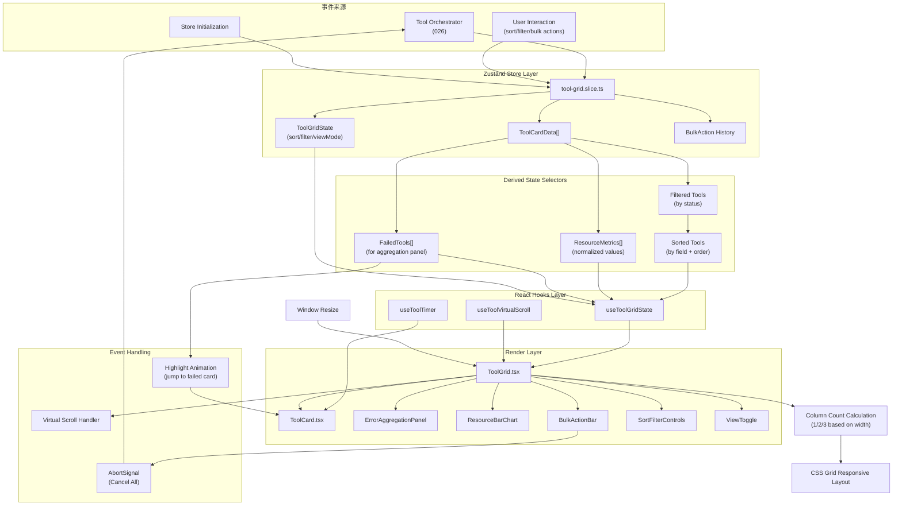

# Implementation Plan: Web Parallel Tool Grid

**Feature**: 031-web-parallel-tool-grid
**Based on**: spec.md
**Status**: Draft

---

## 1. Project File Structure

```
packages/web/src/
├── components/
│   └── chat/
│       └── tool-grid/
│           ├── ToolGrid.tsx                 # 主入口组件
│           ├── ToolCard.tsx                 # 单个工具卡片
│           ├── ToolProgressBar.tsx          # 进度条组件
│           ├── ToolTimer.tsx                # 计时器组件
│           ├── ErrorAggregationPanel.tsx    # 错误聚合面板
│           ├── ResourceBarChart.tsx         # 资源对比条形图
│           ├── BulkActionBar.tsx            # 批量操作栏
│           ├── SortFilterControls.tsx       # 排序筛选控件
│           └── ViewToggle.tsx               # 网格/列表视图切换
├── hooks/
│   ├── use-tool-grid-state.ts               # 网格状态管理 hook
│   ├── use-tool-timer.ts                    # 实时计时器 hook
│   └── use-tool-virtual-scroll.ts           # 网格虚拟滚动
├── store/
│   └── slices/
│       └── tool-grid.slice.ts               # Zustand 工具网格状态
└── types/
    └── tool-grid.ts                         # ToolGrid* 类型定义

tests/
└── components/
    └── chat/
        └── tool-grid/
            ├── ToolCard.test.tsx
            ├── ToolGrid.test.tsx
            ├── ErrorAggregationPanel.test.tsx
            ├── ResourceBarChart.test.tsx
            └── performance.bench.test.ts
```

### 文件职责说明

| 文件 | 核心职责 |
|------|---------|
| `ToolGrid.tsx` | 主入口，聚合所有子组件，管理响应式布局 |
| `ToolCard.tsx` | 单个工具卡片：状态、进度条、计时器、输出预览/展开 |
| `ToolProgressBar.tsx` | 进度条：determinate + indeterminate 两种模式 |
| `ToolTimer.tsx` | 实时计时器：MM:SS 格式，每秒更新 |
| `ErrorAggregationPanel.tsx` | 顶部错误聚合面板：失败工具列表 + 跳转 |
| `ResourceBarChart.tsx` | 资源对比条形图：时长/输出大小/内存横向对比 |
| `BulkActionBar.tsx` | 批量操作：取消全部/展开全部/折叠全部/清空完成 |
| `SortFilterControls.tsx` | 排序字段/方向 + 状态筛选 |
| `ViewToggle.tsx` | 网格视图 / 列表视图切换 |
| `tool-grid.slice.ts` | Zustand store：工具数据 + 筛选/排序/视图状态 |
| `use-tool-timer.ts` | requestAnimationFrame 驱动的精确计时 |

---

## 2. Frontend Design System Injection

### 2.1 Source Materials

| Source | Usage |
|--------|-------|
| Root `DESIGN.md` | Authoritative design direction for dense developer-tool layouts, cards/panels, lists, badges, controls, motion, accessibility, and terminal/code output |
| `specs/design-reference/stitch-export/chat_workspace_parallel_execution/` | Primary visual reference for parallel tool execution inside the chat workspace |
| `specs/design-reference/stitch-export/humanist_chat_workspace_parallel_execution/` | Secondary reference for density, hierarchy, and alternative card composition |

### 2.2 Component Mapping

| Planned component | DESIGN.md mapping | Visual reference |
|-------------------|-------------------|------------------|
| `ToolGrid` | Layout & Spacing, Elevation & Depth, Cards/Panels | `chat_workspace_parallel_execution/` |
| `ToolCard` | Cards/Panels, Lists, Terminal Output | `chat_workspace_parallel_execution/`, `humanist_chat_workspace_parallel_execution/` |
| `ToolProgressBar` / `ToolTimer` | Components, Micro-interactions, Accessibility | `chat_workspace_parallel_execution/` |
| `ErrorAggregationPanel` | Chips/Badges, Cards/Panels, Lists | `humanist_chat_workspace_parallel_execution/` |
| `BulkActionBar`, `SortFilterControls`, `ViewToggle` | Buttons, Inputs, Chips/Badges | `chat_workspace_parallel_execution/` |
| `ResourceBarChart` | Information density and scanability guidance | `humanist_chat_workspace_parallel_execution/` |

### 2.3 Design Constraints

- Tool execution UI must prioritize scanability under high concurrency: dense card grids, compact status metadata, and clear failed/running/completed hierarchy.
- Cards and control surfaces must use panel/border separation from root `DESIGN.md`; avoid decorative shadows or spacious dashboard-style layouts.
- Progress, failure, cancellation, and active generation states must be visually distinct but still subdued enough for long-running developer sessions.
- Grid/list reflow must preserve the same information model across viewport sizes rather than introducing a separate mobile-only experience.

---

## 3. Data Flow



### 关键数据流节点

1. **事件驱动更新**：Tool Orchestrator 发出的工具开始/进度/完成事件直接更新 store，组件响应式重渲染。没有轮询。
2. **派生状态选择器**：筛选/排序/指标/错误列表都是纯函数派生，不存储，避免状态不同步。
3. **实时计时器**：useToolTimer 使用 requestAnimationFrame 而非 setInterval，保证视觉流畅，不在 store 中存计时器状态。
4. **虚拟滚动触发**：工具数量 > 20 时自动启用 useToolVirtualScroll，基于 026 hook 适配。
5. **响应式列数**：CSS Grid auto-fit + minmax，JS 仅在 < 600px 时强制切换为列表视图。
6. **取消信号传播**：Cancel All 批量操作通过 AbortController.signal 向下传递给 Tool Orchestrator。

---

## 4. Dependencies

### 4.1 Runtime Dependencies

| 库 | 用途 | 新增/复用 |
|----|------|----------|
| `zustand` | 工具网格状态管理 | ✅ 复用 026 |
| `useVirtualScroll` hook | 大量工具时的虚拟滚动 | ✅ 复用 026（适配增强） |
| `StatusBadge` component | 状态标签样式一致性 | ✅ 复用 027 |
| `TerminalRenderer` | 工具卡片内的彩色输出渲染 | ✅ 复用 030（用于 Bash 工具输出） |
| CSS Grid（原生） | 响应式网格布局 | ✅ 浏览器原生 |
| `AbortController`（原生） | 取消所有运行中工具 | ✅ 浏览器原生 |

### 4.2 Build Tool Dependencies

无新增构建依赖，完全继承现有 React + TypeScript + CSS 配置。

---

## 5. Integration Points with Existing System

### 5.1 Upstream Dependencies

| 依赖 | 来自 Feature | 集成方式 |
|------|-------------|---------|
| Tool Orchestrator | 026-web-message-input | 订阅工具执行事件：toolStart / toolProgress / toolOutput / toolComplete / toolError，更新 store 中对应 ToolCardData |
| Zustand Store | 026-web-message-input | 扩展主 store，新增 tool-grid slice |
| Virtual Scroll Hook | 026-web-message-input | 复用 useVirtualScroll 核心逻辑，适配网格卡片高度 |
| Status Badge | 027-web-chat-stream | 复用 status badge 组件和样式（pending/running/success/failed 四种状态颜色） |
| TerminalRenderer | 030-web-terminal-color-output | ToolCard 展开时，Bash 工具输出使用 TerminalRenderer 渲染彩色 |

### 5.2 Tool Orchestrator 集成代码

```typescript
// packages/web/src/store/slices/tool-grid.slice.ts
// Tool Orchestrator 事件订阅

// 订阅 orchestrator 事件
orchestrator.on('toolStart', (tool) => {
  set(state => ({
    tools: [...state.tools, {
      toolId: tool.id,
      toolName: tool.name,
      parameters: tool.parameters,
      status: 'running',
      progress: null,
      startTime: Date.now(),
      endTime: null,
      outputPreview: [],
      fullOutput: '',
      error: null,
      isExpanded: false,
      resourceUsage: { outputBytes: 0 }
    }]
  }))
})

orchestrator.on('toolProgress', (toolId, progress) => {
  set(state => ({
    tools: state.tools.map(t =>
      t.toolId === toolId ? { ...t, progress } : t
    )
  }))
})

orchestrator.on('toolOutput', (toolId, output) => {
  set(state => ({
    tools: state.tools.map(t =>
      t.toolId === toolId ? {
        ...t,
        fullOutput: t.fullOutput + output,
        outputPreview: (t.fullOutput + output).split('\n').slice(-5)
      } : t
    )
  }))
})

orchestrator.on('toolComplete', (toolId, result) => {
  set(state => ({
    tools: state.tools.map(t =>
      t.toolId === toolId ? {
        ...t,
        status: result.success ? 'success' : 'failed',
        progress: 100,
        endTime: Date.now(),
        durationMs: Date.now() - t.startTime,
        error: result.error || null
      } : t
    )
  }))
})
```

### 5.3 对 028 Tool Cards 的修改

```typescript
// packages/web/src/components/chat/cards/ToolCard.tsx (028)
// Before: 线性逐个展示工具
<div className="tool-list">
  {tools.map(tool => <SingleTool tool={tool} />)}
</div>

// After: 并发工具使用网格视图
<ToolGrid
  tools={tools}
  enableVirtualScroll={tools.length > 20}
  defaultViewMode="grid"
/>
```

### 5.4 Downstream Dependencies

| Feature | Depends On | Purpose |
|---------|-----------|---------|
| 032-web-session-history-sidebar | This feature | ToolGrid state is serializable and replayable from session history |

---

## 6. Risks & Mitigations

### 5.1 Technical Risks

| ID | Risk Description | Severity | Probability | Mitigation |
|----|-----------------|:--------:|:-----------:|------------|
| R-GRID-01 | 10 个工具同时流式输出 → 频繁重绘 → 掉帧 | 中 | 高 | 每个 ToolCard 独立 memo；输出使用 append-only 策略；outputPreview 节流（最多 100ms 更新一次）；requestAnimationFrame 批量更新 |
| R-GRID-02 | 50+ 工具 DOM 节点过多 → 滚动卡顿 | 中 | 中 | >20 工具自动启用虚拟滚动；每个 ToolCard 固定高度（折叠态）；测量渲染性能，低于 40fps 时自动降级 |
| R-GRID-03 | 状态转换动画与数据更新不同步 → 闪烁 | 低 | 中 | 先更新数据，再触发 CSS transition；使用 useState + useEffect 两阶段提交；opacity 过渡而非 transform 避免 layout thrashing |
| R-GRID-04 | AbortController 取消信号未能及时到达工具 → "已取消"但仍在运行 | 中 | 低 | 所有运行中工具统一挂载 abortSignal；signal.onabort 清理逻辑；双重检查：store 状态 cancelled 后忽略后续事件 |
| R-GRID-05 | 派生状态（筛选/排序/指标）计算量大 → 阻塞主线程 | 低 | 中 | useMemo 深度优化，仅在依赖变化时重算；指标归一化使用简单线性算法，O(n) 单 pass |

### 5.2 UX Risks

| ID | Risk Description | Severity | Probability | Mitigation |
|----|-----------------|:--------:|:-----------:|------------|
| R-UX-GRID-01 | 错误聚合面板被大量滚动内容推到可视区域外 → 用户看不到失败 | 中 | 中 | position: sticky 始终固定在顶部；失败数量用 badge 显示在工具栏；新失败时闪烁提示 |
| R-UX-GRID-02 | 工具数量多时找不到特定工具 | 低 | 中 | 按状态筛选 + 名称搜索（MVP 可选）；失败工具自动排最前；跳转动画高亮 |
| R-UX-GRID-03 | 进度条永远 0% 或永远 50% 不前进 → 用户困惑 | 中 | 中 | indeterminate 状态使用 pulse 动画而非百分比；hover tooltip 显示"进度未知" |
| R-UX-GRID-04 | Cancel All 后工具卡片立即消失 → 用户不确定是否真的取消了 | 低 | 低 | cancelled 状态保留 3 秒后才允许被 Clear Completed 移除；取消动画：进度条变灰 + cancelled 标签 |
| R-UX-GRID-05 | Clear Completed 误操作后无法恢复 | 低 | 低 | undo 按钮显示 5 秒；store 保留最近一次 cleared 批次；Ctrl+Z 快捷键恢复 |

### 5.3 Integration Risks

| ID | Risk Description | Severity | Probability | Mitigation |
|----|-----------------|:--------:|:-----------:|------------|
| R-INT-GRID-01 | Tool Orchestrator 事件顺序与 store 更新不同步 → 状态不一致 | 中 | 中 | 所有事件处理使用 immer 式 immutable update；toolId 作为 key 保证幂等；late arriving events 被忽略（endTime 已设置的不再更新） |
| R-INT-GRID-02 | TerminalRenderer 在 ToolCard 中初始化成本高 → 展开时卡顿 | 低 | 中 | 懒加载：卡片折叠时不渲染 TerminalRenderer，仅在展开时初始化；折叠状态下使用纯文本预览 |
| R-INT-GRID-03 | 与 028 现有 ToolCard 样式冲突 | 低 | 低 | CSS 命名空间：`.tool-grid > .tool-card` 隔离；继承基础变量，覆盖特定属性；视觉回归测试对比新旧 |

---

## 7. Testing Strategy

### 6.1 Unit Tests

| 测试目标 | 覆盖点 |
|---------|-------|
| ToolGrid Selectors | filter by status 正确；sort by status/duration/name 正确；error aggregation 正确收集所有失败工具；resource metrics normalization 0-100 正确 |
| Zustand Slice | toolStart/toolProgress/toolOutput/toolComplete/toolError 事件正确更新状态；bulk actions 更新正确；sort/filter/viewMode 状态持久化 |
| useToolTimer Hook | MM:SS 格式正确；running 状态下每秒更新；completed 状态停止更新；startTime 为 null 时不计时 |

### 6.2 Component Tests

| 组件 | 测试场景 |
|------|---------|
| `ToolCard` | pending → running → success 状态流转视觉正确；progress bar determinate/indeterminate；expand/collapse 输出切换；failed 状态显示错误信息 |
| `ToolProgressBar` | 0% / 50% / 100% 渲染正确；indeterminate pulse 动画正确；颜色与 status 匹配 |
| `ErrorAggregationPanel` | 0 errors → 不显示；1 error → 显示单条；3+ errors → 显示所有，每项可点击跳转 |
| `ResourceBarChart` | 所有条形宽度正比于数值；最长条形 = 100% 宽度；标签显示正确（2.3s / 156KB）；空数据不崩溃 |
| `BulkActionBar` | Cancel All → 所有 running 工具变为 cancelled；Expand All → 所有卡片 isExpanded=true；Clear Completed → 非 running/pending 全部移除 |
| `SortFilterControls` | sort by status/duration/name 正确；asc/desc 切换；filter by running/failed/completed 正确 |
| `ToolGrid` (集成) | 1 工具 → 单列；3 工具 → 双列；6 工具 → 三列；< 600px → 列表视图；20+ 工具 → 虚拟滚动启用；点击错误项 → 滚动 + 高亮动画 |

### 6.3 Integration Tests

| 场景 | 验证点 |
|------|-------|
| Tool Orchestrator → Grid 数据流 | orchestrator emit toolStart → ToolCard 出现 running；emit progress → 进度条更新；emit output → 预览更新；emit complete → success 状态 |
| 真实 10 并发工具 | 10 个工具同时流式输出 → 网格流畅无掉帧 → 所有完成后条形图正确 |
| Cancel All 端到端 | 5 个 running 工具 → 点击 Cancel All → 所有状态变为 cancelled → AbortSignal 触发 |
| 窗口 resize 响应式 | 宽屏 3 列 → 拉窄到 600px → 变为单列列表 → 拉宽 → 恢复 3 列 |

### 6.4 Performance Benchmarks

| 指标 | 目标 | 测试方法 |
|------|------|---------|
| 单工具卡片渲染 | < 16ms | vitest measure render time |
| 10 个并发工具流式更新 | 60fps | PerformanceObserver 测量 5 秒期间 |
| 50 工具滚动性能 | 60fps | virtual scroll enabled, measure frame time during scroll |
| Cancel All 10 工具 | < 100ms | measure from click to all cards showing cancelled |
| Sort 50 工具 | < 50ms | measure selector recompute + re-render time |

### 6.5 Accessibility Tests

| 检查项 | 标准 |
|--------|------|
| 颜色对比度 | 所有状态颜色 WCAG AA ≥ 4.5:1（axe-core 验证） |
| 键盘导航 | Tab 遍历所有交互元素；Enter/Space 激活按钮；方向键在卡片间移动焦点 |
| 屏幕阅读器 | 状态变化朗读；错误到达播报；卡片展开/折叠状态 |
| 减少动画 | prefers-reduced-motion 时禁用 progress pulse 和 highlight flash |

---

## 8. Implementation Phases

### Phase 1: Foundation + Core Types（可独立并行）

**Tasks**:
- TypeScript 类型定义（types/tool-grid.ts）: ToolStatus, ToolCardData, ToolGridState, ResourceMetrics, BulkAction
- Zustand tool-grid.slice.ts: 状态结构 + toolStart/toolProgress/toolOutput/toolComplete actions
- Derived state selectors: filteredTools, sortedTools, resourceMetrics, failedTools 纯函数
- 与 Tool Orchestrator 的事件订阅集成

### Phase 2: Core Components（可独立并行）

**Tasks**:
- ToolProgressBar 组件（determinate + indeterminate）
- ToolTimer 组件 + useToolTimer hook（requestAnimationFrame 精确计时）
- ToolCard 组件（状态 badge + 进度条 + 计时器 + 输出预览 + 展开/折叠）
- ErrorAggregationPanel 组件（失败工具列表 + 跳转高亮）

### Phase 3: Controls + Bulk Actions（依赖 Phase 1+2）

**Tasks**:
- BulkActionBar 组件（Cancel All / Expand All / Collapse All / Clear Completed）
- SortFilterControls 组件（排序字段 + 方向 + 状态筛选）
- ViewToggle 组件（Grid / List 视图切换）
- ResourceBarChart 组件（归一化条形图 + 标签显示）
- Cancel All 的 AbortController 信号传播机制

### Phase 4: ToolGrid 主组件 + 性能（依赖所有前置 Phase）

**Tasks**:
- ToolGrid.tsx 主组件：响应式 CSS Grid + 列数自动计算
- useToolVirtualScroll hook（>20 工具自动启用）
- 跳转动画：点击错误面板 → 滚动到卡片 + 高亮闪烁
- 窗口 < 600px 自动切换列表视图
- 性能优化：React.memo(ToolCard)，输出预览节流，useMemo 选择器
- undo 机制：Clear Completed 后 5 秒内可撤销

### Phase 5: Integration + Polish（串行，依赖所有前置）

**Tasks**:
- 028 ToolCard 集成：替换原有线性工具列表为 ToolGrid
- TerminalRenderer 懒加载：展开时才初始化彩色输出渲染
- 深色主题样式统一：所有组件颜色与整体 UI 协调
- 可访问性优化：键盘导航 + ARIA labels + prefers-reduced-motion
- 完整测试覆盖：单元 + 组件 + 集成 + 性能基准 + axe-core 可访问性

---

**Plan Version**: v1.0
**Created**: 2026-06-19
**Next Step**: Generate tasks.md with task decomposition
