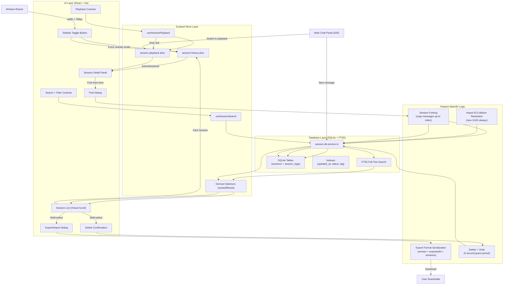

# Implementation Plan: Web Session History Sidebar

**Feature**: 032-web-session-history-sidebar
**Based on**: spec.md
**Status**: Draft

---

## 1. Project File Structure

```
packages/web/src/
├── components/
│   └── sidebar/
│       ├── SessionHistorySidebar.tsx      # Sidebar container + toggle
│       ├── SessionList.tsx                # Session list + virtual scroll
│       ├── SessionListItem.tsx            # Individual session card
│       ├── SessionSearchFilter.tsx        # Search + date range + tags + status
│       ├── SessionDetailPanel.tsx         # Session content view
│       ├── PlaybackControls.tsx           # Play/Pause/Step/Jump + speed
│       ├── PlaybackTimeline.tsx           # Timeline scrubber
│       ├── SessionExportImport.tsx        # Export/Import dialog
│       ├── SessionDeleteConfirm.tsx       # Delete confirmation + undo toast
│       ├── SessionForkDialog.tsx          # Fork from here confirmation
│       ├── TagManager.tsx                 # Tag add/remove UI
│       └── TitleEdit.tsx                  # Inline title editor
├── hooks/
│   ├── useSessionSearch.ts                 # Full-text search + filters
│   ├── useSessionPlayback.ts               # Playback state machine
│   └── useSessionExportImport.ts           # JSON serialization + import
├── store/
│   └── slices/
│       ├── session-history.slice.ts        # Session list + filters state
│       ├── session-playback.slice.ts       # Playback state + actions
│       └── session-history.selectors.ts    # Derived state selectors
├── services/
│   └── session-db.service.ts               # SQLite DB wrapper + FTS queries
└── types/
    └── session-history.ts                  # TypeScript type definitions

tests/
└── components/
    └── sidebar/
        ├── SessionList.test.tsx
        ├── SessionSearchFilter.test.tsx
        ├── PlaybackControls.test.tsx
        └── performance.bench.test.ts
```

### File Responsibilities

| File | Core Responsibility |
|------|---------------------|
| `SessionHistorySidebar.tsx` | Main container: toggle state, width drag, dock/overlay mode switch |
| `SessionList.tsx` | Virtual scrolling list, multi-select for bulk operations |
| `SessionListItem.tsx` | Individual session card: title, preview, duration, tool count, status badge, tags |
| `SessionSearchFilter.tsx` | Full-text search input + date range picker + tag filter chips + status dropdown |
| `SessionDetailPanel.tsx` | Renders full session content during playback |
| `PlaybackControls.tsx` | Play/Pause/Step forward/Step back + speed selector (1x/2x/4x) + Show All button |
| `PlaybackTimeline.tsx` | Visual timeline with click-to-jump to any message index |
| `session-db.service.ts` | SQLite CRUD, FTS5 full-text search queries, tag management |
| `session-history.slice.ts` | Zustand store: sessions cache, filters, active session id |
| `session-playback.slice.ts` | Zustand store: playback state (isPlaying, currentIndex, speed) |
| `useSessionPlayback.ts` | Hook: message replay timer, state transitions, frame rate control |

---

## 2. Frontend Design System Injection

### 2.1 Source Materials

| Source | Usage |
|--------|-------|
| Root `DESIGN.md` | Authoritative design direction for dense sidebar navigation, list hierarchy, panels, badges, controls, playback UI, accessibility, and terminal-first visual style |
| `specs/design-reference/stitch-export/claude_style_session_history/` | Primary visual reference for session history sidebar layout and list/detail hierarchy |
| `specs/design-reference/stitch-export/session_history_replay/` | Primary visual reference for replay controls, timeline, and historical session viewing |

### 2.2 Component Mapping

| Planned component | DESIGN.md mapping | Visual reference |
|-------------------|-------------------|------------------|
| `SessionHistorySidebar` | Layout & Spacing, Elevation & Depth, Cards/Panels | `claude_style_session_history/` |
| `SessionList` / `SessionListItem` | Lists, Chips/Badges, Typography | `claude_style_session_history/` |
| `SessionSearchFilter`, `TagManager`, `TitleEdit` | Inputs, Buttons, Chips/Badges | `claude_style_session_history/` |
| `SessionDetailPanel` | Terminal Output, Cards/Panels, Typography | `session_history_replay/` |
| `PlaybackControls` / `PlaybackTimeline` | Buttons, Micro-interactions, Accessibility | `session_history_replay/` |
| `SessionExportImport`, `SessionDeleteConfirm`, `SessionForkDialog` | Modal/panel layering, Buttons, Inputs | `session_history_replay/` |

### 2.3 Design Constraints

- Sidebar UI must remain compact and scan-oriented: session metadata, status, tags, and previews should fit dense developer workflows without becoming a dashboard.
- Playback mode must look like historical execution review, not a separate chat product; reuse message/tool/terminal presentation from 027-031 and follow root `DESIGN.md` hierarchy.
- Destructive operations and fork/export/import dialogs must use clear panel boundaries, explicit focus states, and keyboard-friendly controls.
- Responsive overlay mode must preserve the same sidebar information architecture while adapting panel placement for narrow widths.

---

## 3. Data Flow



### Key Data Flow Nodes

1. **Database-First State**: Source of truth is always SQLite - Zustand store is a read-through cache. No write operations go directly to store.
2. **FTS5 Full-Text Search**: Search queries hit SQLite FTS5 directly, not in-memory filtering. Results ranked by relevance.
3. **Playback State Machine**: useSessionPlayback hook manages the timer loop for message-by-message replay. Speed controlled by `requestAnimationFrame` interval calculation.
4. **Undo Mechanism**: Deleted sessions are kept in a temporary "tombstone" queue for 5 seconds. If undo is triggered within that window, the tombstone is restored.
5. **Responsive Overlay Mode**: On mobile viewports (<768px), sidebar automatically switches to overlay mode that floats over the chat.

---

## 4. Dependencies

### 4.1 Runtime Dependencies

| Library | Purpose | New/Reused |
|---------|---------|------------|
| `zustand` | Sidebar state management | ✅ Reused from 026 |
| `better-sqlite3` | Local session persistence + FTS5 | ✅ Reused from 009 |
| `react-window` | Virtual scrolling for 1000+ sessions | ✅ Reused from 026 |
| `react-day-picker` | Date range picker for filter | 🆕 New (small footprint) |
| `JSON Streams` | Incremental import/export parsing | ✅ Native JSON.parse with streaming |

### 4.2 Build Tool Dependencies

No new build dependencies - fully inherits existing React + TypeScript configuration.

---

## 5. Integration Points with Existing System

### 5.1 Upstream Dependencies

| Dependency | From Feature | Integration Method |
|------------|-------------|-------------------|
| SQLite Persistence | 009-session-persistence | Extend existing sessions table schema; reuse DB connection pool |
| Zustand Store | 026-web-message-input | Add sidebar slices to root store; share with main chat for active session sync |
| Message Renderer | 027-web-chat-stream | Reuse message component for playback - same rendering as live chat |
| Tool Card Renderer | 028-web-tool-cards | Reuse for tool call playback |
| Virtual Scroll Hook | 026-web-message-input | Adapt for vertical session list |
| Terminal Color Output | 030-web-terminal-color-output | Reuse TerminalRenderer for bash output in playback |
| Tool Grid | 031-web-parallel-tool-grid | Reuse ToolGrid component for multi-tool execution playback |

### 5.2 Database Schema Implementation (009 Extensions)

```typescript
// Schema migrations in packages/server/src/migrations/
// Migration: 004_add_session_history_columns.sql

-- Session table extensions
ALTER TABLE sessions ADD COLUMN title TEXT NOT NULL DEFAULT '';
ALTER TABLE sessions ADD COLUMN status TEXT NOT NULL DEFAULT 'active';
ALTER TABLE sessions ADD COLUMN duration_ms INTEGER DEFAULT 0;
ALTER TABLE sessions ADD COLUMN tool_call_count INTEGER DEFAULT 0;
ALTER TABLE sessions ADD COLUMN message_count INTEGER DEFAULT 0;
ALTER TABLE sessions ADD COLUMN forked_from TEXT REFERENCES sessions(id);
ALTER TABLE sessions ADD COLUMN forked_at_message_index INTEGER;

-- Tags junction table
CREATE TABLE session_tags (
  session_id TEXT REFERENCES sessions(id) ON DELETE CASCADE,
  tag TEXT NOT NULL,
  created_at INTEGER NOT NULL DEFAULT (unixepoch()),
  PRIMARY KEY (session_id, tag)
);

-- Performance indexes
CREATE INDEX idx_sessions_updated_at ON sessions(updated_at DESC);
CREATE INDEX idx_sessions_status ON sessions(status);
CREATE INDEX idx_sessions_title ON sessions(title);
CREATE INDEX idx_session_tags_tag ON session_tags(tag);

-- FTS5 virtual table for full-text search
CREATE VIRTUAL TABLE sessions_fts USING fts5(
  title,
  messages_content,  -- Denormalized copy of all message content
  content='sessions',
  content_rowid='id'
);

-- Triggers to keep FTS table in sync
CREATE TRIGGER sessions_ai AFTER INSERT ON sessions BEGIN
  INSERT INTO sessions_fts(rowid, title, messages_content)
  VALUES (new.id, new.title, new.messages_content);
END;

CREATE TRIGGER sessions_au AFTER UPDATE ON sessions BEGIN
  UPDATE sessions_fts SET
    title = new.title,
    messages_content = new.messages_content
  WHERE rowid = old.id;
END;

CREATE TRIGGER sessions_ad AFTER DELETE ON sessions BEGIN
  DELETE FROM sessions_fts WHERE rowid = old.id;
END;
```

### 5.3 Session Forking Implementation Pattern

```typescript
// packages/web/src/store/slices/session-playback.slice.ts
// Fork from current playback position

interface ForkState {
  forkedFromSessionId: string | null;
  forkedAtIndex: number | null;
}

const createForkedSession = async (
  sourceSessionId: string,
  upToMessageIndex: number
): Promise<Session> => {
  // 1. Read source session up to N messages
  // 2. Create new session with new UUID
  // 3. Copy messages_content truncated at index
  // 4. Set forked_from = sourceSessionId, forked_at_message_index = upToMessageIndex
  // 5. Insert into DB
  // 6. Switch main chat to new session
};
```

### 5.4 Export/Import Format Schema

```typescript
// packages/web/src/types/session-history.ts
interface ExportFormatV1 {
  version: 1;
  exportedAt: number;  // timestamp
  exportedBy: string;  // app identifier
  sessions: {
    id: string;         // Original ID, will be remapped on import
    title: string;
    createdAt: number;
    updatedAt: number;
    messages: Message[];
    toolCalls: ToolCallRecord[];
    tags: string[];
    forkedFrom: string | null;
    forkedAtMessageIndex: number | null;
    durationMs: number;
    toolCallCount: number;
    messageCount: number;
    status: 'active' | 'completed' | 'error';
  }[];
}

// Import always generates NEW UUIDs - no ID conflicts ever
// Original IDs are discarded; forked_from references are remapped to new IDs
```

### 5.5 Downstream Dependencies

| Feature | Depends On | Purpose |
|---------|-----------|---------|
| (None yet) | This feature | - |

---

## 6. Risks & Mitigations

### 6.1 Technical Risks

| ID | Risk Description | Severity | Probability | Mitigation |
|----|-----------------|:--------:|:-----------:|------------|
| R-SIDE-01 | SQLite FTS5 query performance on 1000+ sessions | 中 | 中 | Proper indexes; limit search results; debounce search input (200ms); virtual scroll limits DOM nodes |
| R-SIDE-02 | Large session import blocks main thread | 中 | 中 | Use streaming JSON parser (JSON.parse incrementally); Web Worker for import processing |
| R-SIDE-03 | Playback animation jank on large sessions | 低 | 中 | Virtual scroll in detail panel; only render visible messages; requestAnimationFrame for smooth stepping |
| R-SIDE-04 | FTS5 denormalization data drift | 中 | 低 | Database triggers keep FTS table in sync; periodic integrity check |
| R-SIDE-05 | Sidebar resize causes layout thrashing | 低 | 中 | CSS contain: layout paint; debounce resize events; transform-based drag preview |

### 6.2 UX Risks

| ID | Risk Description | Severity | Probability | Mitigation |
|----|-----------------|:--------:|:-----------:|------------|
| R-UX-SIDE-01 | Accidental session deletion | 中 | 低 | Confirmation dialog; 5-second undo toast; "Clear All" requires typing DELETE |
| R-UX-SIDE-02 | Playback speed too fast/slow | 低 | 中 | 3 speed presets (1x/2x/4x) + "Show All" instant view |
| R-UX-SIDE-03 | Search returns irrelevant results | 低 | 中 | FTS5 BM25 ranking; highlight matched snippets; date range filter defaults to "All" |
| R-UX-SIDE-04 | Forked session doesn't show parent link | 低 | 低 | Visual indicator in header; click navigates back to parent session |

### 6.3 Integration Risks

| ID | Risk Description | Severity | Probability | Mitigation |
|----|-----------------|:--------:|:-----------:|------------|
| R-INT-SIDE-01 | DB migration fails on existing data | 高 | 低 | All ALTER TABLE have defaults; migration tested with empty and populated databases |
| R-INT-SIDE-02 | Forked session loses context | 中 | 低 | Full message copy (not reference); forked_at index stored with session |
| R-INT-SIDE-03 | Sidebar interferes with chat input focus | 低 | 中 | Focus trap in sidebar when open; Escape closes sidebar and returns focus |

---

## 7. Testing Strategy

### 7.1 Unit Tests

| Test Target | Coverage Points |
|------------|----------------|
| Session DB Service | CRUD operations; FTS5 search returns expected results; tag queries; cascade delete works |
| Export/Import Logic | Export produces valid JSON; import creates new sessions; ID collision resolution; tag preservation |
| Fork Logic | Fork at index N copies N messages; forked_from metadata preserved; fork from middle of session |
| Selectors | Filter by date range returns correct sessions; filter by status; filter by tags; combined filters |
| Undo Mechanism | Delete → Undo within 5s → session restored; after 5s permanently deleted |

### 7.2 Component Tests

| Component | Test Scenarios |
|----------|---------------|
| `SessionList` | 1000 items render in <200ms; virtual scroll maintains 60fps; multi-select works |
| `SessionSearchFilter` | Search term highlights matched snippets; date range picker works; tag chips filter correctly |
| `PlaybackControls` | Play starts timer; Pause stops at current message; 1x/2x/4x speed changes timing; Show All displays instantly |
| `SessionExportImport` | Single session export produces valid JSON; multi-session export; import from file |
| `SessionDeleteConfirm` | Single delete shows confirmation; bulk delete shows count; Clear All requires DELETE input |
| `Sidebar` | Toggle open/close <150ms; drag width adjusts; dock vs overlay modes work |

### 7.3 Integration Tests

| Scenario | Verification Points |
|----------|-------------------|
| End-to-end Fork Flow | View session → play to message 10 → Fork from here → new session contains 10 messages → new session shows fork indicator |
| Export → Import Roundtrip | Export session → delete session → import → session content identical to original |
| Search Across 100 Sessions | Search for keyword → results return in <100ms → matched snippets highlighted |
| Sidebar + Chat Coexistence | Sidebar open doesn't block chat input; switching sessions updates main panel |

### 7.4 Performance Benchmarks

| Metric | Target | Test Method |
|--------|--------|-------------|
| Sidebar toggle | <150ms | measure from click to fully rendered |
| List render (100 sessions) | <200ms | vitest render + performance.mark |
| Search (100 sessions) | <100ms | measure FTS5 query + render results |
| Session load (100 messages) | <500ms | click session → content fully rendered |
| Playback framerate | ≥30fps | PerformanceObserver during 100-message playback |
| Export (10 sessions) | <1s | measure JSON.stringify + download initiation |
| Import (10 sessions) | <1s | measure parse + DB insert |

### 7.5 Accessibility Tests

| Check | Standard |
|-------|----------|
| Keyboard Navigation | Tab order: search → list items → playback controls → actions; Enter activates; Space toggles playback |
| Screen Reader | ARIA labels for all interactive elements; status announcements; playback position spoken |
| Color Contrast | All status badges and text meet WCAG AA 4.5:1 |
| Focus Management | Sidebar opens → focus moves to search; sidebar closes → focus returns to toggle |
| Prefers Reduced Motion | Animation disabled when user has OS-level reduced motion setting |

---

## 8. Implementation Phases

### Phase 1: Foundation + Database (Can be done in parallel with UI)

**Tasks**:
- Database migration (ALTER TABLE sessions, create session_tags, FTS5 virtual table)
- DB service layer (CRUD, FTS5 search queries, tag management)
- TypeScript type definitions (SessionSummary, Session, SearchQuery, ExportFormat, PlaybackState)
- Zustand session-history slice (session list cache, filters, active session)

### Phase 2: Core UI Components (Can be done in parallel)

**Tasks**:
- Sidebar container with toggle, drag width, dock/overlay modes
- SessionListItem component (title, preview, duration, tool count, status, tags)
- SessionList with virtual scrolling (react-window)
- SessionSearchFilter (search input + date range + tag filter + status dropdown)
- TagManager component for adding/removing tags

### Phase 3: Playback System (Depends on Phase 1+2)

**Tasks**:
- SessionDetailPanel that reuses message and tool card components
- PlaybackControls (Play/Pause/Step/Show All + speed selector)
- PlaybackTimeline scrubber
- useSessionPlayback hook (timer loop, state machine)
- session-playback Zustand slice

### Phase 4: Operations - Export/Import/Delete/Fork (Depends on Phase 1)

**Tasks**:
- SessionExportImport dialog (single, multi, all)
- SessionDeleteConfirm + undo toast mechanism (5s grace period)
- SessionForkDialog + fork implementation
- TitleEdit inline editor
- Clear All History with DELETE confirmation

### Phase 5: Polish + Integration (Serial, depends on all previous)

**Tasks**:
- Main chat panel integration (click session loads into main chat)
- Auto-switch to overlay mode on mobile (<768px)
- Keyboard navigation full implementation
- Screen reader ARIA labels + announcements
- Performance optimizations (debounce search, virtual scroll tuning)
- WCAG accessibility verification (axe-core)
- Full test coverage (unit + component + integration + performance benchmarks)

---

**Plan Version**: v1.0
**Created**: 2026-06-19
**Next Step**: Generate tasks.md with task decomposition
