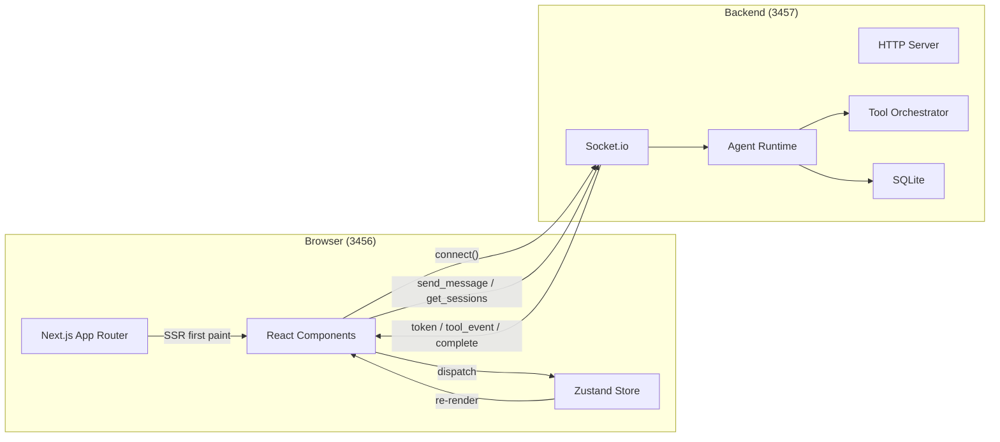

# Implementation Plan: Web App Shell — Next.js Migration

**Feature**: 033-web-app-shell
**Based on**: spec.md + specs/web-plan.md
**Status**: Draft

---

## 1. Project File Structure

```
superAgent/
├── pnpm-workspace.yaml              # NEW: monorepo root
├── package.json                      # UPDATED: workspace scripts
├── packages/
│   ├── web/                          # NEW: Next.js Web UI
│   │   ├── package.json
│   │   ├── next.config.ts
│   │   ├── tailwind.config.ts
│   │   ├── tsconfig.json
│   │   ├── app/
│   │   │   ├── layout.tsx            # Root layout: Sidebar + Chat area
│   │   │   ├── page.tsx              # Main page
│   │   │   └── globals.css           # Tailwind + DESIGN.md tokens
│   │   ├── components/
│   │   │   ├── chat/
│   │   │   │   ├── ChatPage.tsx      # Main chat container
│   │   │   │   ├── MessageList.tsx   # Message list + virtual scroll
│   │   │   │   ├── MessageBubble.tsx # Single message bubble
│   │   │   │   ├── InputBox.tsx      # Multi-line input + send
│   │   │   │   └── MarkdownRenderer.tsx
│   │   │   ├── sidebar/             # Phase 3: 032 migration
│   │   │   ├── diff/                # Phase 3: 029 migration
│   │   │   ├── tool-grid/           # Phase 3: 031 migration
│   │   │   ├── terminal/            # Phase 3: 027 migration
│   │   │   └── cards/               # Phase 3: 028 migration
│   │   ├── store/
│   │   │   └── chat.ts              # Zustand chat store
│   │   ├── hooks/
│   │   │   └── useSocket.ts         # Socket.io-client hook
│   │   ├── lib/
│   │   │   └── utils.ts             # Shared utilities
│   │   └── types/
│   │       └── message.ts           # Message types
│   └── core/                        # FUTURE: shared runtime (placeholder only in 033)
│       └── package.json
├── src/                             # UNCHANGED: CLI + backend server
│   ├── server/                      # HTTP + Socket.io (port 3457)
│   └── ...
└── packages/web/src/                # OLD: to be removed in Phase 3 cleanup
```

### File Responsibilities

| File | Responsibility |
|------|---------------|
| `pnpm-workspace.yaml` | Declare packages/web, packages/core as workspace members |
| `packages/web/package.json` | Next.js 15, React 19, Tailwind, Shadcn UI, Socket.io-client, Zustand |
| `app/layout.tsx` | `<html>` + `<body>` + Tailwind base styles + Sidebar + main content area |
| `app/page.tsx` | Render `<ChatPage>` as main content |
| `app/globals.css` | Tailwind directives + DESIGN.md CSS custom properties |
| `components/chat/ChatPage.tsx` | Top-level chat layout: MessageList + InputBox |
| `components/chat/MessageList.tsx` | Scrollable message list with auto-scroll |
| `components/chat/MessageBubble.tsx` | Single message: user (right) / agent (left) |
| `components/chat/InputBox.tsx` | Textarea + send button + Ctrl+Enter shortcut |
| `store/chat.ts` | Zustand store: messages, input, connection status |
| `hooks/useSocket.ts` | Socket.io connect/disconnect + event dispatch |

---

## 2. Data Flow



**Socket.io events** (reuse existing `src/server/socket-handlers.ts`):
- `client → server`: `send_message`, `cancel`, `get_sessions`
- `server → client`: `token`, `tool_event`, `complete`, `session_list`

---

## 3. Dependencies & Risks

### Dependencies

| Dependency | Status | Risk |
|-----------|--------|------|
| `src/server/` HTTP + Socket.io backend | Existing, working | Low |
| `src/server/socket-handlers.ts` event protocol | Existing, need no changes | Low |
| DESIGN.md design tokens | Existing | Low |
| Tailwind CSS + Shadcn UI | Need install | Low — standard setup |
| Next.js 15 + React 19 | Need install | Low — mature ecosystem |

### Risks

| Risk | Level | Mitigation |
|------|-------|-----------|
| pnpm workspace + Next.js config complexity | Medium | Follow Next.js official monorepo template |
| Socket.io protocol mismatch between old and new | Low | Reuse exact event names, no protocol changes |
| Tailwind conflicting with existing CSS | Low | Clean globals.css, no legacy CSS |
| Core extraction scope creep | Medium | Defer @superagent/core to a separate feature; 033 only creates placeholder |

---

## 4. Implementation Order

```
Phase 1 (T001-T003): Monorepo + Next.js skeleton (parallel)
    ↓
Phase 2 (T004-T005): App shell with Socket.io connectivity
    ↓
Phase 3 (T006-T010): Core chat components (chat store + socket + UI)
    ↓
Phase 4 (T011-T015): Feature module migration (parallel)
    ↓
Phase 5 (T016-T017): Integration + cleanup
```

---

> **Version**: v1.0 | **Created**: 2026-06-20 | **Status**: Draft
