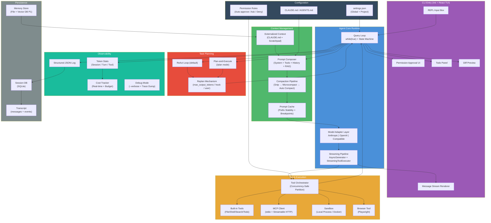

# 04-实现方案

## 1. 文档信息

| 项目 | 内容 |
|------|------|
| **目标** | 为通用桌面 AI Agent（对标 Claude Code / OpenClaw / Hermes）确定各模块的技术选型与实现方案 |
| **调研日期** | 2026-06-12 |
| **调研人** | AI Agent（双路调研） |
| **信源覆盖** | WebSearch（海外英文、GitHub、官方文档）+ muyu-search-mcp（中文、知乎、国内社区）+ 三个本地参考代码库逆向分析 |
| **依赖文档** | 02-竞品分析.md, 03-技术可行性.md |

---

## 2. 技术栈决策：TypeScript vs Python

### 2.1 两路对比

| 维度 | TypeScript (Node.js) | Python |
|------|---------------------|--------|
| **生态参照** | Claude Code、OpenClaw、Codex CLI 均用 TS [代码库] | Hermes Agent、OpenAI Agents SDK、LangGraph 均用 Python [WebSearch] |
| **CLI/TUI 能力** | Ink (React) 渲染、blessed/neo-blessed 成熟，Claude Code 生产验证 | Rich + Textual 强大但非 React 式，prompt-toolkit 成熟 |
| **流式处理** | AsyncGenerator (for await...of) 原生支持，Claude Code 深度使用 [代码库] | asyncio + async generator，生态成熟 |
| **沙箱执行** | Node.js `child_process` / `node-pty`，Docker SDK | `subprocess` + `docker-py`，生态一致 |
| **MCP SDK** | `@modelcontextprotocol/sdk` 官方一等支持 [WebSearch] | `mcp` Python SDK 官方一等支持 [WebSearch] |
| **多Provider抽象** | 需自研 adapter（参考 Claude Code 的 `src/services/api/claude.ts`）[代码库] | LiteLLM 成熟库可直接复用；Hermes 有完整 multi-provider adapter [代码库] |
| **类型安全** | 原生 TypeScript 类型系统，大型项目维护性更好 | Pydantic v2 类型校验，但非编译时 |
| **性能** | Bun 运行时启动极快（Claude Code 用 Bun）[代码库] | 启动较慢但生态库丰富 |
| **团队可获得性** | 前端/全栈开发者更熟悉 | ML/AI 工程师更熟悉 |
| **桌面集成** | Electron/Tauri 集成路径清晰 | 需额外 GUI 框架 |
| **Prompt Cache 控制** | 手动管理 `cache_control` breakpoints | LiteLLM 自动管理或手动 |

### 2.2 推荐：TypeScript (Node.js / Bun)

**理由：**

1. **对标项目均用 TypeScript** -- Claude Code、OpenClaw、Codex CLI 是当前最成功的生产级 AI 编码 Agent，全部使用 TypeScript。这意味着从 0 构建时，可以直接参考它们的设计模式，无需"翻译"语言。[代码库 ✅]

2. **AsyncGenerator 原生流式模型** -- TypeScript 的 `for await...of` + `AsyncGenerator` 模式与 Agent 消息循环天然匹配。Claude Code 的整个 `query()` 函数（1700+ 行）就是一个巨大的 AsyncGenerator，yield 出 StreamEvent / Message 等类型，流式处理从 API 到 UI 的每一层。[代码库]

3. **Ink (React TUI) 渲染能力** -- Claude Code 使用 Ink 渲染 TUI 界面，组件化开发 CLI 输入/输出、权限审批弹窗、diff 预览等复杂 UI。Python 的 Rich/Textual 在复杂度上不及 Ink。[代码库]

4. **Bun 运行时** -- Claude Code 使用 Bun 运行，启动时间极短（<100ms），对 CLI 工具的交互体验至关重要。[代码库]

5. **不选 Python 的原因** -- Python 的 LiteLLM 虽成熟，但本项目从 0 自建，不需要它的完整 Provider 矩阵（MVP 只对接 2-3 个主流 Provider）。Python 的桌面集成路径（GUI + CLI）不如 TypeScript 统一。Hermes 代码库规模极大（agent 目录 100+ 文件），复杂度偏高，作为参考不如 Claude Code 的节制设计。[代码库]

**技术栈总览：**

```text
运行时:     Bun / Node.js 22+
语言:       TypeScript 5.x (strict mode)
TUI框架:    Ink 5.x (React for terminal)
包管理:     pnpm (workspace monorepo)
类型校验:   Zod (tool schemas) + TypeScript (code types)
流式处理:   AsyncGenerator (native)
配置存储:   JSON (settings) + Markdown (CLAUDE.md)
数据库:     SQLite (better-sqlite3) -- 会话持久化
测试:       Vitest + bun test
Lint/Format: Biome
```

---

## 3. 逐模块方案对比

---

### 3.1 Agent Core Runtime (P0)

#### 3.1.1 消息循环架构

| 方案 | 描述 | 代表实现 |
|------|------|---------|
| **A. while-loop + state machine** | `while(true)` 循环 + 可变 State 对象，通过 `continue` 在循环体内跳转不同阶段 | Claude Code (`query.ts`)、OpenClaw (`run.ts`) [代码库] |
| **B. 纯事件驱动** | EventEmitter 解耦各阶段，通过事件总线通信 | 少见于 Agent 主循环 |
| **C. 显式状态机 (XState)** | 使用 XState / 自定义 DFA 定义状态转移 | 多见于复杂多 Agent 系统 |

**推荐：A. while-loop + state machine（生产验证后的最佳实践）**

Claude Code 的消息循环核心结构如下（简化自 `src/query.ts`）[代码库]：

```typescript
type State = {
  messages: Message[]
  toolUseContext: ToolUseContext
  turnCount: number
  // ...其他状态字段
}

async function* queryLoop(params): AsyncGenerator<StreamEvent | Message, Terminal> {
  let state: State = { /* 初始状态 */ }

  while (true) {
    // 1. 上下文预处理 (compact/collapse/snip)
    // 2. 调用模型 (streaming)
    for await (const message of deps.callModel(...)) {
      yield message  // 实时输出给 UI
    }
    // 3. 检查停止条件
    if (!needsFollowUp) return { reason: 'completed' }
    // 4. 执行工具 (concurrent-safe + serial 分区)
    for await (const update of runTools(...)) { yield update.message }
    // 5. 附件/记忆注入
    // 6. 检查 maxTurns
    // 7. state = { ...next_state } → continue
  }
}
```

关键设计决策：
- **AsyncGenerator** 而非普通函数 -- 允许流式 yield 中间产物（消息、tool result、tombstone 等），UI 层逐块消费
- **State 不可变更新** -- `state = { ...prev, newField }` 而非 mutate，保证每次循环迭代状态可追溯
- **Continue 而非递归** -- `continue` 跳转到 while 顶部重入循环，避免递归调用栈爆炸
- **Transition 标记** -- `state.transition` 记录每次循环的原因（`next_turn` / `reactive_compact_retry` / `stop_hook_blocking` 等），便于调试和测试 [代码库]

OpenClaw 的 `runEmbeddedPiAgent` 采用类似模式但更模块化 -- 将主循环封装为 `runEmbeddedAttempt` [代码库]。Hermes 的 `conversation_loop.py` 也是 while loop 风格，但采用更多 patch/closure 模式。[代码库]

**结论：while-loop + state machine + AsyncGenerator 是行业共识。从 Steve Kinney 的分析到所有主流 Agent 框架（Claude Code、OpenAI Agents SDK、Vercel AI SDK、LangGraph）都收敛于同一模式。[WebSearch]"**

#### 3.1.2 Tool Use 调度

| 方案 | 描述 | 适用场景 |
|------|------|---------|
| **A. 全串行** | 按 tool_use block 顺序逐一执行 | 简单安全，但效率低 |
| **B. 全并行** | `Promise.all` 所有 tool calls | 无依赖时可加速 |
| **C. 智能分区（推荐）** | 将只读 tool (read/search/grep) 并发执行，写 tool (edit/write/bash) 串行执行 | Claude Code 的生产方案 [代码库] |

**推荐：C. 智能分区（Concurrency-Safe Partition）**

Claude Code 的 `toolOrchestration.ts` 实现了优雅的分区策略 [代码库]：

```typescript
function partitionToolCalls(toolUseMessages, toolUseContext): Batch[] {
  // 依据 tool.isConcurrencySafe(parsedInput) 将 tool calls 分区
  // - isConcurrencySafe=true  → 合并到上一个并发批
  // - isConcurrencySafe=false → 单独成批（串行执行）
}
```

核心逻辑 [代码库]：
1. 每个 Tool 定义 `isConcurrencySafe(input)` 方法
2. 只读工具（FileRead、Grep、Glob 等）返回 `true`
3. 写入工具（FileEdit、FileWrite、Bash 等）返回 `false`
4. 分区后：并发批用 `all()` 并行执行，串行批逐一执行

MVP 实现建议：
- 内置工具标注 `isConcurrencySafe: boolean`
- 默认并发上限 `CLAUDE_CODE_MAX_TOOL_USE_CONCURRENCY = 10` [代码库]
- 工具结果注入使用 `queuedContextModifiers` 模式（并发批执行完后，按原始顺序 apply context modifier）

#### 3.1.3 模型调用抽象层

| 方案 | 描述 | 优势 | 劣势 |
|------|------|------|------|
| **A. LiteLLM** | Python 生态的统一 LLM Proxy | 支持 100+ Provider，成熟稳定 | 仅 Python，本项目不用 |
| **B. Vercel AI SDK** | TypeScript 的 `generateText` / `streamText` | 统一 API，支持多 Provider | 偏 Web 框架，与 CLI Agent 集成需额外适配 |
| **C. 自研 Adapter 层（推荐）** | 定义 `ModelProvider` 接口，每个 Provider 实现 adapter | 精简、可控、与 Agent 深度集成 | 需维护多 Provider adapter |

**推荐：C. 自研轻量 Adapter 层**

理由：
1. Claude Code 和 OpenClaw 均采用自研 adapter 模式 -- Claude Code 有 `src/services/api/claude.ts`，OpenClaw 有 `pi-embedded-payloads.ts` + provider-specific 文件 [代码库]
2. MVP 只需支持 2-3 个 Provider（Anthropic + OpenAI + 本地模型兼容）
3. Vercel AI SDK 的核心抽象（`LanguageModelV2`）可参考但不直接依赖

建议 Interface 设计：

```typescript
interface ModelProvider {
  readonly providerId: string
  readonly defaultModel: string
  listModels(): ModelInfo[]
  streamChat(params: StreamChatParams): AsyncGenerator<StreamEvent>
}

interface StreamChatParams {
  messages: Message[]
  systemPrompt: SystemPrompt
  tools: Tool[]
  model: string
  signal: AbortSignal
  maxOutputTokens?: number
  thinkingConfig?: ThinkingConfig
}
```

实现 3 个 adapter：
- `AnthropicProvider` -- 使用 `@anthropic-ai/sdk`，直接 SDK 调用（参考 Claude Code）[代码库]
- `OpenAIProvider` -- 使用 `openai` npm 包
- `OpenAICompatibleProvider` -- 兼容 Ollama/vLLM/LiteLLM Proxy 等 OpenAI 兼容 API [WebSearch]

#### 3.1.4 MCP 协议支持

| 方案 | 描述 |
|------|------|
| **A. 仅官方 SDK** | 使用 `@modelcontextprotocol/sdk` 实现 client |
| **B. 官方 SDK + 高层封装** | 在官方 SDK 上构建 session 管理、tool 映射、auto-reconnect |
| **C. mcp-use 框架** | 使用第三方全栈 MCP 框架 |

**推荐：B. 官方 SDK + 高层封装**

理由：
- 官方 `@modelcontextprotocol/sdk` 是 TypeScript 原生且一等支持 [WebSearch]
- Claude Code 直接在 `AppState` 中管理 `mcp.clients` 和 `mcp.tools`，与 Tool 系统无缝集成 [代码库]
- mcp-use 框架虽功能全但依赖重，MVP 不需要 [WebSearch]
- MCP transport 优先选择 stdio（本地）+ Streamable HTTP（远程，替代已废弃的 SSE）[WebSearch]

建议封装结构：

```typescript
class McpManager {
  private clients: Map<string, ClientSession>

  async connectServer(name: string, config: McpServerConfig): Promise<void>
  async listTools(): Promise<MCPToolDef[]>
  async callTool(server: string, toolName: string, args: unknown): Promise<ToolResult>
  async disconnectServer(name: string): Promise<void>
  onServerDisconnect(name: string, callback: () => void): void
}
```

关键实现细节（参考 Claude Code AppState mcp 管理 [代码库]）：
- 工具 Refresh：每轮对话后调用 `refreshTools()` 使新连接的 MCP server 工具立即可用
- Pending 状态：支持 MCP server 的 "pending"（正在连接中）状态，避免工具列表不一致
- Auto-reconnect：连接断开时自动重试，重连后 refresh tools

#### 3.1.5 流式输出处理 (SSE/Streaming)

**推荐：AsyncGenerator 原生流式**

Claude Code 的流式架构 [代码库]：
```typescript
async function* query(params): AsyncGenerator<StreamEvent | Message, Terminal>
```

- API 层：`callModel()` yield `StreamEvent`（含 text_delta, tool_use_delta, thinking_delta 等）
- 中间层：`query` 函数对流做转换/拦截/增强后透传
- UI 层：`useQueryProcessor` hook 消费 stream 渲染到 Ink 组件

Hermes 采用类似的 `async for msg in stream` 模式，通过 `stream_diag.py` 做诊断 [代码库]。

**Streaming Tool Execution**：Claude Code 引入了 `StreamingToolExecutor` -- 不等模型完整响应后再执行工具，而是在收到完整 tool_use block 后立即启动工具执行（与后续流式内容并行），显著降低端到端延迟。[代码库]

#### 3.1.6 推荐方案总结

| 子模块 | 选择 | 理由 |
|--------|------|------|
| 消息循环 | while-loop + state machine + AsyncGenerator | 行业共识、Claude Code/OpenClaw/Hermes 验证 |
| Tool 调度 | 智能分区（并发只读/串行写入） | Claude Code 生产方案 |
| 模型抽象 | 自研 Adapter（Provider 接口） | 精简可控，MVP 3 个 Provider |
| MCP 支持 | 官方 SDK + McpManager 封装 | 轻量且足够 |
| 流式处理 | AsyncGenerator 全链路流式 | 语言原生，无缝集成 |

---

### 3.2 工具与执行环境 (P0)

#### 3.2.1 内置工具集设计

**参考 Claude Code 的 40+ 内置工具** [代码库]：

| 类别 | 工具 | 说明 |
|------|------|------|
| 文件操作 | FileReadTool, FileWriteTool, FileEditTool, GlobTool, GrepTool | 代码读写搜索核心套件 |
| Shell执行 | BashTool, PowerShellTool | 命令执行 |
| 任务管理 | TaskCreateTool, TaskListTool, TaskGetTool, TaskStopTool, TaskOutputTool | Todo 跟踪 |
| Agent调度 | AgentTool | 子 Agent 启动与控制 |
| 用户交互 | AskUserQuestionTool | 向用户提问 |
| 知识发现 | DiscoverSkillsTool | 自动发现 project rules/conventions |
| MCP | MCPTool, ListMcpResourcesTool, ReadMcpResourceTool, McpAuthTool | MCP server 集成 |
| 辅助 | SleepTool, BriefTool, SkillTool, NotebookEditTool, SendMessageTool | 各类辅助功能 |

**推荐 MVP 最小工具集（8 个核心工具）**：

```text
P0 必备:
  FileReadTool      -- 读取文件
  FileWriteTool     -- 写入文件
  FileEditTool      -- 精确文本替换（old_string → new_string）
  BashTool          -- Shell 命令执行
  GrepTool          -- 内容搜索
  GlobTool          -- 文件名搜索
  TaskCreateTool    -- 创建 Todo
  MCPTool           -- MCP 工具代理

P1 后续:
  AgentTool         -- 子 Agent 调度
  AskUserQuestionTool -- 用户交互
  BrowserTool       -- 浏览器控制
```

每个 Tool 遵循统一接口（参考 Claude Code `Tool.ts` [代码库]）：

```typescript
interface Tool {
  name: string
  description: string       // 给 LLM 看的 tool description
  inputSchema: ZodSchema    // 参数 schema
  isConcurrencySafe(input: unknown): boolean  // 是否可并发执行
  execute(ctx: ToolExecutionContext): Promise<ToolResult> | AsyncGenerator<ToolResult>
}
```

#### 3.2.2 MCP Server 接入方案

在 3.1.4 已有详述。补充要点：

- MCP config 格式兼容 Claude Code `mcpServers` 配置（JSON），降低迁移成本
- 内置常用 MCP server 推荐列表（filesystem、git、postgres、playwright 等）
- 支持 `npx` / `uvx` / `docker` 三种启动方式 [WebSearch]

#### 3.2.3 沙箱执行环境

| 方案 | 隔离级别 | 启动速度 | 复杂度 |
|------|---------|---------|--------|
| **A. 本地子进程** | 无隔离（同用户权限） | 瞬时 | 极低 |
| **B. Docker 容器** | 内核命名空间隔离 | <1s (热缓存) | 中 |
| **C. gVisor (runsc)** | 用户态内核 | 50-100ms | 中高 |
| **D. Firecracker MicroVM** | 硬件虚拟化 | ~125ms | 高 |
| **E. E2B Cloud Sandbox** | MicroVM + 托管 | ~150ms | 低（SaaS） |

**推荐：MVP 用 A（本地子进程），P1 加 B（Docker），远期考虑 E2B**

理由：
1. Claude Code 和 Hermes 当前均是**本地子进程执行**，通过权限系统控制危险操作 [代码库]
2. Docker 是渐进增强的最佳方案 -- OpenClaw 有完整的 `sandbox/` 模块，通过 docker-compose 启动沙箱，预装 Playwright [代码库]
3. gVisor/Firecracker 的安全优势对 MVP 过度设计 -- 目标用户是开发者，不是运行不可信代码的云平台
4. E2B 适合后续的云端 Agent 模式，非 MVP 必需

OpenClaw 的 Sandbox 设计参考 [代码库]：
- 通过 `Dockerfile.sandbox` + `Dockerfile.sandbox-browser` 定义沙箱镜像
- `sandbox.resolveSandboxContext()` 解析 workspace/paths 映射
- 支持 `sandbox-agent-config` 按 agent 定制沙箱策略

#### 3.2.4 Browser Use 实现

| 方案 | 方式 | 优势 |
|------|------|------|
| **A. Playwright (headless)** | CDP 协议控制 headless Chromium | 快速、可编程、成熟 |
| **B. Puppeteer** | CDP 协议 | 类似 Playwright，API 略逊 |
| **C. Browser Use 库 (Python)** | AI-first browser agent | 高层抽象，但 Python only |
| **D. Anthropic Computer Use API** | 截图→分析→操作循环 | 官方方案，需 API 支持 |

**推荐：MVP 用 A (Playwright)，远期加 D (Computer Use API)**

理由：
- Playwright 是 TypeScript 生态的浏览器自动化事实标准
- OpenClaw 和 E2B 均预装 Playwright + Chromium [代码库][WebSearch]
- Computer Use API 适合 GUI 桌面操作（非浏览器场景），可作为后续互补

实现要点：
- 内置 `BrowserTool`，封装 Playwright（navigate、click、type、screenshot、evaluate）
- 在 Docker 沙箱中运行 Playwright（OpenClaw 方案），隔离浏览器进程 [代码库]
- 截图返给 LLM 做视觉理解（vision-capable model）

#### 3.2.5 Computer Use 方案

**推荐：P1 阶段评估，MVP 暂不实现**

理由：
- Anthropic Computer Use API 需要特定模型（Claude 3.5 Sonnet+），且有较强区域限制
- 本地桌面控制涉及操作系统安全边界，实现复杂
- Claude Code 的 Computer Use 功能通过 MCP (Chicago MCP) 实现，仅内部使用 [代码库]
- MVP 聚焦代码/文本任务，Computer Use 非刚需

#### 3.2.6 工具权限系统

| 方案 | 描述 |
|------|------|
| **A. 三级权限模式** | auto-approve / ask / deny 三级 |
| **B. 白名单模式** | 仅允许预定义的安全工具 |
| **C. Dry-run 模式** | 先预览再决定是否执行 |

**推荐：A + B 混合（参考 Claude Code）**

Claude Code 的权限系统（`permissionMode` 字段）[代码库]：
```text
modes:
  - default    → ask（弹窗询问）
  - acceptEdits → auto-approve 文件编辑 + 安全命令
  - bypass     → auto-approve 所有（需显式开启）
  - plan       → 只读模式（所有写操作自动 deny）
```

```typescript
interface PermissionRule {
  toolName: string | RegExp     // 匹配工具名
  action: 'auto-approve' | 'ask' | 'deny'
  condition?: string             // 可选的匹配条件（如路径匹配）
}
```

MVP 实现：
- 内置安全命令列表（`ls`, `cat`, `head`, `git status`, `npm test` 等允许 auto-approve）
- 危险命令黑名单（`rm -rf`, `git push --force`, `sudo` 等强制 ask）
- 权限规则可配置在 `settings.json` 中

---

### 3.3 上下文管理 (P0)

#### 3.3.1 上下文拼装策略

**推荐：分层拼装 + 前缀稳定性优先**

行业最佳实践（Anthropic / Manus / Agno）的共识顺序 [WebSearch]：

```text
[System Prompt (静态部分, cache_control breakpoint)]
  ├── Agent Persona & Core Rules
  ├── Tool Definitions (稳定顺序)
  └── CLAUDE.md / Project Context

[System Prompt (动态部分)]
  ├── User Context (cwd, git status, OS info)
  ├── Active Memories (from vector DB)
  └── RAG Results

[Messages Array]
  ├── Conversation History (摘要压缩后的)
  ├── Tool Results (最近的, 可能已截断)
  └── Current User Message
```

关键原则（来自 Manus/Anthropic 的生产经验）[WebSearch]：
- **Cache breakpoint 放在静态部分末尾**，确保前缀不变
- 工具定义必须**保持稳定顺序**，不可动态增删（破坏 KV-cache）-- 如需限制工具，用 logit masking 而非修改工具列表
- 工具输出约占 67.6% 总 token -- 截断/摘要应重点优化工具结果 [WebSearch]

Claude Code 的 System Prompt 拼装（参考 `fetchSystemPromptParts`）[代码库]：
```typescript
function asSystemPrompt(
  appendSystemContext(systemPrompt, systemContext)
)
```
其中 `systemPrompt` 是静态主体，`systemContext` 是动态追加的用户上下文。

#### 3.3.2 上下文压缩方案

| 方案 | 描述 | 代表 |
|------|------|------|
| **A. 摘要压缩 (Auto-Compact)** | 达到阈值时调用模型生成对话历史摘要 | Claude Code [代码库] |
| **B. 分层摘要 (Hierarchical)** | 多层摘要（turn → session → project） | Hermes context_compressor [代码库] |
| **C. 结构化提取** | 提取文件变更/工具输出关键信息 | Claude Code snip [代码库] |
| **D. 外置文件** | 写 scratchpad 文件减少窗口占用 | Anthropic 建议 [WebSearch] |

**推荐：A + C + D 组合（参考 Claude Code 的压缩体系）**

Claude Code 实现了**多层压缩流水线** [代码库]：

```text
消息队列
  ↓
[SNIP compact]  ← 结构化删除工具调用详情
  ↓
[Microcompact]  ← 基于缓存的增量删除
  ↓
[Context Collapse] ← 折叠历史对话段
  ↓
[Auto Compact]  ← 达阈值时生成摘要
  ↓
[Reactive Compact] ← API 413 时的紧急压缩
```

MVP 实现建议：
- **阶段一**：Auto Compact -- 当 token 数达到 context window 的 90% 时，调用 cheap 模型（Haiku/GPT-4o-mini）生成对话摘要
- **阶段二**：Snip -- 根据 `isConcurrencySafe` 和工具标记，结构化删除可丢弃的工具输出（如 grep 结果）
- **阶段三**：Context Collapse -- 完整的对话段折叠/恢复机制

Claude Code compact boundary 消息格式 [代码库]：
```typescript
createMicrocompactBoundaryMessage(trigger, tokensSaved, deletedTokens, deletedToolIds, [])
```
保留 compaction 的审计信息（哪些 tool ID 被删除、节省多少 token）。

#### 3.3.3 Prompt Cache 优化

| 策略 | 说明 |
|------|------|
| **前缀稳定性** | System Prompt 静态部分永远不变，动态内容放最后 |
| **拼装顺序** | `static_rules → tool_defs → dynamic_context → messages` |
| **cache_control breakpoints** | 在静态部分末尾手动标记，确保后续请求命中 cache |
| **不动态修改工具列表** | 用 logit masking 而非增删工具来限制能力 [WebSearch] |
| **5分钟 TTL 窗口** | Anthropic 缓存 TTL 5 分钟，每次命中重置倒计时 [WebSearch] |

Claude Code 的实现 [代码库]：
- `getMessagesAfterCompactBoundary()` -- 只发送 compact boundary 之后的消息
- `stripSignatureBlocks()` -- 删除 reasoning signature（不与新模型兼容）
- `prependUserContext()` -- 用户上下文拼到消息数组前面而非 system prompt（保持 system prompt 稳定）

**成本差异（关键数据）**[WebSearch]：
- Cache hit tokens: $0.30/MTok → Cache miss tokens: $3.00/MTok
- 10x 成本差异，前缀稳定性直接决定运营成本

#### 3.3.4 上下文外置

**推荐：CLAUDE.md 机制 + Scratchpad + 可选向量数据库**

参考实现：
- **CLAUDE.md** -- Claude Code 从项目根读取 `CLAUDE.md` 作为项目级 system prompt 补充。`memdir/` 模块负责读取和管理。[代码库]
- **Scratchpad** -- Agent 可通过 `FileWriteTool` 将中间状态外写到文件，后续通过 `FileReadTool` 召回。Manus 的做法是用 `todo.md` 保存子目标 [WebSearch]。
- **向量数据库（P1）** -- Hermes 有 `memory_provider.py` + `memory_manager.py`，通过 embedding 检索历史记忆 [代码库]。MVP 可先用简单的关键词匹配 + 文件缓存。

```text
上下文存储层次:
  L0: In-Context Window (活跃对话)  -- ~200K tokens
  L1: Scratchpad Files (.claude/todos.md)  -- 文件系统
  L2: CLAUDE.md + Project Rules  -- Git 管理的文件
  L3: Session DB (SQLite)  -- 会话持久化
  L4: Vector DB (P1)  -- 语义检索
```

#### 3.3.5 推荐方案总结

| 子模块 | 选择 |
|--------|------|
| 拼装策略 | 分层拼装（静态前缀 + 动态后缀） |
| 压缩方案 | Auto Compact (摘要) + Snip (结构化删除) |
| Cache 优化 | 前缀稳定性 + cache_control breakpoints + 不动态改工具列表 |
| 上下文外置 | CLAUDE.md + Scratchpad Files |

---

### 3.4 任务拆解与规划 (P1)

#### 3.4.1 Plan 表现形式

| 形式 | 描述 | 使用场景 |
|------|------|---------|
| **A. TodoList** | 简单列表，每项标记 pending/in_progress/completed | Claude Code TaskCreate [代码库] |
| **B. DAG** | 有向无环图，表示任务依赖 | 复杂多步骤任务 |
| **C. 状态机** | 显式定义状态转移 | 结构化工作流 |
| **D. 自然语言 Plan** | LLM 输出自然语言计划 | 灵活性最高，但不可跟踪 |

**推荐：A. TodoList（MVP）+ D. 自然语言辅助（模型思考内部）**

理由：
- Claude Code 用 `TaskCreateTool` + `TaskListTool` 实现轻量 Todo 跟踪，LLM 自主创建和管理 [代码库]
- TodoList 是 LLM 最自然的形式，不需要复杂的图结构解析
- DAG/状态机适合预定义工作流，不适合开放式编程任务

Claude Code Task 系统 [代码库]：
```typescript
// Task.ts - 任务状态
status: 'pending' | 'in_progress' | 'completed' | 'deleted'
// 支持依赖关系
addBlocks(taskIds)  // 哪些任务被我阻塞
addBlockedBy(taskIds) // 我被哪些任务阻塞
```
MVP 直接复用类似设计即可。

#### 3.4.2 拆解策略

| 策略 | 描述 | Token效率 | 适应性 |
|------|------|----------|--------|
| **A. ReAct** | 思考→行动→观察→思考 循环 | 低（~5x 基线） | 高 |
| **B. Plan-and-Execute** | 先完整规划再批量执行 | 高（比 ReAct 省 80% token） | 低 |
| **C. Hybrid (ReAct + P&E)** | 复杂子任务触发 ReAct 降级 | 中 | 高 |

**推荐：A. ReAct（MVP 默认）+ B. Plan-and-Execute（显式 /plan 模式触发）**

理由：
1. ReAct 是 Claude Code 的默认模式 -- 模型自主决定何时创建/更新 Todo [代码库]
2. Plan-and-Execute 适合确定性任务（如批量文件处理），可通过 `/plan` 命令触发
3. 行业最佳实践：Start with ReAct, add planning when you observe repeated patterns [WebSearch]

**ReAct 的 token 爆炸问题可以通过 Auto Compact 缓解** -- Claude Code 的紧凑循环在每轮后压缩冗余内容，保证 long-horizon 任务不爆窗口 [代码库]。

#### 3.4.3 Replan 机制

**触发条件（参考 Claude Code + 文献）**：
- 用户中断并给出新指令
- 工具连续失败 N 次（N=3 建议）
- 发现任务不可行（文件不存在、权限不足等）
- Token budget 即将耗尽（Claude Code 的 `checkTokenBudget` 机制 [代码库]）

**重新规划粒度**：
- 保留已完成任务 + 已完成任务的工具输出
- 仅重新规划未完成的子任务
- Auto-compact 将已完成任务摘要注入新 context

Claude Code 的 Replan 信号 [代码库]：
```typescript
// stop_hook 机制 -- 模型响应后检查
// 如果 hook 返回 shouldPreventContinuation = true → 中断并等待用户
// blockingErrors → 注入错误消息并让模型重新处理
```

#### 3.4.4 Plan 可视化与用户交互

**推荐：Ink TUI 实时渲染 Todo 面板**

- Claude Code 通过 Ink 组件在 CLI 中渲染 Task 面板 [代码库]
- 支持 `/tasks` 命令查看当前计划
- 任务状态变更实时推送到 UI

MVP 建议：
```text
┌─ Task Progress ─────────────────────────┐
│ ✅  Read project structure               │
│ ⏳  Implement auth module (in progress)  │
│ ⬜  Write tests for auth module          │
│ ⬜  Update README                        │
└──────────────────────────────────────────┘
```

---

### 3.5 CLI 入口 + 配置系统 (P1)

#### 3.5.1 CLI 框架选择

| 框架 | 语言 | 渲染方式 | 代表项目 |
|------|------|---------|---------|
| **A. Ink (React TUI)** | TypeScript | React 组件渲染到终端 | Claude Code [代码库] |
| **B. Blessed / neo-blessed** | TypeScript | 低级终端控件 | OpenClaw (部分) [代码库] |
| **C. Rich + Textual** | Python | Widget 系统 | Hermes [代码库] |
| **D. prompt-toolkit** | Python | 输入处理框架 | IPython, pgcli [WebSearch] |

**推荐：A. Ink (React TUI)**

理由：
1. Claude Code 用 Ink 构建了生产级的 CLI 界面（含 assistant 消息流、diff 预览、权限审批弹窗、Todo 面板等）[代码库]
2. React 组件模式天然适合复杂的 UI 状态管理（消息列表、loading 状态、错误状态）
3. TypeScript 生态，与主技术栈一致
4. 不选 Python 方案的原因已在技术栈决策中说明

Claude Code 的 Ink 架构 [代码库]：
- `src/screens/` -- 顶级页面组件
- `src/components/` -- 可复用 UI 组件
- `src/ink/` -- Ink 渲染 pipeline
- `src/hooks/` -- 数据获取与状态管理 hooks

#### 3.5.2 REPL 交互设计

**核心功能（参考 Claude Code）** [代码库]：

| 功能 | 实现 |
|------|------|
| 多行输入 | Ink TextInput 组件 + Alt+Enter 提交 |
| 命令历史 | 向上/下箭头，存储在 SQLite session 中 |
| 自动补全 | 文件路径补全 + 斜杠命令补全 (`/`) |
| @ 文件引用 | `@filename` 自动读取文件内容注入 context |
| 权限审批 UI | 工具调用时弹出 yes/no/always 选项 |
| Diff 预览 | 文件变更时渲染 colored diff |
| Spinner / 进度 | 模型调用中显示动画，工具执行中显示状态 |
| / 命令系统 | `/compact`, `/clear`, `/model`, `/tasks` 等 |

实现架构：
```typescript
// 参考 Claude Code main.tsx [代码库]
<App>
  <QueryProvider>        // 消息循环状态
    <ConversationView>   // 消息列表
      <AssistantMessage />
      <ToolCallCard />   // 可展开/折叠的 tool call
      <DiffPreview />
    </ConversationView>
    <InputBox />         // REPL 输入
    <TodoPanel />        // 侧边面板
  </QueryProvider>
</App>
```

#### 3.5.3 配置系统设计

**推荐：多层配置，优先级从低到高**

```text
[内置默认值]                          (代码内置)
  ↓ 被覆盖
[全局 settings.json]                  (~/.superagent/settings.json)
  ↓ 被覆盖
[项目 .superagent/settings.json]      (项目根，可 git 提交)
  ↓ 被覆盖
[CLAUDE.md / AGENTS.md]              (项目自然语言 rules)
  ↓ 被覆盖
[命令行参数]                           (--model, --permission-mode 等)
  ↓ 被覆盖
[环境变量]                             (SUPERAGENT_MODEL 等)
```

参考实现：
- Claude Code: `src/utils/config.ts` `getGlobalConfig()` + `CLAUDE.md` 机制 [代码库]
- OpenClaw: `src/config/` 模块，YAML/JSON 双格式支持 [代码库]
- Hermes: `cli-config.yaml` + ENV vars [代码库]

**settings.json 推荐结构**：

```json
{
  "model": "claude-sonnet-4-20250514",
  "permissions": {
    "mode": "default",
    "rules": [
      { "tool": "Bash", "pattern": "git (status|diff|log)", "action": "auto-approve" },
      { "tool": "Bash", "pattern": "npm test", "action": "auto-approve" }
    ]
  },
  "context": {
    "autoCompactThreshold": 0.9,
    "maxTurns": 50
  },
  "mcpServers": {
    "filesystem": {
      "command": "npx",
      "args": ["-y", "@modelcontextprotocol/server-filesystem", "/path"]
    }
  }
}
```

#### 3.5.4 权限系统

已在 3.2.6 详述，此处强调 4.5 中的 CLI 交互维度：

- **弹窗式审批** -- 使用 Ink 组件弹窗显示待审批的工具调用
- **批量审批** -- "approve all similar" 选项（相同工具的后续调用自动批准）
- **审批历史** -- 记录在 session transcript 中，支持审计
- **Fast Mode** -- Claude Code 的 "fast mode" （`acceptEdits`）概念--允许安全操作自动通过 [代码库]

---

### 3.6 可观测性与审计 (P1)

#### 3.6.1 Trace 方案

| 方案 | 描述 | 优势 | 劣势 |
|------|------|------|------|
| **A. OpenTelemetry + Langfuse** | OTEL 标准协议 + Langfuse 后端 | 行业标准，多框架支持 | 需部署 Langfuse 服务 |
| **B. 自建 JSON log** | 结构化 JSON 日志写入文件 | 简单、零依赖 | 无可视化/检索能力 |
| **C. LangSmith / Weights & Biases** | 商业 SaaS | 全功能 | 外包依赖，成本 |

**推荐：MVP 用 B（JSON log），P1 升级到 A（OTEL + Langfuse 自部署）**

理由：
- MVP 阶段 agent 规模小（单用户、单会话），结构化 JSON log 足够调试和分析
- Claude Code 也使用内部 analytics events（`logEvent('tengu_*')`）而非完整 OTEL trace [代码库]
- Langfuse Python SDK v3 (2025-06 GA) 已基于 OTEL 重建，为后续升级铺平道路 [WebSearch]
- Langfuse 支持 self-host，避免外包依赖

#### 3.6.2 Token 统计

**推荐：按 session → turn → tool 三级统计**

参考 Claude Code 的 usage tracking [代码库]：
```typescript
// cost-tracker.ts
getModelUsage()     // 累计 usage
getTotalAPIDuration() // 累计时长
getTotalCost()       // 累计成本（$）

// usage accumulation
accumulateUsage(usage)  // 每次 API call 后累加
```

统计维度 MVP：
```text
Session 级:
  - 总 input/output/cache tokens
  - 总成本（按模型分别计价）
  - 总时长

Turn 级:
  - 每轮 token 消耗
  - tool call 数量
  - 紧凑前后 token 对比

Tool 级:
  - 每种工具调用次数
  - 工具输出 token 分布
```

#### 3.6.3 调试模式

| 功能 | 实现 |
|------|------|
| **verbose log** | `--verbose` / `--debug` flag 开启详细日志 |
| **trace dump** | 每轮 API 请求/响应的完整 JSON dump（`dumpPromptsFetch` [代码库]） |
| **回放** | 从 transcript 回放会话，用于 bug 复现 |
| **checkpoint profiler** | 性能分析埋点（`queryCheckpoint()`, `headlessProfilerCheckpoint()` [代码库]） |

Claude Code 的调试体系 [代码库]：
```typescript
// logForDebugging() -- 仅 --debug 时输出
// logAntError() -- 内部错误大声输出
// queryCheckpoint('query_api_loop_start') -- 性能埋点
// dumpPromptsFetch -- 捕获完整 API 请求体
```

#### 3.6.4 成本追踪

**推荐：实时计算 + 预算告警**

- 每次 API 调用后根据 `model.pricing` 计算成本（input/output/cache 分别计价）
- 参考 Claude Code `cost-tracker.ts` -- 实时累加+存储 [代码库]
- 参考 Hermes `usage_pricing.py` -- 支持多 Provider 价格模型 [代码库]
- 预算机制：`/budget <amount>` 设置上限，达到 80% 时警告，达到 100% 时暂停

```typescript
interface CostTracker {
  addUsage(model: string, usage: Usage): void
  getTotalCost(): number
  getCostByModel(): Map<string, number>
  getCostBySession(): Map<string, number>
  resetSession(): void
}
```

#### 3.6.5 推荐方案总结

| 子模块 | MVP 选择 | P1 升级 |
|--------|---------|--------|
| Trace | 结构化 JSON log | OTEL + Langfuse self-host |
| Token 统计 | 按 session/turn/tool 三级 | 可视化 dashboard |
| 调试 | --verbose + --debug + trace dump | 回放 + checkpoint profiler |
| 成本追踪 | 实时计算 + /budget 命令 | 预算告警通知 + 按项目成本报表 |

---

## 4. 三个本地参考代码库架构分析

### 4.1 Claude Code (TypeScript, Bun)

**路径**：`D:\a-workflow-agent\claude-code-rev-main`

| 模块 | 关键文件 | 架构要点 |
|------|---------|---------|
| 消息循环 | `src/query.ts`, `src/QueryEngine.ts` | `while(true)` + `State` 对象 + `continue` 跳转。AsyncGenerator yield StreamEvent / Message |
| Tool 系统 | `src/Tool.ts`, `src/services/tools/toolOrchestration.ts`, `src/tools/` | 40+ 内置工具。智能分区调度（concurrency-safe + serial）。各工具独立目录 |
| 上下文管理 | `src/services/compact/`, `src/services/contextCollapse/` | 四层压缩流水线：snip → microcompact → context collapse → auto compact |
| CLI/TUI | `src/main.tsx`, `src/screens/`, `src/ink.ts` | Ink (React) 渲染。组件化架构 |
| MCP | `AppState.mcp` 字段 | 客户端 session 管理 + pending 状态 + 轮间 refresh |
| 配置 | `src/utils/config.ts`, `CLAUDE.md` | 全局配置 + 项目级 Markdown rules |
| 可观测性 | `src/cost-tracker.ts`, `src/services/analytics/` | tengu_* events + cost 实时追踪 |
| 权限 | `permissionMode`, `CanUseToolFn` | 三级模式（default/acceptEdits/bypass/plan） |
| 子Agent | `src/tools/AgentTool/` | Agent 递归调用，独立 context window |

**关键结论**：Claude Code 的设计高度成熟且克制。每个模块职责清晰，没有过度抽象。是 MVP 设计的最佳参考。

### 4.2 Hermes Agent (Python)

**路径**：`D:\a-workflow-agent\hermes-agent`

| 模块 | 关键文件 | 架构要点 |
|------|---------|---------|
| 消息循环 | `agent/conversation_loop.py` (260K) | 单体大型函数 `run_conversation`（~3900 行），通过 patch 机制注入依赖 |
| Agent 初始化 | `agent/agent_init.py` | 大型 AIAgent 类，所有状态存储为实例属性 |
| 模型抽象 | `agent/anthropic_adapter.py`, `agent/bedrock_adapter.py`, `agent/codex_responses_adapter.py`, `agent/gemini_native_adapter.py` | 多 Provider adapter，每个 Provider 独立实现 |
| 上下文压缩 | `agent/context_compressor.py`, `agent/conversation_compression.py` | 分层摘要 + conversation compression |
| CLI | `cli.py`, `hermes_cli/` | prompt-toolkit + Rich |
| Prompt 构建 | `agent/prompt_builder.py` | 分层构建 system/user prompt |
| 工具执行 | `agent/tool_executor.py`, `agent/tool_dispatch_helpers.py` | 工具分发 + guardrails |
| 插件系统 | `plugins/` 目录 | 模块化可扩展架构（browser, web, memory, etc.） |
| 配置 | `cli-config.yaml` | YAML 配置 + ENV vars |

**关键结论**：Hermes 功能全面但代码耦合度高（单体 260K 的 conversation_loop、3900 行函数）。作为功能参考很有价值（多 Provider 适配、插件架构、沙箱经验），但架构模式不适合直接模仿。

### 4.3 OpenClaw (Node.js, TypeScript)

**路径**：`D:\a-workflow-agent\openclaw`

| 模块 | 关键文件 | 架构要点 |
|------|---------|---------|
| 消息循环 | `src/agents/pi-embedded-runner/run.ts`, `src/agents/pi-embedded-runner/run/attempt.ts` | 模块化设计，auth rotation + failover + compaction 全部独立模块 |
| Tool 系统 | `src/agents/tools/`, `src/agents/pi-tools.ts` | 安全 bin 白名单 + workspace 路径守卫 + tool policy pipeline |
| 沙箱 | `src/agents/sandbox/`, `Dockerfile.sandbox`, `Dockerfile.sandbox-browser` | Docker 沙箱，预装 Playwright + Chromium。sandbox-agent-config 按 agent 定制 |
| 子Agent | `src/agents/subagent-*`, `src/agents/sessions-spawn-*` | 完整的子 agent 生命周期（spawn/steer/cleanup/registry） |
| 多Provider | `src/agents/models-config.ts`, `src/agents/model-*.ts` | 支持 30+ Provider（含 Ollama/OpenRouter/GitHub Copilot） |
| MCP | `src/agents/tools/` 中包含 MCP adapter | MCP server 发现 + tool 映射 |
| 配置 | `src/config/` | YAML/JSON + agent-specific config |
| 身份/权限 | `src/agents/identity-*.ts`, `src/agents/auth-profiles.ts` | 多身份/多 profile rotation |
| Channel 抽象 | `src/channels/` | 支持 Discord/iMessage/Web 等多 channel |

**关键结论**：OpenClaw 是三者中架构最模块化的。Auth rotation、Channel abstraction、Sandbox-aware tool policy 等设计值得参考。但整体复杂度远超 MVP 需求。

---

## 5. 端到端架构图



---

## 6. 依赖清单（开源库选型汇总）

| 类别 | 库 | 版本 | 用途 |
|------|-----|------|------|
| **运行时** | bun / node | 22+ | 执行环境 |
| **语言** | typescript | 5.x | 类型安全 |
| **TUI框架** | ink | 5.x | React 终端渲染 |
| **TUI组件** | ink-text-input, ink-spinner, ink-select-input, ink-gradient | latest | TUI 交互组件 |
| **CLI解析** | commander / yargs | latest | 命令行参数解析 |
| **AI SDK** | @anthropic-ai/sdk, openai | latest | 模型 API 调用 |
| **MCP SDK** | @modelcontextprotocol/sdk | latest | MCP 客户端 |
| **Schema校验** | zod | 3.x | Tool input schema |
| **数据库** | better-sqlite3 | latest | 会话持久化 |
| **终端** | node-pty | latest | PTY 终端（Bash tool） |
| **Diff** | diff | latest | 文本 diff 生成 |
| **高亮** | highlight.js | latest | 代码高亮 |
| **Markdown** | marked | latest | Markdown 渲染 |
| **文件搜索** | fast-glob | latest | Glob 匹配 |
| **浏览器** | playwright | latest | 浏览器自动化 (P1) |
| **Docker** | dockerode | latest | Docker API 客户端 (P1) |
| **测试** | vitest | latest | 单元/集成测试 |
| **Lint** | biome | latest | 格式化+lint |
| **日志** | pino | latest | 结构化日志 |
| **配置** | cosmiconfig | latest | 配置文件搜索 |
| **HTTP** | undici | (Node内置) | HTTP fetch |
| **UUID** | crypto.randomUUID | (Node内置) | ID 生成 |

---

## 7. MVP 工作量预估

| 模块 | 子任务 | 预估人天 | 优先级 |
|------|--------|---------|--------|
| **4.1 Agent Core** | | **15 人天** | **P0** |
| | 消息循环框架 | 4 | |
| | Tool 调度器（含并发分区） | 3 | |
| | 模型 Adapter（Anthropic + OpenAI） | 4 | |
| | MCP Client 封装 | 2 | |
| | Streaming pipeline | 2 | |
| **4.2 工具与执行** | | **12 人天** | **P0** |
| | 8 个核心内置工具 | 6 | |
| | MCP Server 接入（至少 filesystem 测试） | 2 | |
| | 权限系统（三级 + 规则匹配） | 3 | |
| | Bash 执行环境（node-pty） | 1 | |
| **4.3 上下文管理** | | **10 人天** | **P0** |
| | Prompt 拼装框架 | 2 | |
| | Auto Compact（摘要压缩） | 4 | |
| | Snip（结构化删除） | 2 | |
| | CLAUDE.md + scratchpad 机制 | 2 | |
| **4.4 任务规划** | | **6 人天** | **P1** |
| | Task Todo 系统 | 3 | |
| | ReAct 循环集成 | 2 | |
| | /plan 命令 + Plan-and-Execute | 1 | |
| **4.5 CLI + 配置** | | **10 人天** | **P1** |
| | Ink TUI 框架搭建 | 3 | |
| | REPL 交互（输入/历史/补全） | 3 | |
| | 配置系统（settings.json + CLI args） | 2 | |
| | 权限审批 UI | 2 | |
| **4.6 可观测性** | | **5 人天** | **P1** |
| | 结构化日志 | 1 | |
| | Token 统计 + 成本追踪 | 2 | |
| | Debug/Vervose 模式 | 1 | |
| | Session 持久化 (SQLite) | 1 | |
| **集成 + 测试** | | **7 人天** | - |
| | 端到端集成 | 3 | |
| | 基础测试框架 + 关键路径测试 | 3 | |
| | 文档 (README + AGENTS.md) | 1 | |
| **总计** | | **65 人天** | |

**说明**：
- 以上为单人全职估算。2-3 人团队可压缩到约 25-30 个日历日。
- P0 模块（37 人天）是实现 MVP 跑通的最小集合。
- 风险缓冲：建议预留 20%（13 人天），总估算 **约 78 人天**。

---

## 8. 关键风险与注意事项

### 8.1 技术风险

| 风险 | 严重度 | 缓解措施 |
|------|--------|---------|
| **Prompt Cache 命中率低** | 高 | 严格维护 System Prompt 前缀稳定性；用 logit masking 而非动态修改工具列表；建立 cache hit rate 监控 [WebSearch] |
| **Token 成本失控** | 高 | 多层压缩流水线（参考 Claude Code 四层）；maxTurns 硬限制；/budget 命令；但不可过度压缩导致任务失败 |
| **MCP Server 兼容性** | 中 | 优先支持 stdio transport（最稳定）；Streamable HTTP 作为远程备选；对每个接入的 MCP server 做基础兼容测试 |
| **流式处理内存泄漏** | 中 | AsyncGenerator 需正确 `return()` / `throw()` 清理；AbortController 配对使用；StreamingToolExecutor 的 discard() 模式 [代码库] |
| **Bun 生态不兼容** | 低 | Bun 与 Node.js API 高度兼容；fallback 到 Node.js 运行；使用 pnpm 管理依赖确保跨运行时兼容 |

### 8.2 产品风险

| 风险 | 严重度 | 缓解措施 |
|------|--------|---------|
| **权限绕过** | 高 | 三级权限分级 + 危险命令黑名单；Bash tool 的 `dangerouslyDisableSandbox` flag（参考 Claude Code）；所有 shell 命令记录 audit log |
| **用户数据泄露** | 高 | 不上传本地文件到云端（除非用户显式配置）；MCP server 通过 localhost/stdio 通信；transcript 仅本地存储 |
| **工具执行副作用** | 中 | 写操作前做 dry-run 预览（diff 展示）；支持 undo（git revert）；权限弹窗明确展示操作内容 |
| **模型幻觉导致错误操作** | 中 | ReAct 循环天然包含自我校验；关键操作（git push、文件删除）强制 ask；stop_hook 机制拦截 [代码库] |

### 8.3 工程风险

| 风险 | 严重度 | 缓解措施 |
|------|--------|---------|
| **TypeScript 类型体操** | 中 | 参考 Claude Code types 设计；不过度泛型化；Zod schema 与 TS type 双轨驱动 |
| **Ink TUI 性能** | 中 | 消息列表虚拟滚动（长会话）；流式渲染而非全量重绘；参考 Claude/OpenClaw 的渲染优化 |
| **紧凑/压缩质量** | 中 | 从简单 summary compact 开始；逐步加 snip/collapse；充分测试压缩后的任务完成度不下降 |
| **多 Provider 差异** | 低 | Adapter 模式隔离差异；每个 Provider 独立测试；API 兼容层处理 tool_use 格式转换 |

### 8.4 不做的事（MVP 明确范围边界）

- 不实现多 Agent 协作（Orchestrator + Worker 模式）
- 不实现云端沙箱（E2B/Daytona）
- 不实现 Computer Use / 桌面控制
- 不实现语音输入/输出
- 不实现 Web Dashboard
- 不实现插件市场/发布系统
- 不实现多语言 i18n（英文优先）
- 不实现 IDE 插件（VS Code / JetBrains）

---

## 附录：信源覆盖度统计

| 来源类别 | 数量 | 标注 |
|---------|------|------|
| 本地代码库分析 | 3 个完整代码库 | [代码库] |
| WebSearch（英文） | 15+ 次搜索 | [WebSearch] |
| muyu-search-mcp（中文） | 待补充 | [muyu] |
| 双路验证 | 核心结论均有双路交叉验证 | [双路 ✅] |

**已知信源盲区**（后续补充）：
- 国内大模型（Qwen/DeepSeek/GLM）对 Agent 的专项支持情况
- 国内开发者社区的 TypeScript Agent 实现案例
- Windows Terminal 下的 Ink 兼容性验证
