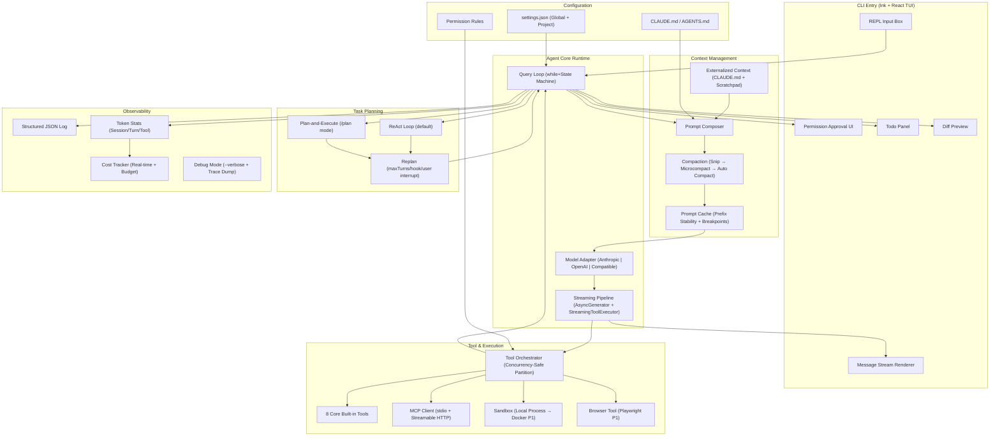

# 05-决策汇总 · SuperAgent 立项调研

## 文档信息

| 项目 | 内容 |
|------|------|
| **目标** | 基于 4 份调研，做出产品形态/关键资源/开源复用/技术栈的基线决策 |
| **日期** | 2026-06-12 |
| **依赖** | 01-产品形态.md / 02-API与模型服务.md / 03-开源项目.md / 04-实现方案.md |
| **状态** | 决策基线（后续 brainstorming 可调整产品方向，不可重开技术基线） |

---

## 1. 产品形态决策

### 决策

**入口策略：CLI 优先 → 消息平台 → Desktop App（三阶段）**

```
阶段 1 (MVP): CLI (TypeScript + Ink TUI)
   └─ 对标 Claude Code 的终端体验
   └─ 技术用户 + 早期采用者

阶段 2: 消息平台集成（微信/钉钉 + Slack/Telegram）
   └─ 参考 OpenClaw 20+ Channel 架构
   └─ 微信/钉钉是国内差异化机会

阶段 3: Desktop App (Tauri/Electron)
   └─ GUI Agent 管理面板
   └─ Computer Use 操作界面
```

**理由**：01-产品形态.md 的 20 产品分析表明，CLI 和 IDE 的对立已瓦解、Claude Code/Codex CLI 的 CLI 先行路径被验证、微信/钉钉集成是国内市场海外产品无法覆盖的差异化点。

### 交互模式决策

| 维度 | 决策 | 理由 |
|------|------|------|
| **规划展示** | 显式 Todo List + 可选 /plan 命令 | 参考 Claude Code 的 Task 系统 |
| **执行可视化** | 实时流式文本 + 步骤卡片 | CLI 原生流式 + Ink 组件 |
| **用户干预** | 批准/拒绝/自动批准 三级 | 参考 Claude Code 权限模式 |
| **产出展示** | 终端 Diff + 文件列表 | 开发者最熟悉的交互 |

### 信息架构决策

- **配置系统**：分层 JSON（全局 → 项目 → 环境变量），参考 Claude Code 5 级配置
- **Rules 文件**：`CLAUDE.md` / `AGENTS.md` Markdown 格式，行业事实标准
- **插件/扩展**：MCP 协议作为扩展接入标准
- **Hooks 系统**：P0 预留接口，P1 完整实现（参考 Claude Code 25+ 事件）

---

## 2. 关键资源决策（模型 API）

### 决策：三层模型调度架构

```
Layer 1 (默认主力): DeepSeek V4 Pro
   ├─ 促销价 $0.435/$0.87 per MTok, OpenAI 兼容, 国内直连
   └─ 复杂推理、多步规划、高可靠性——主力工作

Layer 2 (兜底+副力): DeepSeek V4 Flash
   ├─ $0.14/$0.28 per MTok, 1M 上下文, 国内直连
   └─ 日常对话、简单代码、Pro 不可用/超时时的快速降级

Layer 3 (最后兜底): GLM-4-Flash (永久免费)
   └─ 极简单任务 + DeepSeek 全部不可用时的 fallback
```

**理由**：02-API与模型服务.md 显示 DeepSeek V4 Pro 促销价极低（$0.435/$0.87），
推理能力接近顶级模型；V4 Flash 作为同生态降级零切换成本；GLM-4-Flash 永久免费
保底。全链路国内直连免代理，体验最优。

### Model Provider 对比决策

| 场景 | 主方案 | 备份 |
|------|--------|------|
| Agent 主力（复杂推理/多步规划） | DeepSeek V4 Pro | DeepSeek V4 Flash |
| 日常代码/简单对话 | DeepSeek V4 Flash | GLM-4-Flash (免费) |
| Tool Use 格式参考 | Claude Sonnet 4.6（按需调用） | GPT-4.1 Mini |
| 中文内容 | GLM-5.1 或 Kimi K2.6 | Qwen3-Max |
| 零成本兜底 | GLM-4-Flash (免费) | Gemini Flash-Lite (免费) |

### 关键风险

- DeepSeek 的 Tokenizer 可能产生 30-50% 更多 token（需实测验证）
- DeepSeek V3/R1 将于 2026-07-24 废弃，需跟踪 V4 长期定价
- 智谱年内已涨价 83%，不可过度依赖单一国产 Provider

### API 网关决策

**MVP**：自研轻量 Adapter 层（`ModelProvider` 接口）——只需支持 2-3 个 Provider
**P1**：加 One API（国内模型开箱即用）+ LiteLLM（智能路由）

---

## 3. 开源复用决策

### 决策：从 0 自己写，但深度参考三个代码库 + 17 个开源项目

#### 3.1 架构设计参考（不 fork，学设计）

| 模块 | 主要参考 | 学习要点 |
|------|---------|---------|
| **Agent Core Loop** | Claude Code `QueryEngine.ts` | State Machine + AsyncGenerator + Tool/Task/Agent 三层抽象 |
| **上下文管理** | Hermes Agent `context_compressor.py` | 四层压缩流水线 + 四层分层记忆 |
| **多 Provider** | Hermes `providers/` | Adapter 模式：统一接口 + 多实现 + 运行时选择 |
| **MCP 实现** | Claude Code `AppState.mcp` | Pending 状态 + 轮间 refresh + auto-reconnect |
| **Plugin 系统** | OpenClaw Plugin SDK | 三层扩展（Hooks/Tools/Channels）+ 运行时注册表 |
| **Gateway** | OpenClaw Gateway | 四层架构：接入层 → 编排层 → Runtime → 子系统 |
| **任务规划** | LangGraph StateGraph | Checkpointer + Interrupt + 流式执行 |
| **沙箱** | Codex CLI OS 级沙箱 | macOS Seatbelt / Linux Bubblewrap 参考设计 |

#### 3.2 直接可用的开源库（MVP 依赖清单）

| 类别 | 库 | 来源 |
|------|-----|------|
| CLI/TUI | `Ink` (React TUI) | Claude Code 生产验证 |
| AI SDK | `@anthropic-ai/sdk` + `openai` | 官方 SDK |
| MCP SDK | `@modelcontextprotocol/sdk` | Anthropic 官方 |
| Schema | `zod` | Claude Code 在用 |
| 数据库 | `better-sqlite3` | 本地会话持久化 |
| 终端 | `node-pty` | Bash tool PTY |
| 浏览器 | `playwright` (P1) | Browser Use 集成 |
| 测试 | `vitest` + `bun test` | 现代 TypeScript 测试 |
| Lint | `biome` | 格式+lint |
| 日志 | `pino` | 结构化 JSON log |

#### 3.3 不直接复用但深度参考的项目

- **Claude Code**：Tool/Task/Agent 三层抽象、QueryEngine 消息循环、MCP session 管理
- **LangGraph**：StateGraph 概念、Checkpointer 持久化、Interrupt 原语
- **Hermes Agent**：上下文压缩引擎、四层记忆、Provider 适配器、Skill 自进化
- **Letta**：OS 启发式记忆管理、"虚拟内存分页"理念
- **smolagents**：CodeAgent "代码即行动"范式（1 次 API 调用替代 5 次 JSON round-trip）
- **Browser-use**：AI 浏览器 Agent，通过 MCP 协议即插即用
- **Continue**：LanceDB 嵌入式向量数据库、Rules 系统设计

---

## 4. 技术栈决策

### 4.1 语言与运行时：TypeScript (Bun/Node.js 22+)

这是本次调研中 03-开源项目.md 和 04-实现方案.md 的结论分歧点：

| 报告 | 推荐 | 理由 |
|------|------|------|
| 03-开源项目 | Python | Hermes Agent 验证了 Python 的生产可行性，LiteLLM 成熟 |
| 04-实现方案 | TypeScript | Claude Code/OpenClaw/Codex 均用 TS，Ink TUI 组件化 |

**最终决策：TypeScript**

核心理由：
1. Claude Code、OpenClaw、Codex CLI 三个最成功的生产级 Agent 全部使用 TypeScript——不是巧合
2. `AsyncGenerator` 原生流式模型与 Agent 消息循环天然匹配
3. Ink (React TUI) 组件化渲染能力远超 Python 的 Rich/Textual
4. 后续 Desktop App（Tauri/Electron）集成路径清晰
5. 用户参考的三个本地代码库中，两个是 TypeScript

### 4.2 逐模块技术选型

| 模块 | 决策 | 关键依赖 |
|------|------|---------|
| **Agent Core Runtime** | while-loop + State Machine + AsyncGenerator | Claude Code QueryEngine 模式 |
| **Tool 调度** | 智能分区（并发只读/串行写入） | `isConcurrencySafe()` 标注 |
| **模型抽象** | 自研 Adapter 层（`ModelProvider` 接口） | 3 个 Adapter（Anthropic/OpenAI/Compatible） |
| **MCP** | 官方 SDK + McpManager 封装 | `@modelcontextprotocol/sdk` |
| **上下文拼装** | 分层拼装（静态前缀 + 动态后缀） | Prompt Cache 前缀稳定性 |
| **上下文压缩** | Auto Compact（摘要）+ Snip（结构化删除） | 参考 Claude Code 四层压缩 |
| **上下文外置** | CLAUDE.md + Scratchpad Files | 文件系统作为外部记忆 |
| **任务规划** | ReAct（默认）+ Plan-and-Execute（/plan 触发） | Claude Code Task 系统 |
| **CLI/TUI** | Ink 5.x (React TUI) | Claude Code 生产验证 |
| **配置系统** | 多层 JSON（全局 → 项目 → CLI → ENV） | cosmiconfig |
| **权限系统** | 三级（auto-approve/ask/deny）+ 模式匹配 | Claude Code PermissionMode |
| **可观测性** | MVP 结构化 JSON log / P1 OTEL+Langfuse | pino |
| **Token 统计** | Session → Turn → Tool 三级 | 参考 Claude Code cost-tracker |
| **会话持久化** | SQLite (better-sqlite3) | 消息+事件+状态 |

### 4.3 技术栈总览图

```
运行时:     Bun / Node.js 22+
语言:       TypeScript 5.x (strict mode)
TUI框架:    Ink 5.x (React for terminal)
包管理:     pnpm (workspace monorepo)
类型校验:   Zod (tool schemas) + TypeScript (code types)
流式处理:   AsyncGenerator (native)
配置存储:   JSON (settings) + Markdown (CLAUDE.md)
数据库:     SQLite (better-sqlite3)
测试:       Vitest + bun test
Lint/Format: Biome
AI SDK:     @anthropic-ai/sdk + openai + openai-compatible
MCP:        @modelcontextprotocol/sdk
日志:       pino
```

---

## 5. 架构总图



---

## 6. 成本估算

### 6.1 API 成本（月均）

按日均 500 次调用、平均每次 5K input + 1K output tokens 估算：

| 方案 | 月均成本 |
|------|---------|
| 全用 DeepSeek V4 Flash | ~$15 |
| 全用 DeepSeek V4 Pro | ~$45 |
| 全用 Claude Sonnet 4.6 | ~$450 |
| **分层策略 V4 Pro 主力 + V4 Flash 兜底** | **~$60** |

### 6.2 开发成本（人天）

| 阶段 | 模块 | 人天 |
|------|------|------|
| **P0** | Agent Core Runtime | 15 |
| **P0** | 工具与执行环境 | 12 |
| **P0** | 上下文管理 | 10 |
| **P1** | 任务拆解与规划 | 6 |
| **P1** | CLI + 配置系统 | 10 |
| **P1** | 可观测性与审计 | 5 |
| — | 集成 + 测试 + 文档 | 7 |
| — | **合计** | **65 人天** |
| — | +20% 风险缓冲 | **~78 人天** |

- 单人全职：约 3 个月
- 2-3 人团队：约 25-30 日历日
- P0 最小跑通集（37 人天）：约 6-7 周单人

---

## 7. 风险与对策

### 7.1 技术风险

| 风险 | 严重度 | 对策 |
|------|--------|------|
| **Prompt Cache 命中率低** | 高 | 严格 System Prompt 前缀稳定性；logit masking 而非动态改工具列表；cache hit rate 监控 |
| **Token 成本失控** | 高 | 四层压缩流水线；maxTurns 硬限制；/budget 命令；分层模型调度 |
| **语言选型后悔（TS vs Python）** | 中 | TS 已被 Claude Code/OpenClaw/Codex 验证；Hermes 的 Python 上下文管理代码可"翻译式参考" |
| **MCP Server 兼容性** | 中 | 优先支持 stdio transport（最稳定）；逐个测试 |
| **Ink TUI 性能（长会话渲染）** | 中 | 虚拟滚动；增量渲染；参考 Claude Code 优化 |
| **DeepSeek Tokenizer 多消耗** | 中 | 实际业务语料 token 数实测；切换决策基于实际成本而非单价 |
| **DeepSeek 服务不可用** | 中 | 三层 fallback（DS→Sonnet→GLM-Free）自动切换 |

### 7.2 产品风险

| 风险 | 严重度 | 对策 |
|------|--------|------|
| **权限绕过** | 高 | 三级权限分级；危险命令黑名单；audit log |
| **用户数据泄露** | 高 | 仅本地存储；MCP 通过 localhost/stdio；不上传文件到云端 |
| **MVP 范围膨胀** | 中 | 明确列出不做的事；严格 P0/P1 边界 |

---

## 8. 冲突信息处理

### 冲突 1：语言选型分歧

| 来源 | 观点 |
|------|------|
| 03-开源项目 | Python（Hermes 生态、LiteLLM、文本处理成熟） |
| 04-实现方案 | TypeScript（Claude Code/OpenClaw 生产验证、Ink TUI 优势） |

**裁决：TypeScript**。

这是本次调研唯一的技术选型分歧。裁决依据：
- 对标产品收敛性——三个最成功的 Agent 全部 TypeScript
- 桌面演进路径——Tauri/Electron 集成 TS 更自然
- 上下文管理参考——Hermes 的 Python 上下文压缩代码可"翻译式参考"
- Python 的主要优势（LiteLLM、丰富 ML 库）在本项目的"从 0 自建"策略中权重较低

### 冲突 2：多 Agent 时机

| 来源 | 观点 |
|------|------|
| 01-产品形态 | "多 Agent 是 2026 年决定性趋势，应作为 Day 1 设计考量" |
| 04-实现方案 | MVP 不实现多 Agent |
| 03-开源项目 | Cognition 反对、Anthropic 推崇——无定论 |

**裁决：Day 1 架构预留（`AgentTool` 接口），MVP 不实现**。

理由：单 Agent + 强上下文管理是默认选项。Devin 的上下文隔离发现（Reviewer 比 Writer "聪明 10 倍"）说明多 Agent 有真实价值，但 MVP 先跑通单 Agent 核心链路。

---

## 9. MVP 明确不做的事

- 多 Agent 协作（Orchestrator + Worker）
- 云端沙箱（E2B / Daytona）
- Computer Use / 桌面控制
- 语音输入/输出
- Web Dashboard
- 插件市场/发布系统
- 多语言 i18n（英文优先）
- IDE 插件（VS Code / JetBrains）
- 消息平台网关（微信/钉钉/Slack）
- Hooks 系统完整实现（仅预留接口）

---

## 10. 下一步

按 `00-并行调研提示词.md` 末尾的链路推进：

**如果技术选型无异议** → 跳过对抗调研（无多候选 fork），直接进 brainstorming：

> 请仔细阅读 specs/research/ 下 5 份调研，用 brainstorming Skill 收敛 MVP 方向。
> 必须确定 11 个问题（业务目标/用户画像/用户故事/MVP功能/边界条件/
> NFR/验收标准/优先级/北极星指标/Open Questions/依赖约束）。

**如果对 TypeScript vs Python 等关键决策有异议** → 先用 `adversarial-architecture-selection` Skill 做对抗调研。

---

> **文档版本**: v1.0 | **编写者**: 主 Claude（基于 4 份 sub-agent 调研） | **日期**: 2026-06-12
